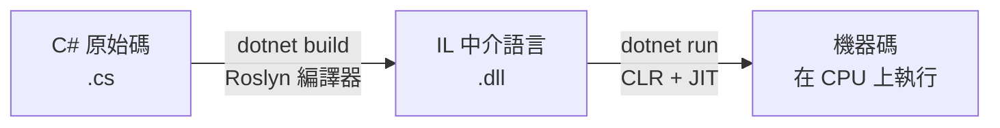
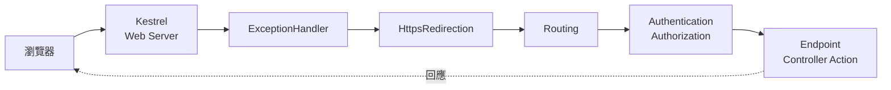

<div class="flex flex-col justify-center items-center h-full" style="background: #ffffff;">
  <p style="color: #5eada0; font-size: 1rem; font-weight: 600; letter-spacing: 0.2em; text-transform: uppercase; margin-bottom: 1.2rem;">ASP.NET Core Masterclass</p>
  <h1 style="color: #1a5c5c; font-size: 3.4rem; font-weight: 900; line-height: 1.15; margin-bottom: 1.5rem;">環境建置 & 關於 .NET 10</h1>
  <div style="height: 4px; width: 320px; background: linear-gradient(90deg, #5eada0, #a7d9d0); border-radius: 2px; margin-bottom: 1.5rem;"></div>
  <p style="color: #4a7c7c; font-size: 1.15rem; font-style: italic;">「先把工具準備好，再來蓋房子」</p>
  <Link to="home" style="color: #9dc4c4; font-size: 0.85rem; margin-top: 2rem; text-decoration: none; letter-spacing: 0.05em;">← 返回目錄</Link>
</div>

<!--
大家好，歡迎來到「ASP.NET Core 實戰開發」的第一章！

在正式寫程式之前，我們要先搞清楚兩件事：第一，ASP.NET Core 和 .NET 10 到底是什麼、彼此是什麼關係；第二，把開發環境架好，讓我們的第一個網站可以在自己的電腦上跑起來。

這一章的最後，我們還會看一個瀏覽器送出請求之後，ASP.NET Core 網站內部到底經歷了哪些步驟，也就是「網站的生命週期」。掌握這張地圖之後，後面每一章學到的東西，大家都能知道它是放在哪個位置。
-->

---
layout: default
---

# Outline

- **1-1 ASP.NET Core 簡介** — 它是什麼、能做什麼、為什麼選它
- **1-2 .NET 10 簡介** — LTS 版本、C# 14 與這一版的新東西
- **1-3 開發工具、環境架設** — .NET SDK + VS Code + C# Dev Kit
- **1-4 ASP.NET Core 網站生命週期** — 從 `Program.cs` 到 Middleware Pipeline
- **總結**

<!--
這一章分成四個小節。

前兩節是觀念：什麼是 ASP.NET Core、什麼是 .NET 10。第三節是動手做：安裝 SDK、VS Code，建立並執行第一個 MVC 專案。第四節我們會打開 Program.cs，一行一行看網站是怎麼啟動、請求是怎麼被處理的。

每個小節結束都有一個小練習，章節最後還有一題綜合練習。
-->

---

# 課程開場：這門課會做出什麼？

整門課我們會從零開始，做出一個線上咖啡豆商店 **EShop**：

| 章節 | 我們會完成的功能 |
| --- | --- |
| Ch01 – Ch03 | 環境、C# 語法、LINQ 查詢，把基本功打好 |
| Ch04 – Ch05 | MVC 架構 + Entity Framework Core，完成第一個 CRUD |
| Ch06 – Ch07 | 依賴注入、Repository、UnitOfWork、Area 前後台 |
| Ch08 | 商品管理（含圖片上傳、DataTable）與前台首頁 |
| Ch09 | 會員註冊登入、角色權限、分店資訊 |
| Ch10 | 購物車、結帳、訂單與庫存管理 |

<!--
在開始之前，我想先讓大家看到終點長什麼樣子。

這門課不是零散地學語法，而是一路做出一個完整的線上商店 EShop。前三章是基本功，第四、五章開始有畫面、有資料庫，第六、七章把程式架構整理乾淨，最後三章把商品、會員、購物車和訂單全部串起來。

每一章都建立在上一章的基礎上，所以大家不要跳著學，跟著順序走，最後一定能做出一個像樣的網站。
-->

---
layout: section
class: flex flex-col justify-center items-center text-center
---

# 1-1 ASP.NET Core 簡介
### What is ASP.NET Core?

<!--
第一個小節，我們先來認識今天的主角：ASP.NET Core。
-->

---

# 什麼是 ASP.NET Core？

想像我們要開一間網路咖啡豆商店，需要處理的事情有：

| 需求 | 如果全部自己寫 |
| --- | --- |
| 接收瀏覽器的 HTTP 請求 | 自己解析網路封包、Header、Cookie |
| 根據網址找到對應的程式 | 自己寫一大堆 `if (url == "...")` |
| 產生 HTML 畫面 | 自己用字串拼出整頁 HTML |
| 會員登入、權限 | 自己處理密碼加密、Session、Cookie |

<div class="mt-4 p-3 bg-blue-50 border-l-4 border-blue-400 text-gray-700 text-sm text-left">
💡 <b>定義：</b>「ASP.NET Core 是微軟開發、開源且跨平台的 Web 框架，幫我們把上面這些重複又容易出錯的工作都處理好，讓我們專心寫商業邏輯。」
</div>

<!--
我們先想像一個情境：如果要從零開始做一個網站，而且什麼框架都不用，會發生什麼事？

我們得自己去接收瀏覽器送來的 HTTP 請求、自己判斷網址要交給哪段程式處理、自己用字串拼出 HTML、自己處理登入和密碼加密。光是這些基礎工作，就可能花掉好幾個月，而且很容易有安全漏洞。

這就是框架存在的意義。「ASP.NET Core 是微軟開發、開源且跨平台的 Web 框架」，它把這些重複的底層工作都處理好了，我們只要專心寫「商店要怎麼賣咖啡豆」這種商業邏輯就好。
-->

---

# 框架的生活類比：蓋房子

| 蓋房子 | 寫網站 |
| --- | --- |
| 地基、鋼筋、水電管線 | HTTP 處理、路由、安全機制 |
| 建商提供的標準格局 | ASP.NET Core 框架 |
| 自己挑的裝潢、家具 | 我們寫的 Controller、View、商業邏輯 |

「框架就像建商已經幫我們打好地基、拉好水電，我們只要專心做室內設計。」

<div class="mt-4 p-3 bg-blue-50 border-l-4 border-blue-400 text-gray-700 text-sm text-left">
💡 如果沒有框架，每蓋一間房子都要從挖地基開始；有了框架，我們可以直接從「這間房子要長什麼樣子」開始思考。
</div>

<!--
用蓋房子來比喻會更直觀。

如果每次蓋房子都要自己挖地基、綁鋼筋、拉水電管線，那蓋一間房子要花好幾年。但如果有建商已經把這些結構做好，我們只要決定裝潢和家具，速度就快很多。

ASP.NET Core 就是那個幫我們打好地基的建商。HTTP 處理、路由、安全機制這些「地基」它都做好了，我們寫的 Controller、View、商業邏輯，就是這間房子的裝潢和家具。
-->

---

# ASP.NET Core 能做哪些類型的應用？

| 類型 | 說明 | 本課程 |
| --- | --- | --- |
| **MVC** | Controller + Razor View，伺服器端產生 HTML | ✅ 主軸 |
| **Razor Pages** | 以「頁面」為單位的開發方式 | ✅ Identity 頁面 |
| **Web API / Minimal API** | 回傳 JSON，給前端或 App 使用 | ✅ DataTable 資料來源 |
| **Blazor** | 用 C# 寫互動式前端元件 | 補充 |
| **gRPC / SignalR** | 高效能 RPC、即時通訊 | 補充 |

<!--
ASP.NET Core 不是只能做一種網站，它是一個平台，上面可以長出很多種應用。

這門課的主軸是 MVC，也就是 Controller 搭配 Razor View，由伺服器產生 HTML 回傳給瀏覽器。第九章做會員系統時，會用到 Razor Pages；第八章做 DataTable 時，會寫一個回傳 JSON 的 API。

Blazor、gRPC、SignalR 這些大家先知道有這些東西就好，它們都跑在同一個 ASP.NET Core 底層上，學會 MVC 之後要再學它們，會輕鬆很多。
-->

---

# ASP.NET 的演進：從 Framework 到 Core

| 年份 | 名稱 | 特色 |
| --- | --- | --- |
| 2002 | ASP.NET Web Forms | 只能跑在 Windows + IIS |
| 2009 | ASP.NET MVC | 引入 MVC 架構 |
| 2016 | ASP.NET Core 1.0 | 重寫、開源、跨平台 |
| 2020 | .NET 5 | 統一品牌，拿掉「Core」字樣 |
| 2025 | **.NET 10（LTS）** | 本課程使用的版本 |

<div class="mt-4 p-3 bg-blue-50 border-l-4 border-blue-400 text-gray-700 text-sm text-left">
💡 <b>命名小提醒：</b>執行環境從 .NET 5 開始不再叫「.NET Core」，但 Web 框架仍然叫 <b>ASP.NET Core</b>。
</div>

<!--
大家上網查資料的時候，一定會看到 ASP.NET、ASP.NET MVC、ASP.NET Core 這些名字混在一起，這裡幫大家整理一下。

早期的 ASP.NET 只能跑在 Windows 上。2016 年微軟把整個框架重寫，推出 ASP.NET Core，開源而且跨平台。2020 年之後，執行環境統一叫 .NET，版本號一路從 5、6、7、8、9 到現在的 10。

有個容易搞混的地方：執行環境已經不叫 .NET Core 了，但 Web 框架還是叫 ASP.NET Core。所以我們今天用的組合是「.NET 10 上的 ASP.NET Core 10」。

補充一下，網路上如果看到 Web Forms、`Global.asax`、`Web.config` 這種寫法，那是舊版 .NET Framework 的東西，這門課不會用到。
-->

---

# 為什麼選 ASP.NET Core？

| 優勢 | 說明 |
| --- | --- |
| **跨平台** | Windows、macOS、Linux 都能開發與部署，也能跑在 Docker |
| **高效能** | 在 TechEmpower 基準測試中長期名列前茅 |
| **開源** | 原始碼在 GitHub（`dotnet/aspnetcore`），社群活躍 |
| **內建功能齊全** | DI、設定、Logging、Identity 都是官方內建 |
| **企業主流** | 台灣金融、製造、政府系統大量使用 |

<!--
那為什麼要選 ASP.NET Core？

第一，跨平台，我們可以在 Mac 上開發、部署到 Linux 伺服器或 Docker 容器。第二，效能非常好。第三，完全開源。第四，很多功能是官方內建的，像依賴注入、設定檔、Logging、會員系統，不用到處找第三方套件拼湊。

最後一點很實際：在台灣，金融業、製造業、政府標案有大量系統是用 .NET 開發的，學會 ASP.NET Core，在求職上是很主流的技能。
-->

---
layout: default
---

# 練習 1：認識 ASP.NET Core
### 認證模擬題（單選）

關於 ASP.NET Core，下列描述哪一項是**正確**的？

A. ASP.NET Core 只能在 Windows 作業系統上開發與執行
B. ASP.NET Core 是 .NET 平台上的開源、跨平台 Web 框架，可以開發 MVC、Web API 等應用
C. 從 .NET 5 開始，ASP.NET Core 已經改名為 ASP.NET 5，不再使用 Core 這個名字
D. 使用 ASP.NET Core 開發網站，必須要自己處理 HTTP 封包的解析

<!--
【出題動機】
這題幫大家確認 1-1 最重要的三個觀念：跨平台、開源、以及命名。

【解題引導】
回想一下蓋房子的比喻：框架幫我們處理了哪些「地基」？再想想 .NET 5 之後，拿掉「Core」字樣的是執行環境，還是 Web 框架？
-->

---
layout: default
---

# 練習 1：解析

**正確答案：B**

| 選項 | 解析 |
| --- | --- |
| A ❌ | ASP.NET Core 跨平台，Windows / macOS / Linux 都能開發與部署 |
| B ✅ | 正確，MVC、Razor Pages、Web API、Blazor 都建立在 ASP.NET Core 上 |
| C ❌ | 拿掉 Core 的是「執行環境」（.NET 5+），Web 框架仍叫 ASP.NET Core |
| D ❌ | HTTP 解析是框架（Kestrel）幫我們處理的底層工作 |

<!--
答案是 B。

A 錯在跨平台，C 錯在把執行環境和 Web 框架的命名搞混了，D 錯在 HTTP 解析正是框架幫我們做掉的事情。

大家記住一句話就好：「.NET 是執行環境，ASP.NET Core 是跑在上面的 Web 框架。」
-->

---
layout: section
class: flex flex-col justify-center items-center text-center
---

# 1-2 .NET 10 簡介
### What's new in .NET 10

<!--
認識了 ASP.NET Core，接下來我們來看它底下的執行環境：.NET 10。
-->

---

# 什麼是 .NET？

「.NET 是一個免費、開源、跨平台的開發平台，包含 **執行環境（Runtime）**、**SDK** 和 **程式語言**。」

| 組成 | 角色 | 比喻 |
| --- | --- | --- |
| **Runtime（CLR）** | 負責執行編譯後的程式 | 播放器 |
| **SDK** | 建立、編譯、執行專案的工具（`dotnet` 指令） | 錄音室 |
| **BCL 基礎類別庫** | `List<T>`、`DateTime`、檔案、網路等 API | 樂器庫 |
| **語言** | C#（主流）、F#、VB | 樂譜 |

<!--
.NET 這個名字包含了好幾樣東西，我們用做音樂來比喻。

SDK 像錄音室，是我們開發時用的工具，最常用的就是 dotnet 這個指令。Runtime 像播放器，負責把編譯好的程式跑起來。BCL 基礎類別庫像樂器庫，裡面有 List、DateTime、讀寫檔案這些現成的 API。而 C# 就是我們寫樂譜用的語言。

開發的電腦要裝 SDK，SDK 裡面已經包含 Runtime；如果只是要在伺服器上執行已經編譯好的網站，裝 Runtime 就夠了。
-->

---

# .NET 程式是怎麼被執行的？



| 階段 | 說明 |
| --- | --- |
| 編譯 | C# 先被編譯成與平台無關的 IL（Intermediate Language） |
| 執行 | CLR 的 JIT 在執行時把 IL 轉成當前 CPU 的機器碼 |

<!--
我們寫的 C# 程式，並不是直接變成機器碼。

執行 dotnet build 的時候，Roslyn 編譯器會先把 C# 編譯成 IL，也就是中介語言，存在 .dll 檔案裡。等到真正執行時，CLR 裡的 JIT 編譯器才把 IL 轉成目前這台電腦 CPU 看得懂的機器碼。

這個設計的好處是：同一份 .dll，可以跑在 Windows、Mac、Linux 上，因為最後一步的翻譯是各平台的 Runtime 自己做的。
-->

---

# .NET 的版本節奏：LTS 與 STS

| 版本 | 發布時間 | 類型 | 支援期限 |
| --- | --- | --- | --- |
| .NET 8 | 2023/11 | LTS | 2026/11 |
| .NET 9 | 2024/11 | STS | 2026/11 |
| **.NET 10** | **2025/11** | **LTS** | **2028/11** |
| .NET 11 | 2026/11（預定） | STS | — |

<div class="mt-4 p-3 bg-blue-50 border-l-4 border-blue-400 text-gray-700 text-sm text-left">
💡 <b>規則：</b>每年 11 月發布一版；<b>偶數版是 LTS（支援 3 年）</b>，奇數版是 STS（支援 2 年）。企業專案通常選 LTS。
</div>

<!--
.NET 每年 11 月會發布一個新版本，而且有固定的規則：偶數版是 LTS，長期支援 3 年；奇數版是 STS，標準支援 2 年。

.NET 10 在 2025 年 11 月發布，是 LTS 版本，會支援到 2028 年 11 月。這也是這門課選擇 .NET 10 的原因：企業專案大多會選 LTS 版本，學了之後好幾年都用得上。

大家也注意一下，.NET 8 和 .NET 9 都會在 2026 年 11 月結束支援，所以現在開新專案，主流選擇就是 .NET 10。
-->

---

# .NET 10 的重點更新

| 領域 | 新東西 |
| --- | --- |
| **C# 14** | extension members、`field` 關鍵字、null 條件指派 `a?.B = x` |
| **SDK** | `dotnet run app.cs` 直接執行單一檔案，不用建專案 |
| **ASP.NET Core 10** | OpenAPI 3.1、Identity 支援 Passkey、Blazor 效能提升 |
| **EF Core 10** | `LeftJoin` / `RightJoin`、具名查詢過濾器、向量搜尋 |
| **效能** | JIT、GC、陣列介面去虛擬化等大量效能優化 |

<!--
.NET 10 的更新非常多，這裡挑跟我們課程比較相關的講。

C# 14 多了幾個語法糖，後面第二章會看到。SDK 最有感的是可以直接 dotnet run 一個 .cs 檔，不用先建專案，非常適合拿來練習語法。ASP.NET Core 10 和 EF Core 10 也都有更新，EF Core 10 多了 LeftJoin 這種以前要寫很長的 LINQ 運算子。

大家現在不需要全部記住，這張表只是讓大家有個印象：我們學的是目前最新的主流版本。
-->

---

# 在 .NET 10 中練習：單一檔案直接執行

.NET 10 開始，一個 `.cs` 檔就能直接跑，不需要 `.csproj`：

```csharp
// hello.cs
var name = "EShop";
Console.WriteLine($"Hello, {name}! 現在時間：{DateTime.Now:HH:mm}");
```

```bash
dotnet run hello.cs
```

執行後，console 會輸出：

```text
Hello, EShop! 現在時間：09:30
```

<!--
我們來體驗一下 .NET 10 最方便的新功能：file-based app。

以前要跑一行 C#，得先 dotnet new console 建一個專案，會生出 .csproj、Program.cs、obj、bin 一堆東西。現在只要一個 hello.cs 檔案，直接 dotnet run hello.cs 就能執行。

第二章練習 C# 語法的時候，我們就會大量使用這個方式，專心在語法本身，不用管專案結構。
-->

---
layout: default
---

# 練習 2：.NET 10 版本觀念
### 認證模擬題（單選）

公司要在 2026 年開發一套預計使用 5 年的內部訂單系統，下列哪一個選擇**最合適**？

A. 選 .NET 9，因為 9 比 8 新
B. 選 .NET 10，因為它是 LTS 版本，支援到 2028 年 11 月，之後可升級到下一個 LTS
C. 選 .NET Framework 4.8，因為它最穩定
D. 等 .NET 11 出來再開發，因為版本越新越好

<!--
【出題動機】
版本選擇是實務上很常遇到的決策，這題幫大家把 LTS / STS 的觀念落地。

【解題引導】
想想看 .NET 9 什麼時候結束支援？.NET Framework 4.8 還能跨平台嗎？.NET 11 是 LTS 還是 STS？
-->

---
layout: default
---

# 練習 2：解析

**正確答案：B**

| 選項 | 解析 |
| --- | --- |
| A ❌ | .NET 9 是 STS，2026/11 就結束支援 |
| B ✅ | LTS 支援 3 年，到期前再升級到 .NET 12（LTS）是主流做法 |
| C ❌ | .NET Framework 只能跑在 Windows，新專案不建議使用 |
| D ❌ | .NET 11 是奇數版 STS，而且等待會延誤專案時程 |

<!--
答案是 B。

實務上的做法就是：選目前最新的 LTS 開發，到期前再升級到下一個 LTS。.NET 的升級通常只要改 csproj 裡的 TargetFramework 和套件版本，大部分程式碼不用動。
-->

---
layout: section
class: flex flex-col justify-center items-center text-center
---

# 1-3 開發工具、環境架設
### .NET SDK + VS Code

<!--
觀念講完了，我們來動手把開發環境架起來。這門課以 VS Code 為主，Windows、Mac、Linux 都可以跟著做。
-->

---

# 我們需要安裝哪些工具？

| 工具 | 用途 | 下載位置 |
| --- | --- | --- |
| **.NET 10 SDK** | 編譯、執行專案（`dotnet` 指令） | dotnet.microsoft.com/download |
| **VS Code** | 輕量、跨平台的程式編輯器 | code.visualstudio.com |
| **C# Dev Kit** | VS Code 的 C# 擴充套件（含 IntelliSense、除錯） | VS Code Extensions |
| **SQL Server** | 第 5 章開始使用的資料庫 | Docker 或 SQL Server Express |
| **Git** | 版本控制 | git-scm.com |

<div class="mt-4 p-3 bg-blue-50 border-l-4 border-blue-400 text-gray-700 text-sm text-left">
💡 <b>補充：</b>Windows 使用者也可以選 Visual Studio 2026 Community，功能更完整；但本課程的指令都以 <code>dotnet</code> CLI 為主，兩邊都通用。
</div>

<!--
開發 ASP.NET Core 需要的工具不多，最核心的就是 .NET 10 SDK 和一個編輯器。

我們選 VS Code 搭配 C# Dev Kit，原因是它跨平台、輕量，而且所有操作都透過 dotnet 指令完成，學到的東西在任何環境都通用。資料庫第五章才會用到，到時候再安裝也可以。

用 Windows 的同學如果習慣 Visual Studio 也沒問題，這門課的所有指令都可以在 Visual Studio 的終端機裡執行。
-->

---

# Step 1：安裝 .NET 10 SDK

到官網下載 **.NET 10.0 SDK**（選 SDK，不是 Runtime），安裝後開啟終端機確認：

```bash
dotnet --version
```

```text
10.0.100
```

```bash
dotnet --list-sdks
```

<div class="mt-4 p-3 bg-blue-50 border-l-4 border-blue-400 text-gray-700 text-sm text-left">
💡 macOS 也可以用 Homebrew：<code>brew install --cask dotnet-sdk</code>；Windows 可以用 <code>winget install Microsoft.DotNet.SDK.10</code>。
</div>

<!--
第一步，安裝 .NET 10 SDK。到官網下載頁面，記得選 SDK 而不是 Runtime，因為我們要開發，需要完整的工具。

裝好之後打開終端機，輸入 dotnet --version，只要看到 10 開頭的版本號就代表成功了。實際的小版本號可能會比畫面上的新，沒關係。

如果電腦裡同時裝了好幾個版本的 SDK，可以用 dotnet --list-sdks 列出來看看。
-->

---

# Step 2：安裝 VS Code 與擴充套件

| 擴充套件 | 用途 |
| --- | --- |
| **C# Dev Kit**（Microsoft） | 方案總管、IntelliSense、除錯、測試 |
| **C#**（Microsoft） | C# 語言服務，安裝 Dev Kit 時自動帶入 |
| **SQL Server (mssql)** | 在 VS Code 內連線、查詢資料庫（第 5 章用） |

安裝完成後，按 `Ctrl + Shift + P` 輸入 **.NET: New Project** 也能用圖形介面建立專案。

<!--
第二步，安裝 VS Code，然後到左邊的 Extensions 搜尋 C# Dev Kit 安裝。它會順便幫我們裝好 C# 語言服務，之後寫程式就有自動完成、錯誤提示和除錯功能了。

SQL Server 的擴充套件可以先裝起來，第五章連資料庫的時候會用到。

C# Dev Kit 也提供圖形化的建立專案功能，不過這門課我們會以 dotnet 指令為主，因為指令在任何環境都一樣。
-->

---

# Step 3：建立第一個 MVC 專案

```bash
dotnet new mvc -n EShop.Web
cd EShop.Web
code .
```

| 指令 | 說明 |
| --- | --- |
| `dotnet new list` | 列出所有可用的專案範本 |
| `dotnet new mvc -n EShop.Web` | 用 MVC 範本建立名為 `EShop.Web` 的專案 |
| `code .` | 用 VS Code 開啟目前資料夾 |

<!--
第三步，用 dotnet new 建立第一個 MVC 專案。

dotnet new mvc 代表使用 MVC 範本，-n 後面接專案名稱，我們取名叫 EShop.Web，這就是整門課會一路做下去的網站。

如果想知道還有哪些範本，可以輸入 dotnet new list，會看到 console、webapi、razor、blazor 等等。
-->

---

# Step 4：執行網站

```bash
dotnet dev-certs https --trust   # 第一次執行：信任 HTTPS 開發憑證
dotnet watch                     # 啟動網站，存檔自動重新載入
```

執行後，終端機會輸出：

```text
info: Microsoft.Hosting.Lifetime[14]
      Now listening on: https://localhost:7123
info: Microsoft.Hosting.Lifetime[0]
      Application started. Press Ctrl+C to shut down.
```

<div class="mt-4 p-3 bg-blue-50 border-l-4 border-blue-400 text-gray-700 text-sm text-left">
💡 <code>dotnet run</code> 只跑一次；<code>dotnet watch</code> 會監看檔案，存檔後自動套用變更（Hot Reload），開發時最常用。
</div>

<!--
第四步，把網站跑起來。

第一次執行前，先用 dotnet dev-certs https --trust 信任開發用的 HTTPS 憑證，不然瀏覽器會跳出不安全的警告。

接著執行 dotnet watch，終端機出現 Now listening on 某個網址，就代表網站啟動成功了，打開那個網址就能看到預設的首頁。port 號每個人不一樣，是建立專案時隨機產生的。

dotnet watch 和 dotnet run 的差別是：watch 會監看檔案變化，改了 View 或 C# 程式存檔之後會自動套用，開發時我們幾乎都用 watch。
-->

---

# 專案結構導覽

| 檔案 / 資料夾 | 用途 |
| --- | --- |
| `EShop.Web.csproj` | 專案設定：目標框架 `net10.0`、NuGet 套件 |
| `Program.cs` | 網站進入點：註冊服務、設定 Middleware |
| `appsettings.json` | 設定檔：連線字串、Logging 等 |
| `Properties/launchSettings.json` | 本機啟動設定：port、環境變數 |
| `Controllers/` | 控制器，處理請求 |
| `Models/` | 資料模型 |
| `Views/` | Razor 畫面（`.cshtml`） |
| `wwwroot/` | 靜態檔案：CSS、JS、圖片、Bootstrap |

<!--
專案建好之後，我們先認識一下每個檔案和資料夾是做什麼的。

最重要的是 Program.cs，它是整個網站的進入點，下一節會仔細看。Controllers、Models、Views 三個資料夾就是 MVC 的三個角色，第四章會詳細介紹。wwwroot 放的是靜態檔案，範本已經幫我們放好 Bootstrap 和 jQuery 了。

appsettings.json 是設定檔，之後資料庫的連線字串就會寫在這裡。
-->

---

# 認識 .csproj 專案檔

```xml
<Project Sdk="Microsoft.NET.Sdk.Web">

  <PropertyGroup>
    <TargetFramework>net10.0</TargetFramework>
    <Nullable>enable</Nullable>
    <ImplicitUsings>enable</ImplicitUsings>
  </PropertyGroup>

</Project>
```

| 設定 | 意義 |
| --- | --- |
| `Sdk="Microsoft.NET.Sdk.Web"` | 這是一個 Web 專案，自動引用 ASP.NET Core |
| `TargetFramework` | 目標框架版本 `net10.0` |
| `Nullable` | 開啟可為 null 參考型別檢查 |
| `ImplicitUsings` | 自動加入常用的 `using`，檔案開頭不用一直寫 |

<!--
我們打開 EShop.Web.csproj 看看。現代 .NET 的專案檔非常精簡，只有幾行。

注意 TargetFramework 是 net10.0，代表這個專案使用 .NET 10。Nullable 開啟之後，編譯器會幫我們檢查可能的 null 錯誤，第二章會介紹。ImplicitUsings 則是自動幫我們 using 常用的命名空間，所以 Program.cs 開頭才會那麼乾淨。

之後我們用 dotnet add package 安裝 NuGet 套件，套件也會自動記錄在這個檔案裡。
-->

---

# 常用的 dotnet 指令

| 指令 | 用途 |
| --- | --- |
| `dotnet new <範本>` | 建立新專案 |
| `dotnet build` | 編譯專案 |
| `dotnet run` / `dotnet watch` | 執行 / 監看並執行 |
| `dotnet add package <套件>` | 安裝 NuGet 套件 |
| `dotnet tool install -g dotnet-ef` | 安裝 EF Core 命令列工具（第 5 章） |
| `dotnet publish -c Release` | 發佈成可部署的版本 |

<!--
這張表整理了這門課最常用的 dotnet 指令，大家可以截圖起來。

new 建專案、build 編譯、run 和 watch 執行、add package 安裝套件、publish 發佈。dotnet-ef 這個工具第五章建資料庫的時候才會用到，到時候再裝就好。
-->

---
layout: default
---

# 練習 3：建立並修改第一個網站
### 任務說明

1. 用 `dotnet new mvc` 建立一個名為 `MyFirstSite` 的專案
2. 用 `dotnet watch` 執行網站
3. 打開 `Views/Home/Index.cshtml`，把標題改成「我的第一個 ASP.NET Core 網站」
4. 存檔後觀察瀏覽器是否自動更新

<!--
【練習目的】
讓每位同學都親手完成一次「建立 → 執行 → 修改 → 看到結果」的完整流程。

【操作提示】
如果瀏覽器沒有自動更新，看一下終端機是否有錯誤訊息；如果 port 被占用，可以修改 Properties/launchSettings.json 裡的 applicationUrl。
-->

---
layout: default
---

# 練習 3：解題提示
### 提示說明

```bash
dotnet new mvc -n MyFirstSite
cd MyFirstSite
dotnet watch
```

```razor
@{
    ViewData["Title"] = "Home Page";
}
<div class="text-center">
    <h1 class="display-4">我的第一個 ASP.NET Core 網站</h1>
</div>
```

<!--
指令只有三行。修改的檔案是 Views/Home/Index.cshtml，把 h1 裡的 Welcome 換成我們的文字就可以了。

存檔之後，dotnet watch 會偵測到變化，瀏覽器會自動重新整理。如果有看到新標題，恭喜大家，第一個 ASP.NET Core 網站就完成了！
-->

---
layout: section
class: flex flex-col justify-center items-center text-center
---

# 1-4 ASP.NET Core 網站生命週期
### Application & Request Lifecycle

<!--
網站跑起來了，但大家可能會好奇：瀏覽器打開網址之後，到底發生了什麼事？最後一個小節，我們來看 ASP.NET Core 網站的生命週期。
-->

---

# 什麼是網站生命週期？

生命週期分成兩個層次：

| 層次 | 說明 | 發生頻率 |
| --- | --- | --- |
| **應用程式生命週期** | 網站啟動 → 持續運作 → 關閉 | 一次 |
| **請求生命週期** | 一個 HTTP 請求進來 → 處理 → 回應 | 每個請求一次 |

<div class="mt-4 p-3 bg-blue-50 border-l-4 border-blue-400 text-gray-700 text-sm text-left">
💡 <b>比喻：</b>應用程式生命週期像「咖啡店的開店到打烊」；請求生命週期像「一位客人從點餐到拿到咖啡」。
</div>

<!--
生命週期有兩個層次。

第一個是應用程式的生命週期：網站啟動、持續運作、最後關閉，只會發生一次。就像咖啡店每天早上開店、營業、晚上打烊。

第二個是請求的生命週期：每一個 HTTP 請求進來，網站處理完再回應出去。就像每一位客人從點餐到拿到咖啡的過程，一天會發生很多很多次。

接下來我們先看開店，再看客人點餐。
-->

---

# 應用程式生命週期：Program.cs 的兩個階段

```csharp
var builder = WebApplication.CreateBuilder(args);   // ① 建立 Builder

// ② 註冊服務（Services）到 DI 容器
builder.Services.AddControllersWithViews();

var app = builder.Build();                           // ③ 建立 App

// ④ 設定 Middleware Pipeline（請求處理流程）
app.UseHttpsRedirection();
app.UseRouting();
app.UseAuthorization();
app.MapStaticAssets();
app.MapControllerRoute(name: "default", pattern: "{controller=Home}/{action=Index}/{id?}")
   .WithStaticAssets();

app.Run();                                           // ⑤ 啟動網站，開始接收請求
```

<!--
我們打開 Program.cs，這就是網站啟動時會執行的程式。整個檔案可以切成兩個階段。

第一階段是 builder 階段，也就是 Build 之前：我們在這裡「註冊服務」，告訴框架我們要用哪些功能，例如 AddControllersWithViews 代表要使用 MVC。這就像開店前先把咖啡機、收銀機都準備好。

第二階段是 app 階段，也就是 Build 之後：我們在這裡設定 Middleware，決定每個請求要經過哪些處理步驟。最後 app.Run 讓網站開始營業，持續接收請求。

「先註冊服務，再設定 Pipeline」，這個順序在這門課會一直出現，大家一定要記住。
-->

---

# Program.cs 兩階段對照

| 階段 | 位置 | 做什麼 | 咖啡店比喻 |
| --- | --- | --- | --- |
| **服務註冊** | `builder.Build()` 之前 | `builder.Services.AddXxx()` | 採購咖啡機、收銀機 |
| **Pipeline 設定** | `builder.Build()` 之後 | `app.UseXxx()` / `app.MapXxx()` | 規劃客人動線：排隊 → 點餐 → 取餐 |
| **啟動** | 最後一行 | `app.Run()` | 開門營業 |

<div class="mt-4 p-3 bg-blue-50 border-l-4 border-blue-400 text-gray-700 text-sm text-left">
💡 <b>補充：</b>舊版 ASP.NET Core（5.0 以前）會把這兩個階段拆在 <code>Startup.cs</code> 的 <code>ConfigureServices</code> 和 <code>Configure</code>，從 .NET 6 開始統一寫在 <code>Program.cs</code>。
</div>

<!--
用一張表整理這兩個階段。

大家在網路上查資料的時候，可能會看到 Startup.cs 裡面有 ConfigureServices 和 Configure 兩個方法，那是 .NET 5 以前的寫法，概念完全一樣，只是現在合併成 Program.cs 一個檔案，寫法更精簡。
-->

---

# 請求生命週期：Middleware Pipeline



「每個請求都會依照 `app.UseXxx()` 的順序，一個接一個經過 Middleware，最後抵達 Controller。」

<!--
接下來看請求的生命週期。

瀏覽器送出請求後，最先接住它的是 Kestrel，這是 ASP.NET Core 內建的 Web Server。接著請求會像走過一條生產線，依序經過我們在 Program.cs 設定的每一個 Middleware：例外處理、HTTPS 轉址、路由、驗證授權……最後抵達真正處理商業邏輯的 Controller Action。

處理完之後，回應會沿著原路反向走回去，最後送回瀏覽器。

「Middleware 的順序就是 app.UseXxx() 寫的順序」，這一點非常重要。
-->

---

# 什麼是 Middleware？

「Middleware（中介軟體）就是請求進來和回應出去時，會經過的一個個處理站。」

| 常見 Middleware | 功能 |
| --- | --- |
| `UseExceptionHandler` | 發生例外時導向錯誤頁面 |
| `UseHttpsRedirection` | 把 http 自動轉到 https |
| `MapStaticAssets` | 提供 `wwwroot` 裡的 CSS、JS、圖片（.NET 9+ 取代 `UseStaticFiles`） |
| `UseRouting` | 判斷網址要對應到哪個 Endpoint |
| `UseAuthentication` | 確認「你是誰」（第 9 章） |
| `UseAuthorization` | 確認「你能不能做這件事」（第 9 章） |

<!--
Middleware 中文叫中介軟體，我們可以把它想成機場的安檢流程：證件檢查、行李 X 光、隨身安檢，每一站各自負責一件事，全部通過才能登機。

表格裡是最常見的幾個 Middleware。其中 MapStaticAssets 是 .NET 9 之後的新寫法，會在編譯時幫靜態檔案做壓縮和快取指紋，效能比舊的 UseStaticFiles 更好。Authentication 和 Authorization 第九章做會員系統時會詳細介紹。
-->

---

# 在 ASP.NET Core 中練習自訂 Middleware

我們寫一個 Middleware，記錄每個請求花了多少時間：

```csharp
var app = builder.Build();

app.Use(async (context, next) =>
{
    var start = DateTime.Now;
    Console.WriteLine($"→ 請求進來：{context.Request.Path}");

    await next(context);   // 交給下一個 Middleware

    var ms = (DateTime.Now - start).TotalMilliseconds;
    Console.WriteLine($"← 回應出去：{context.Response.StatusCode}（{ms:F0} ms）");
});
```

<!--
光看圖可能還是有點抽象，我們自己寫一個 Middleware 來觀察。

app.Use 可以加入一個自訂的 Middleware，它接住兩個參數：context 代表這次請求的所有資訊，next 代表下一個 Middleware。

注意 await next(context) 這一行：在它之前的程式碼，會在請求「進來」的時候執行；在它之後的程式碼，會在回應「出去」的時候執行。這就是 Middleware 雙向處理的特性。
-->

---

# 自訂 Middleware — 執行結果

把網站跑起來，打開首頁，console 會輸出：

```text
→ 請求進來：/
← 回應出去：200（35 ms）
→ 請求進來：/Home/Privacy
← 回應出去：200（8 ms）
```

| 觀察 | 說明 |
| --- | --- |
| 每個請求都會經過 | Middleware 對所有請求生效 |
| 「進來」先印、「出去」後印 | `next()` 前後分別是請求與回應階段 |
| 不呼叫 `next()` | 請求會被「短路」，後面的 Middleware 與 Controller 都不會執行 |

<!--
執行之後，每打開一個頁面，console 就會印出一進一出兩行紀錄。

大家可以試試看把 await next(context) 這行註解掉，會發現瀏覽器變成一片空白，因為請求在這裡就被「短路」了，後面的 Controller 根本沒被執行。

像 UseAuthorization 就是利用這個特性：如果使用者沒有權限，它就不呼叫 next，直接回傳 403，請求根本到不了 Controller。
-->

---

# 請求抵達 Controller 之後：MVC 的處理流程

| 步驟 | 說明 |
| --- | --- |
| ① Routing | `/Product/Details/5` → `ProductController.Details(5)` |
| ② Model Binding | 把網址、表單、JSON 的值轉成方法參數 |
| ③ Filters | 授權、驗證等前置／後置處理 |
| ④ Action 執行 | 執行我們寫的商業邏輯，回傳 `IActionResult` |
| ⑤ Result 執行 | `View()` 用 Razor 產生 HTML；`Json()` 產生 JSON |

<!--
請求穿過所有 Middleware，抵達 MVC 之後，還會經過幾個步驟。

路由先根據網址決定要執行哪個 Controller 的哪個方法；Model Binding 把網址或表單裡的值，自動轉成方法的參數；接著經過 Filters；然後執行我們寫的 Action；最後 Action 回傳的結果，例如 View()，會交給 Razor 引擎產生 HTML。

這些步驟在第四、五章會一個一個實際操作，現在大家先有一張整體地圖就好。
-->

---

# 使用 Middleware 的注意事項

| 注意事項 | 說明 |
| --- | --- |
| **之一：順序很重要** | `UseAuthentication` 必須在 `UseAuthorization` 之前，否則授權時還不知道使用者是誰 |
| **之二：服務要先註冊** | 在 `builder.Build()` 之後就不能再 `builder.Services.Add...` |
| **之三：記得呼叫 next** | 忘了 `await next(context)`，後面的流程全部不會執行 |

<!--
最後整理三個使用 Middleware 的注意事項。

之一，順序很重要。最經典的錯誤就是把 UseAuthorization 寫在 UseAuthentication 前面，這樣授權檢查的時候還不知道使用者是誰，所有需要登入的頁面都會出錯。

之二，服務一定要在 builder.Build() 之前註冊，Build 之後服務容器就鎖定了。

之三，自訂 Middleware 記得呼叫 next，除非你是故意要短路。
-->

---
layout: default
---

# 練習 4：Middleware 的順序
### 任務說明

在 `Program.cs` 中加入**兩個**自訂 Middleware：

1. 第一個印出 `[A] 進來` / `[A] 出去`
2. 第二個印出 `[B] 進來` / `[B] 出去`
3. 執行網站並打開首頁，預測 console 的輸出順序，再實際驗證

<!--
【練習目的】
透過實際觀察，理解 Middleware「先進後出」的洋蔥式執行順序。

【操作提示】
先在紙上寫下你預測的順序，再執行網站比對。如果預測錯了，回頭想想 next() 前後的程式碼分別在什麼時候執行。
-->

---
layout: default
---

# 練習 4：解題提示
### 提示說明

```csharp
app.Use(async (context, next) =>
{
    Console.WriteLine("[A] 進來");
    await next(context);
    Console.WriteLine("[A] 出去");
});
app.Use(async (context, next) =>
{
    Console.WriteLine("[B] 進來");
    await next(context);
    Console.WriteLine("[B] 出去");
});
```

輸出順序：`[A] 進來` → `[B] 進來` → `[B] 出去` → `[A] 出去`

<!--
輸出順序是 A 進來、B 進來、B 出去、A 出去。

這就是 Middleware 常被比喻成「洋蔥」的原因：請求從外層一路剝到最內層，回應再從內層一路包回外層。先進去的最後出來。

補充一下，瀏覽器可能會順便請求 favicon 或 CSS 檔，所以大家可能會看到不只一組輸出，這是正常的。
-->

---
layout: default
---

# 綜合練習：打造咖啡店的營業時間 Middleware
### 任務說明

建立一個新的 MVC 專案 `CoffeeShop`，完成以下需求：

1. 建立一個自訂 Middleware，**只有 09:00 ~ 21:00** 才放行請求
2. 非營業時間直接回應文字：「本店已打烊，營業時間 09:00 – 21:00」
3. 在 console 印出每個請求的路徑與處理時間
4. 確認 `Program.cs` 的服務註冊與 Pipeline 設定分別寫在正確的位置

<!--
【練習目的】
把本章學到的專案建立、Program.cs 兩階段、Middleware 短路一次整合起來。

【解題引導】
營業時間的判斷寫在 next() 之前；如果不在營業時間，就不要呼叫 next，直接寫出回應。測試時可以暫時把時間範圍改小一點，比較容易驗證。
-->

---
layout: default
---

# 綜合練習：解題提示

```csharp
app.Use(async (context, next) =>
{
    var hour = DateTime.Now.Hour;
    if (hour < 9 || hour >= 21)
    {
        context.Response.ContentType = "text/plain; charset=utf-8";
        await context.Response.WriteAsync("本店已打烊，營業時間 09:00 – 21:00");
        return;                       // 短路：不呼叫 next
    }
    await next(context);
});
```

<div class="mt-4 p-3 bg-blue-50 border-l-4 border-blue-400 text-gray-700 text-sm text-left">
💡 記錄處理時間的 Middleware 要放在營業時間 Middleware 的<b>前面</b>，才能連「打烊」的請求一起記錄。
</div>

<!--
關鍵在 return 這一行：非營業時間直接寫出回應並 return，不呼叫 next，請求就在這裡短路了。

注意 ContentType 要加上 charset=utf-8，不然中文會變成亂碼。

另外，Middleware 的順序也要想一下：如果記錄時間的 Middleware 放在後面，被短路的請求就不會被記錄到。
-->

---

# 總結

| 小節 | 重點 |
| --- | --- |
| 1-1 ASP.NET Core | 微軟開源、跨平台的 Web 框架，幫我們處理 HTTP、路由、安全等底層工作 |
| 1-2 .NET 10 | 2025/11 發布的 LTS 版本，支援到 2028/11；搭配 C# 14 |
| 1-3 開發環境 | .NET 10 SDK + VS Code + C# Dev Kit；`dotnet new mvc`、`dotnet watch` |
| 1-4 生命週期 | `Program.cs` 先註冊服務、再設定 Pipeline；請求依序經過 Middleware 到 Controller |

下一章我們會介紹 **C# 基礎語法**，把寫 ASP.NET Core 需要的語言基本功打好。

<!--
我們來總結一下這一章。

ASP.NET Core 是跨平台的 Web 框架；.NET 10 是目前最新的 LTS 版本；我們用 dotnet new mvc 建立了第一個專案，也用 dotnet watch 把它跑起來；最後我們知道 Program.cs 分成「註冊服務」和「設定 Pipeline」兩個階段，每個請求都會像剝洋蔥一樣經過 Middleware，最後抵達 Controller。

掌握了這張地圖，後面學到的每個功能，大家都能知道它是放在哪個位置。

下一章我們會介紹 C# 的基礎語法，包括程式架構、變數、條件判斷、迴圈，以及類別與物件，把寫 ASP.NET Core 需要的語言基本功打好。
-->

---
layout: end
---

# 第 1 章結束
### 下一章：C# 基礎語法
