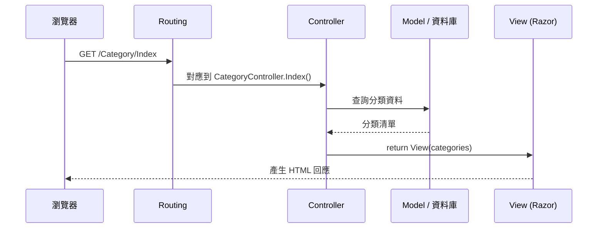

<div class="flex flex-col justify-center items-center h-full" style="background: #ffffff;">
  <p style="color: #5eada0; font-size: 1rem; font-weight: 600; letter-spacing: 0.2em; text-transform: uppercase; margin-bottom: 1.2rem;">ASP.NET Core Masterclass</p>
  <h1 style="color: #1a5c5c; font-size: 3.4rem; font-weight: 900; line-height: 1.15; margin-bottom: 1.5rem;">MVC 基本觀念</h1>
  <div style="height: 4px; width: 320px; background: linear-gradient(90deg, #5eada0, #a7d9d0); border-radius: 2px; margin-bottom: 1.5rem;"></div>
  <p style="color: #4a7c7c; font-size: 1.15rem; font-style: italic;">「各司其職，網站才好維護」</p>
  <Link to="home" style="color: #9dc4c4; font-size: 0.85rem; margin-top: 2rem; text-decoration: none; letter-spacing: 0.05em;">← 返回目錄</Link>
</div>

<!--
大家好，歡迎來到第四章！

前三章我們把環境、C# 語法和 LINQ 都準備好了。從這一章開始，我們要正式進入網站開發。

在動手寫 CRUD 之前，我們要先搞懂一個最重要的架構觀念：MVC。ASP.NET Core 的網站，幾乎都是照著 MVC 的方式來分工的。這一章我們會先了解 MVC 是什麼、檔案怎麼配置、每個角色負責什麼，最後看 ASP.NET Core 是怎麼實作 MVC 的。
-->

---
layout: default
---

# Outline

- **回顧：LINQ 與 IQueryable**
- **4-1 MVC 概觀** — 為什麼需要分工
- **4-2 MVC 檔案配置** — Controllers、Models、Views 放在哪裡
- **4-3 MVC 職責** — 三個角色各自負責什麼
- **4-4 MVC 架構** — 一個請求的完整旅程
- **4-5 .NET 中的 MVC** — Routing、Action、IActionResult、Razor、Tag Helper
- **總結**

<!--
這一章有五個小節，觀念比較多，但每個觀念後面都會有程式碼驗證。學完這一章，下一章我們就能直接動手做 CRUD 了。
-->

---

# 回顧：LINQ 與 IQueryable

| 重點 | 說明 |
| --- | --- |
| Lambda | `p => p.Price < 500`，把條件當作參數傳遞 |
| 常用方法 | `Where`、`Select`、`OrderBy`、`FirstOrDefault`、`Any`、`GroupBy` |
| 延遲執行 | 查詢在使用結果時才執行 |
| IQueryable | 翻譯成 SQL，「條件先串完，最後再 ToList()」 |

<!--
我們先回顧上一章。

LINQ 讓我們用 Lambda 串接 Where、Select、OrderBy 這些方法來查詢資料。查詢是延遲執行的，而 IQueryable 會把查詢翻譯成 SQL 交給資料庫。

上一章我們都在 console 裡查詢，但真正的網站要把查詢結果顯示在網頁上。那「查資料」和「顯示畫面」的程式碼要怎麼分工？這就是今天 MVC 要回答的問題。
-->

---
layout: section
class: flex flex-col justify-center items-center text-center
---

# 4-1 MVC 概觀
### What is MVC?

<!--
第一個小節，我們來看什麼是 MVC。
-->

---

# 什麼是 MVC？

想像一間咖啡店，如果**只有一個人**要負責點餐、煮咖啡、管理庫存、收錢：

| 問題 | 結果 |
| --- | --- |
| 所有工作混在一起 | 忙不過來，容易出錯 |
| 換一種菜單設計 | 整個流程都要重新調整 |
| 新人接手 | 完全不知道從哪裡開始 |

「MVC 是一種設計模式，把程式分成 **Model（資料）**、**View（畫面）**、**Controller（流程控制）** 三個角色，各司其職。」

<!--
我們先想像一間只有一個員工的咖啡店，他要點餐、煮咖啡、管庫存、收錢，全部都自己來。一開始客人少還可以，但客人一多就忙不過來，而且只要換一種菜單設計，整個流程都要重新調整。

早期的網站就是這樣：查資料庫、商業邏輯、HTML 全部寫在同一個檔案裡，一個檔案幾千行，改一個地方很容易影響到其他地方。

「MVC 是一種設計模式，把程式分成 Model、View、Controller 三個角色，各司其職」。就像咖啡店分成點餐櫃台、咖啡師、倉庫管理員，每個人只做自己的事。
-->

---

# MVC 的咖啡店比喻

| 角色 | 咖啡店 | 網站 |
| --- | --- | --- |
| **Controller** | 點餐櫃台店員：接單、分派工作、把咖啡交給客人 | 接收請求、呼叫 Model、選擇 View |
| **Model** | 咖啡豆與配方、倉庫庫存 | 資料與商業規則（`Product`、`Category`） |
| **View** | 杯子與拉花：客人看到的樣子 | 使用者看到的 HTML 畫面 |

<div class="mt-4 p-3 bg-blue-50 border-l-4 border-blue-400 text-gray-700 text-sm text-left">
💡 客人（瀏覽器）只跟<b>櫃台（Controller）</b>打交道，不會直接走進倉庫（Model）。
</div>

<!--
我們把 MVC 對應到咖啡店。

Controller 就像點餐櫃台的店員：接住客人的點單，分派給後面的人處理，最後把做好的咖啡交給客人。Model 是咖啡豆和配方，也就是資料和規則。View 則是杯子和拉花，是客人最後看到的樣子。

重點是：客人只會跟櫃台打交道，不會自己跑進倉庫拿豆子。在網站裡也一樣，瀏覽器的請求一定先到 Controller，由 Controller 決定要查什麼資料、顯示哪個畫面。
-->

---

# 為什麼要用 MVC？

| 好處 | 說明 |
| --- | --- |
| **關注點分離** | 改畫面不用動資料邏輯，改資料邏輯不用動畫面 |
| **分工合作** | 前端設計 View、後端寫 Controller 與 Model，可以同時進行 |
| **容易測試** | Controller 和 Model 可以不透過瀏覽器直接測試 |
| **容易維護** | 出問題時知道要去哪個資料夾找 |

<!--
使用 MVC 有四個好處。

最核心的是關注點分離，英文叫 Separation of Concerns：每個角色只關心自己的事。老闆說要改網頁配色，我們只要改 View；說要改折扣規則，只要改 Model 或 Controller。

分工合作也變得容易，前端工程師可以專心在 View，後端工程師專心在 Controller 和 Model。
-->

---
layout: default
---

# 練習 1：MVC 概觀
### 認證模擬題（單選）

在 MVC 架構中，瀏覽器送出請求後，**最先**接收並處理請求的是哪一個角色？

A. Model，因為要先查詢資料
B. View，因為使用者看到的是畫面
C. Controller，負責接收請求並決定後續流程
D. 資料庫，因為資料都存在資料庫中

<!--
【出題動機】
確認大家記得「客人只跟櫃台打交道」這個比喻。

【解題引導】
回想咖啡店的比喻：客人走進店裡，第一個接觸的是誰？
-->

---
layout: default
---

# 練習 1：解析

**正確答案：C**

| 選項 | 解析 |
| --- | --- |
| A ❌ | Model 由 Controller 呼叫，不直接接收請求 |
| B ❌ | View 是最後產生回應畫面的角色 |
| C ✅ | Controller 就像櫃台店員，接單並分派工作 |
| D ❌ | 資料庫藏在 Model 後面，瀏覽器永遠不會直接接觸 |

<!--
答案是 C。請求一定先到 Controller，由 Controller 決定要呼叫哪個 Model、回傳哪個 View。
-->

---
layout: section
class: flex flex-col justify-center items-center text-center
---

# 4-2 MVC 檔案配置
### Project Structure

<!--
第二個小節，我們打開第一章建立的 MVC 專案，看看 MVC 的三個角色分別放在哪裡。
-->

---

# MVC 專案的資料夾結構

```text
EShop.Web/
├── Controllers/
│   └── HomeController.cs          ← Controller
├── Models/
│   └── ErrorViewModel.cs          ← Model
├── Views/
│   ├── Home/
│   │   ├── Index.cshtml           ← HomeController.Index() 的畫面
│   │   └── Privacy.cshtml
│   ├── Shared/
│   │   ├── _Layout.cshtml         ← 共用版面
│   │   └── _ValidationScriptsPartial.cshtml
│   ├── _ViewImports.cshtml        ← 共用 using 與 Tag Helper
│   └── _ViewStart.cshtml          ← 指定預設 Layout
├── wwwroot/                       ← CSS、JS、圖片、lib（Bootstrap）
└── Program.cs
```

<!--
這是 dotnet new mvc 產生的資料夾結構。

Controllers 資料夾放控制器，Models 放資料模型，Views 放畫面。注意 Views 底下還有一層資料夾，名稱要跟 Controller 對應：HomeController 的畫面就放在 Views/Home 底下。

Shared 資料夾放共用的東西，例如整個網站共用的版面 _Layout。底線開頭的檔案代表它不是一個獨立的頁面，而是被其他頁面引用的。
-->

---

# 命名慣例：Convention over Configuration

| 規則 | 範例 |
| --- | --- |
| Controller 類別名稱以 `Controller` 結尾 | `CategoryController` |
| 網址中省略 `Controller` 字尾 | `/Category/Index` |
| View 資料夾名稱 = Controller 名稱（不含字尾） | `Views/Category/` |
| View 檔名 = Action 方法名稱 | `Index()` → `Views/Category/Index.cshtml` |
| 找不到時，再到 `Views/Shared/` 找 | `Views/Shared/Error.cshtml` |

「ASP.NET Core MVC 用『約定』代替『設定』：只要照著命名規則放檔案，框架就找得到。」

<!--
ASP.NET Core MVC 有一個很重要的設計哲學，叫做 Convention over Configuration，約定優於設定。

意思是：只要我們照著命名規則放檔案，框架就會自動找到對應的東西，不需要另外寫設定。例如 CategoryController 的 Index 方法呼叫 View()，框架就會自動去找 Views/Category/Index.cshtml。

如果找不到，框架會再去 Views/Shared 找。這就是為什麼 Error 頁面放在 Shared 裡，任何 Controller 都可以使用。

新手最常見的錯誤就是檔案放錯位置或名稱打錯，然後出現「找不到 View」的錯誤，這時候先檢查命名規則就對了。
-->

---

# 共用檔案：_Layout、_ViewStart、_ViewImports

| 檔案 | 作用 |
| --- | --- |
| `_Layout.cshtml` | 網站的共用版面（導覽列、頁尾），用 `@RenderBody()` 放入各頁內容 |
| `_ViewStart.cshtml` | 每個 View 執行前先執行，設定預設 Layout |
| `_ViewImports.cshtml` | 所有 View 共用的 `@using` 與 `@addTagHelper` |

```razor
@* Views/_ViewStart.cshtml *@
@{
    Layout = "_Layout";
}
```

<!--
Views 資料夾裡有三個特殊的共用檔案。

_Layout 是整個網站的共用版面，導覽列和頁尾都寫在這裡，每一頁的內容會被放到 RenderBody 的位置。就像咖啡店的杯子都印著一樣的 Logo，只有裡面的咖啡不同。

_ViewStart 會在每個 View 執行之前先執行，通常只做一件事：指定 Layout。_ViewImports 則是放所有 View 共用的 using，這樣每個 View 就不用重複寫。
-->

---
layout: default
---

# 練習 2：新增一個頁面
### 任務說明

在第一章建立的專案中：

1. 在 `HomeController` 新增一個 `About()` Action
2. 依照命名慣例，建立對應的 View 檔案
3. 在 View 中顯示「關於 EShop 咖啡豆商店」
4. 瀏覽 `/Home/About` 確認頁面正常顯示，並且有共用的導覽列

<!--
【練習目的】
實際體驗 Convention over Configuration。

【解題引導】
About 這個 Action 的 View 檔案要放在哪個資料夾、叫什麼名字？為什麼頁面會自動有導覽列？
-->

---
layout: default
---

# 練習 2：解題提示

```csharp
// Controllers/HomeController.cs
public IActionResult About()
{
    return View();       // 自動找 Views/Home/About.cshtml
}
```

```razor
@* Views/Home/About.cshtml *@
@{
    ViewData["Title"] = "關於我們";
}
<h1>關於 EShop 咖啡豆商店</h1>
```

<!--
View 檔案要放在 Views/Home/About.cshtml。頁面會自動有導覽列，是因為 _ViewStart 已經幫所有 View 指定了 _Layout。

ViewData Title 會被 _Layout 讀取，顯示在瀏覽器的分頁標題上。
-->

---
layout: section
class: flex flex-col justify-center items-center text-center
---

# 4-3 MVC 職責
### Responsibilities

<!--
第三個小節，我們來看 Model、View、Controller 三個角色各自應該負責什麼，以及「不應該」做什麼。
-->

---

# Model：資料與商業規則

「Model 負責描述資料的**形狀**與**規則**。」

```csharp
namespace EShop.Web.Models;

public class Category
{
    public int Id { get; set; }

    [Required(ErrorMessage = "分類名稱為必填")]
    [MaxLength(30)]
    public string Name { get; set; } = "";

    [Range(1, 100, ErrorMessage = "顯示順序必須介於 1 到 100")]
    public int DisplayOrder { get; set; }
}
```

<!--
Model 負責描述資料的形狀和規則。

這個 Category 類別描述了「分類」有哪些資料：編號、名稱、顯示順序。上面的中括號叫 Data Annotation，用來描述規則：名稱必填、最多 30 個字、顯示順序要在 1 到 100 之間。

這些規則寫在 Model 上，不管是從哪個頁面新增或修改分類，都會套用同樣的規則。下一章我們就會用這個 Category 做第一個 CRUD。
-->

---

# Controller：接收請求、協調流程

「Controller 負責**接住請求**、**呼叫 Model**、**決定回應**。」

```csharp
public class CategoryController : Controller
{
    public IActionResult Index()
    {
        List<Category> categories =
        [
            new() { Id = 1, Name = "單品咖啡豆", DisplayOrder = 1 },
            new() { Id = 2, Name = "精品咖啡豆", DisplayOrder = 2 },
        ];
        return View(categories);     // 把資料交給 View
    }
}
```

<!--
Controller 就像櫃台店員：接住請求、協調流程、決定回應。

CategoryController 繼承 Controller 這個基底類別，裡面每一個 public 方法都叫做 Action，對應一個網址。Index 這個 Action 準備好分類資料，然後呼叫 View 並把資料傳進去。

現在我們先用寫死的 List 當作資料，下一章會換成從資料庫查詢。
-->

---

# View：呈現畫面

「View 負責把 Controller 給的資料，**呈現**成 HTML。」

```razor
@model List<Category>

<h2>商品分類</h2>
<table class="table">
    @foreach (var c in Model)
    {
        <tr>
            <td>@c.Name</td>
            <td>@c.DisplayOrder</td>
        </tr>
    }
</table>
```

<!--
View 負責呈現畫面。

第一行 @model 宣告這個 View 接收的資料型別，要跟 Controller 傳進來的一致。接著就可以用 Model 這個屬性取得資料，搭配 C# 的 foreach 產生表格的每一列。

小老鼠符號是 Razor 語法，代表「這裡開始是 C#」。HTML 和 C# 可以混在一起寫，Razor 引擎會把它轉成純 HTML 送給瀏覽器。
-->

---

# 三個角色的職責邊界

| 角色 | ✅ 應該做 | ❌ 不應該做 |
| --- | --- | --- |
| **Model** | 定義資料欄位、驗證規則 | 知道 HTTP、畫面長什麼樣子 |
| **Controller** | 接收參數、呼叫資料存取、選擇 View | 寫大量 HTML、塞滿商業邏輯 |
| **View** | 顯示資料、表單 | 查詢資料庫、計算商業邏輯 |

<div class="mt-4 p-3 bg-blue-50 border-l-4 border-blue-400 text-gray-700 text-sm text-left">
💡 <b>經驗法則：</b>View 裡的 C# 只做「顯示」相關的事，例如 <code>foreach</code>、<code>if</code>、格式化；Controller 保持「薄」，複雜邏輯交給 Service 或 Repository（第 7 章）。
</div>

<!--
知道每個角色該做什麼，更要知道它們「不應該」做什麼。

Model 不應該知道 HTTP 或畫面；Controller 不應該寫一大堆 HTML，也不應該塞滿商業邏輯；View 絕對不應該直接查資料庫。

常見的壞味道是 Controller 越長越胖，一個 Action 幾百行。第七章我們會學分層架構，把資料存取抽到 Repository，讓 Controller 保持精簡。
-->

---
layout: default
---

# 練習 3：判斷職責
### 認證模擬題（單選）

下列哪一個做法**符合** MVC 的職責分工？

A. 在 View 中直接建立資料庫連線，查詢商品資料
B. 在 Model 中根據使用者瀏覽器種類，產生不同的 HTML
C. Controller 接收查詢參數，取得資料後交給 View 顯示
D. 在 Controller 中用字串組合出整頁 HTML 回傳

<!--
【出題動機】
用具體的反例，確認大家理解職責邊界。

【解題引導】
一個一個對照上一頁的「不應該做」欄位。
-->

---
layout: default
---

# 練習 3：解析

**正確答案：C**

| 選項 | 違反的職責 |
| --- | --- |
| A ❌ | View 不應該查詢資料庫 |
| B ❌ | Model 不應該知道 HTTP 與畫面 |
| C ✅ | Controller 協調流程，View 負責顯示 |
| D ❌ | Controller 不應該產生 HTML，這是 View 的工作 |

<!--
答案是 C。這就是 MVC 最標準的流程：Controller 接收參數、取得資料、交給 View 顯示。
-->

---
layout: section
class: flex flex-col justify-center items-center text-center
---

# 4-4 MVC 架構
### Request Flow

<!--
第四個小節，我們把三個角色串起來，看一個請求在 MVC 架構裡的完整旅程。
-->

---

# 一個請求的完整旅程



<!--
我們用序列圖看一個請求的完整旅程。

瀏覽器送出 GET /Category/Index，第一章學的 Routing Middleware 會根據網址找到 CategoryController 的 Index 方法。Controller 向 Model 查詢分類資料，拿到資料後呼叫 View，並把資料傳進去。最後 Razor 引擎把 View 轉成 HTML，回傳給瀏覽器。

這張圖把第一章的生命週期和這一章的 MVC 串在一起了：Middleware Pipeline 的終點，就是這裡的 Controller。
-->

---

# 資料的流向

| 步驟 | 資料從哪裡來 | 到哪裡去 | 機制 |
| --- | --- | --- | --- |
| ① | 瀏覽器網址、表單 | Controller 參數 | **Model Binding** |
| ② | Controller | Model / 資料庫 | 呼叫方法（第 5 章 EF Core） |
| ③ | Controller | View | `View(model)`、`ViewData`、`ViewBag`、`TempData` |
| ④ | View | 瀏覽器 | Razor 產生 HTML |

<!--
我們再從資料的角度看一次。

第一步，瀏覽器的資料透過 Model Binding 自動轉成 Controller 的參數，例如網址上的 id。第二步，Controller 呼叫資料存取的程式。第三步，Controller 把資料傳給 View，最主要的方式是 View(model)，另外還有 ViewData、ViewBag、TempData，第五章和第八章會介紹。第四步，View 產生 HTML 回給瀏覽器。
-->

---

# 補充：MVC vs 三層式架構

| | MVC | 三層式架構 |
| --- | --- | --- |
| 關注的問題 | **展示層**怎麼分工 | **整個系統**怎麼分層 |
| 分層 | Model / View / Controller | 展示層 / 商業邏輯層 / 資料存取層 |
| 關係 | MVC 是三層式架構中「展示層」的實作方式 | — |

<div class="mt-4 p-3 bg-blue-50 border-l-4 border-blue-400 text-gray-700 text-sm text-left">
💡 第 7 章我們會把專案拆成 <code>EShop.Web</code>（展示層，MVC）、<code>EShop.DataAccess</code>（資料存取層）、<code>EShop.Models</code>（模型）。
</div>

<!--
補充一個很常被搞混的觀念：MVC 和三層式架構有什麼不同？

MVC 關注的是展示層怎麼分工，三層式架構關注的是整個系統怎麼分層。它們不是互斥的，MVC 可以看成是三層式架構中「展示層」的實作方式。

第七章我們會把專案拆成多個專案，到時候就能清楚看到兩者是怎麼搭配的。
-->

---
layout: default
---

# 練習 4：畫出請求流程
### 任務說明

使用者在瀏覽器輸入 `/Category/Details/3`，請依序寫出：

1. 哪個 Controller 的哪個 Action 會被執行？
2. `3` 這個值會怎麼傳進 Action？
3. Action 取得資料後，會找哪一個 View 檔案？
4. 最後瀏覽器收到的是什麼？

<!--
【練習目的】
把 Routing、Model Binding、View 查找、HTML 回應串成一條完整的流程。

【解題引導】
預設的路由樣板是 {controller=Home}/{action=Index}/{id?}，對照一下網址的每一段。
-->

---
layout: default
---

# 練習 4：解題提示

| 步驟 | 答案 |
| --- | --- |
| 1 | `CategoryController.Details()` |
| 2 | 路由樣板的 `{id?}` 對應到參數 `int id`（Model Binding） |
| 3 | `Views/Category/Details.cshtml` |
| 4 | Razor 產生的 HTML |

```csharp
public IActionResult Details(int id)   // id = 3
{
    // 依 id 找出分類，交給 View
    return View(category);
}
```

<!--
網址的三段分別對應 controller、action 和 id。參數名稱要跟路由樣板的 id 一樣，Model Binding 才會自動接住這個值。
-->

---
layout: section
class: flex flex-col justify-center items-center text-center
---

# 4-5 .NET 中的 MVC
### ASP.NET Core MVC

<!--
最後一個小節，我們來看 ASP.NET Core 是怎麼實作 MVC 的，包括路由、Action、IActionResult、Razor 語法和 Tag Helper。
-->

---

# 在 ASP.NET Core 中啟用 MVC

```csharp
var builder = WebApplication.CreateBuilder(args);

builder.Services.AddControllersWithViews();   // ① 註冊 MVC 服務

var app = builder.Build();

app.UseRouting();
app.MapStaticAssets();
app.MapControllerRoute(                       // ② 設定路由樣板
    name: "default",
    pattern: "{controller=Home}/{action=Index}/{id?}")
    .WithStaticAssets();

app.Run();
```

<!--
我們回到 Program.cs，看看 MVC 是怎麼被啟用的。

只需要兩個步驟：第一，在服務註冊階段呼叫 AddControllersWithViews，把 MVC 需要的服務都註冊進去；第二，在 Pipeline 階段呼叫 MapControllerRoute，設定路由樣板。

這就是第一章說的「先註冊服務，再設定 Pipeline」。
-->

---

# 什麼是路由（Routing）？

「路由就是決定『這個網址要交給哪個 Controller 的哪個 Action 處理』。」

| 網址 | Controller | Action | id |
| --- | --- | --- | --- |
| `/` | `Home`（預設） | `Index`（預設） | — |
| `/Category` | `Category` | `Index`（預設） | — |
| `/Category/Edit/5` | `Category` | `Edit` | `5` |

<div class="mt-4 p-3 bg-blue-50 border-l-4 border-blue-400 text-gray-700 text-sm text-left">
💡 樣板 <code>{controller=Home}/{action=Index}/{id?}</code>：等號後面是預設值，問號代表可省略。
</div>

<!--
路由就像咖啡店的點餐單號碼，決定這張單要交給哪個櫃台處理。

預設樣板有三段：controller、action、id。等號後面是預設值，所以只輸入網域的時候，會執行 Home 的 Index；問號代表 id 可以省略。
-->

---

# 補充：Attribute Routing

除了路由樣板，也可以直接在 Controller / Action 上標註路由：

```csharp
[Route("menu")]
public class MenuController : Controller
{
    [HttpGet("")]                 // GET /menu
    public IActionResult Index() => View();

    [HttpGet("{id:int}")]         // GET /menu/5（id 必須是整數）
    public IActionResult Detail(int id) => View();
}
```

| 使用時機 | 建議 |
| --- | --- |
| MVC 網站頁面 | 慣例路由（`MapControllerRoute`） |
| Web API | Attribute Routing |

<!--
補充一下另一種路由方式：Attribute Routing，直接在 Controller 或 Action 上用中括號標註路由。

它的好處是網址可以完全自訂，也可以加上型別限制，例如 id 冒號 int，代表 id 一定要是整數。

一般來說，MVC 網站用慣例路由，Web API 用 Attribute Routing。這門課以慣例路由為主，第八章寫 DataTable 的 API 時會用到一點 Attribute Routing。
-->

---

# Action 與 IActionResult

「Action 是 Controller 中處理請求的 public 方法，回傳 `IActionResult` 代表『要怎麼回應』。」

| 回傳方法 | 回應內容 | 使用時機 |
| --- | --- | --- |
| `View()` / `View(model)` | HTML 頁面 | 顯示頁面 |
| `RedirectToAction("Index")` | 302 轉址 | 新增、修改、刪除成功後 |
| `NotFound()` | 404 | 找不到資料 |
| `Json(data)` / `Ok(data)` | JSON | 提供 API 給前端（DataTable） |
| `BadRequest()` | 400 | 參數錯誤 |

<!--
Controller 裡的 public 方法叫 Action，回傳型別通常是 IActionResult，代表「要怎麼回應這個請求」。

最常用的是 View，回傳 HTML 頁面；RedirectToAction 是轉址，新增資料成功之後，我們會轉回列表頁；NotFound 回傳 404；Json 回傳 JSON 資料。

這幾個方法下一章的 CRUD 會全部用到。
-->

---

# 在 ASP.NET Core 中練習 IActionResult

```csharp
public class CategoryController : Controller
{
    private static readonly List<Category> _data =
    [
        new() { Id = 1, Name = "單品咖啡豆", DisplayOrder = 1 },
        new() { Id = 2, Name = "精品咖啡豆", DisplayOrder = 2 },
    ];

    public IActionResult Index() => View(_data);

    public IActionResult Details(int id)
    {
        var category = _data.FirstOrDefault(c => c.Id == id);
        if (category is null) return NotFound();
        return View(category);
    }

    public IActionResult Api() => Json(_data);
}
```

<!--
我們把 IActionResult 實際用一次。

Index 回傳 View，顯示所有分類。Details 用上一章學的 FirstOrDefault 找出分類，找不到就回傳 NotFound，找到就回傳 View。Api 則把資料轉成 JSON 回傳。

大家可以試試看瀏覽 /Category/Details/99，會看到 404；瀏覽 /Category/Api，會看到 JSON。

這裡用 static 的 List 模擬資料，下一章換成資料庫。
-->

---

# 什麼是 Razor？

「Razor 是在 HTML 中嵌入 C# 的語法，用 `@` 切換到 C#。」

| 語法 | 用途 | 範例 |
| --- | --- | --- |
| `@變數` | 輸出值（自動 HTML 編碼） | `@Model.Name` |
| `@( 運算式 )` | 輸出運算結果 | `@(item.Price * 0.9m)` |
| `@{ ... }` | C# 程式區塊 | `@{ var total = 0; }` |
| `@if` / `@foreach` | 條件與迴圈 | `@foreach (var c in Model)` |
| `@model` | 宣告 View 的 Model 型別 | `@model List<Category>` |
| `@* ... *@` | Razor 註解 | 不會輸出到 HTML |

<!--
Razor 是 ASP.NET Core 的 View 引擎，讓我們在 HTML 裡嵌入 C#。規則很簡單：看到小老鼠，就是切換到 C#。

@ 加變數會輸出值，而且會自動做 HTML 編碼，防止 XSS 攻擊。複雜的運算要用小括號包起來。@ 加大括號是一段 C# 程式區塊。@if 和 @foreach 是最常用的條件和迴圈。

Razor 註解是 @星號，它跟 HTML 註解不同，不會出現在瀏覽器的原始碼裡。
-->

---
zoom: 0.95
---

# 什麼是 Tag Helper？

「Tag Helper 讓 C# 程式碼以 HTML 屬性的形式出現，最常用的是 `asp-` 開頭的屬性。」

```razor
@model Category

<a asp-controller="Category" asp-action="Edit" asp-route-id="@Model.Id">編輯</a>

<form asp-action="Create" method="post">
    <input asp-for="Name" class="form-control" />
    <span asp-validation-for="Name" class="text-danger"></span>
    <button type="submit" class="btn btn-primary">新增</button>
</form>
```

| Tag Helper | 產生結果 |
| --- | --- |
| `asp-action` / `asp-route-id` | `href="/Category/Edit/1"` |
| `asp-for="Name"` | `id="Name" name="Name" value="..."`，並依 Data Annotation 加上驗證屬性 |
| `asp-validation-for` | 顯示該欄位的驗證錯誤訊息 |

<!--
Tag Helper 是 ASP.NET Core 的一大特色，讓我們用看起來像 HTML 屬性的方式寫 C#。

asp-controller、asp-action、asp-route-id 會自動產生正確的網址，就算之後路由規則改了，連結也會跟著變。asp-for 會根據 Model 的屬性自動產生 id、name 和 value，還會根據 Data Annotation 加上前端驗證。asp-validation-for 則顯示驗證錯誤訊息。

跟手寫網址和 name 屬性比起來，Tag Helper 有編譯時期的檢查，屬性名稱打錯會直接報錯。下一章寫表單的時候會大量使用。
-->

---

# 使用 ASP.NET Core MVC 的注意事項

| 注意事項 | 說明 |
| --- | --- |
| **之一：View 找不到** | 檢查資料夾與檔名是否符合 `Views/{Controller}/{Action}.cshtml` |
| **之二：@model 型別要一致** | Controller 傳 `List<Category>`，View 就要宣告 `@model List<Category>` |
| **之三：Tag Helper 要註冊** | `_ViewImports.cshtml` 需有 `@addTagHelper *, Microsoft.AspNetCore.Mvc.TagHelpers` |

<!--
ASP.NET Core MVC 的注意事項有三個。

之一，最常見的錯誤就是找不到 View，錯誤訊息會列出框架搜尋過的路徑，對照一下就知道哪裡放錯了。

之二，@model 宣告的型別要跟 Controller 傳進來的一致，否則會出現型別轉換錯誤。

之三，Tag Helper 要在 _ViewImports 裡註冊才會生效。範本已經幫我們加好了，但如果自己新建 Area，第七章會遇到，要記得複製一份。
-->

---
layout: default
---

# 練習 5：咖啡菜單頁
### 任務說明

1. 建立 `MenuItem` Model：`Id`、`Name`、`Price`
2. 建立 `MenuController`，用 static List 模擬 3 筆資料
3. `Index` 顯示菜單表格，每一列有「詳細」連結（使用 Tag Helper）
4. `Details(int id)`：找不到回傳 `NotFound()`，找到顯示名稱與價格
5. 價格 ≥ 150 元的品項，在畫面上加上「⭐ 招牌」標記（在 View 中用 `@if`）

<!--
【練習目的】
把 Model、Controller、View、Routing、IActionResult、Razor、Tag Helper 全部用一次。

【解題引導】
詳細連結要用 asp-action 和 asp-route-id。招牌標記是「顯示」相關的判斷，可以放在 View 裡。
-->

---
layout: default
---

# 練習 5：解題提示

```razor
@* Views/Menu/Index.cshtml *@
@model List<MenuItem>

<table class="table">
    @foreach (var item in Model)
    {
        <tr>
            <td>
                @item.Name
                @if (item.Price >= 150) { <span class="badge bg-warning">⭐ 招牌</span> }
            </td>
            <td>@item.Price.ToString("N0") 元</td>
            <td><a asp-action="Details" asp-route-id="@item.Id">詳細</a></td>
        </tr>
    }
</table>
```

<!--
在 foreach 裡面用 @if 判斷價格，符合就輸出一個 Bootstrap 的 badge。這種「根據資料決定怎麼顯示」的邏輯，放在 View 裡是合理的。

asp-action 沒有指定 controller 的時候，預設就是目前的 Controller，所以會產生 /Menu/Details/1 這樣的連結。
-->

---
layout: default
---

# 綜合練習：咖啡店分類瀏覽
### 任務說明

完成一個「分類 → 商品」的兩層瀏覽功能（資料用 static List 模擬）：

1. Model：`Category`（Id、Name）、`Product`（Id、Name、Price、CategoryId）
2. `/Shop` 顯示所有分類，點擊分類進入 `/Shop/Category/{id}`
3. `/Shop/Category/{id}` 用 LINQ 篩選該分類的商品，依價格排序顯示
4. 分類不存在時回傳 `NotFound()`；分類下沒有商品時，View 顯示「此分類尚無商品」
5. 所有頁面共用 `_Layout`，並在導覽列加入「商店」連結

<!--
【練習目的】
整合 MVC 三個角色、路由、LINQ 查詢與 Razor 條件顯示。這也是第八章前台首頁的雛形。

【解題引導】
Category Action 需要回傳分類名稱和商品清單兩種資料，可以先用 ViewData 傳分類名稱，第八章會學更好的 ViewModel 寫法。導覽列在 Views/Shared/_Layout.cshtml。
-->

---
layout: default
---

# 綜合練習：解題提示

```csharp
public class ShopController : Controller
{
    public IActionResult Index() => View(Data.Categories);

    public IActionResult Category(int id)
    {
        var category = Data.Categories.FirstOrDefault(c => c.Id == id);
        if (category is null) return NotFound();

        ViewData["CategoryName"] = category.Name;
        var products = Data.Products
            .Where(p => p.CategoryId == id)
            .OrderBy(p => p.Price)
            .ToList();
        return View(products);
    }
}
```

<!--
Category 這個 Action 先確認分類存在，再用 LINQ 篩選商品。分類名稱先用 ViewData 傳給 View。

View 裡面可以用 if (Model.Count == 0) 或 !Model.Any() 判斷有沒有商品。

Data 是自己寫的一個 static 類別，放模擬資料。下一章開始，這些資料就會換成資料庫了。
-->

---

# 總結

| 小節 | 重點 |
| --- | --- |
| 4-1 MVC 概觀 | Model（資料）、View（畫面）、Controller（流程），關注點分離 |
| 4-2 檔案配置 | `Views/{Controller}/{Action}.cshtml`，約定優於設定 |
| 4-3 MVC 職責 | Controller 保持精簡、View 不查資料庫、Model 不管畫面 |
| 4-4 MVC 架構 | 請求 → Routing → Controller → Model → View → HTML |
| 4-5 .NET 中的 MVC | `AddControllersWithViews`、路由樣板、`IActionResult`、Razor `@`、Tag Helper `asp-` |

下一章我們會介紹 **CRUD 實作練習**，用 Entity Framework Core 連線資料庫，完成分類管理的新增、查詢、修改、刪除。

<!--
我們來總結這一章。

MVC 把程式分成三個角色，各司其職。ASP.NET Core 用約定優於設定，只要照命名規則放檔案，框架就找得到。一個請求會經過 Routing 找到 Controller，Controller 取得資料後交給 View，View 用 Razor 產生 HTML。

這一章的資料都是用 static List 模擬的，重新啟動網站資料就不見了。下一章我們會介紹 Entity Framework Core，把資料存到真正的資料庫，並完成第一個完整的 CRUD 功能。
-->

---
layout: end
---

# 第 4 章結束
### 下一章：CRUD 實作練習
