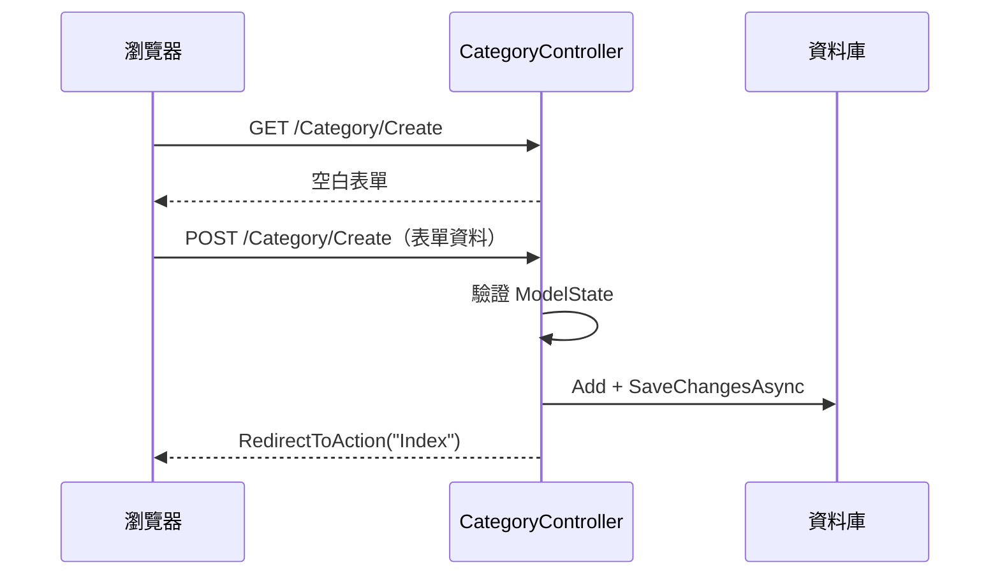

<div class="flex flex-col justify-center items-center h-full" style="background: #ffffff;">
  <p style="color: #5eada0; font-size: 1rem; font-weight: 600; letter-spacing: 0.2em; text-transform: uppercase; margin-bottom: 1.2rem;">ASP.NET Core Masterclass</p>
  <h1 style="color: #1a5c5c; font-size: 3.4rem; font-weight: 900; line-height: 1.15; margin-bottom: 1.5rem;">CRUD 實作練習</h1>
  <div style="height: 4px; width: 320px; background: linear-gradient(90deg, #5eada0, #a7d9d0); border-radius: 2px; margin-bottom: 1.5rem;"></div>
  <p style="color: #4a7c7c; font-size: 1.15rem; font-style: italic;">「新增、查詢、修改、刪除，網站的四個基本動作」</p>
  <Link to="home" style="color: #9dc4c4; font-size: 0.85rem; margin-top: 2rem; text-decoration: none; letter-spacing: 0.05em;">← 返回目錄</Link>
</div>

<!--
大家好，歡迎來到第五章！

上一章我們認識了 MVC，也用 static List 模擬資料做了幾個頁面。但 static List 有個大問題：網站一重新啟動，資料就全部不見了。

這一章我們要把資料存到真正的資料庫。我們會使用 Entity Framework Core，也就是 EF Core，讓我們用 C# 類別和上一章學的 LINQ 操作資料庫，不用手寫 SQL。

我們會從建立專案開始，一路完成「商品分類」的新增、查詢、修改、刪除，也就是 CRUD。最後再加上 Toastr 通知，讓使用者操作完之後，右上角會跳出「新增成功」的提示。這一章做完，EShop 就正式有後台功能了。
-->

---
layout: default
---

# Outline

- **回顧：MVC 的分工**
- **5-1 創建 MVC 專案**
- **5-2 建立 Model & 連線資料庫（EF Core）**
- **5-3 Read 查看資料**
- **5-4 Create 新增資料**
- **5-5 Edit 編輯資料**
- **5-6 Delete 刪除資料**
- **5-7 TempData & Toastr 通知整合**
- **EShop 專案實作** — 第 5 步：分類管理與名稱不可重複
- **總結**

<!--
這一章有七個小節，是一個完整的實作章節。

前兩節是準備工作：建立專案、連上資料庫。中間四節就是 CRUD 的四個動作。最後一節加上操作成功的通知。

每一節的程式碼都會接續上一節，所以大家要跟著做，不要跳過任何一步。

最後的 EShop 專案實作，我們會把分類管理做進 EShop，並從程式和資料庫兩個層面確保分類名稱不重複。
-->

---

# 回顧：MVC 的分工

| 角色 | 職責 | 上一章的寫法 |
| --- | --- | --- |
| Model | 資料的形狀與規則 | `Category` + Data Annotation |
| Controller | 接收請求、取得資料、選擇 View | `return View(_data);` |
| View | 用 Razor 把資料呈現成 HTML | `@model List<Category>` + `@foreach` |

「上一章的資料存在 static List 裡，網站一重啟就消失。」

<!--
我們先回顧上一章。

MVC 把程式分成三個角色：Model 描述資料，Controller 協調流程，View 呈現畫面。上一章的 Controller 是從 static List 取得資料，這只是模擬，網站重新啟動資料就不見了，而且沒辦法新增或修改。

這一章我們要把資料來源換成真正的資料庫。
-->

---
layout: section
class: flex flex-col justify-center items-center text-center
---

# 5-1 創建 MVC 專案
### Create the EShop Solution

<!--
第一個小節，我們建立整門課會一路使用的 EShop 專案。
-->

---

# 在 ASP.NET Core 中建立方案與專案

```bash
mkdir EShop && cd EShop
dotnet new sln -n EShop                  # 建立方案（.NET 10 預設產生 EShop.slnx）
dotnet new mvc -n EShop.Web              # 建立 MVC 專案
dotnet sln add EShop.Web                 # 把專案加入方案
code .
```

| 名詞 | 說明 |
| --- | --- |
| **方案（Solution）** | 裝多個專案的容器，第 7 章會加入更多專案 |
| **專案（Project）** | 一個可以編譯的單位，例如 `EShop.Web` |
| **`.slnx`** | .NET 10 預設的新版方案格式，XML 寫法更精簡 |

<!--
我們先建立一個叫 EShop 的方案，再建立 EShop.Web 這個 MVC 專案，然後把專案加入方案。

方案就像一個資料夾，可以裝很多個專案。現在只有一個 Web 專案，第七章做分層架構的時候，我們會再加入 Models、DataAccess 等專案，到時候方案的用處就出來了。

.NET 10 的 dotnet new sln 預設會產生 .slnx 格式，這是新的方案格式，比舊的 .sln 好讀很多。VS Code 的 C# Dev Kit 和 Visual Studio 都支援。
-->

---

# 調整共用版面：加入導覽連結

```razor
@* Views/Shared/_Layout.cshtml（導覽列的部分） *@
<ul class="navbar-nav flex-grow-1">
    <li class="nav-item">
        <a class="nav-link text-dark" asp-controller="Home" asp-action="Index">首頁</a>
    </li>
    <li class="nav-item">
        <a class="nav-link text-dark" asp-controller="Category" asp-action="Index">分類管理</a>
    </li>
</ul>
```

<div class="mt-4 p-3 bg-blue-50 border-l-4 border-blue-400 text-gray-700 text-sm text-left">
💡 範本已內建 <b>Bootstrap 5</b>，可以直接使用 <code>table</code>、<code>btn</code>、<code>form-control</code> 等 class。
</div>

<!--
專案建好之後，我們打開共用版面 _Layout.cshtml，在導覽列加一個「分類管理」的連結，指向等一下要建立的 CategoryController。

範本已經幫我們放好 Bootstrap 5，所以後面的表格、按鈕、表單都可以直接用 Bootstrap 的 class，不用自己寫 CSS。
-->

---
layout: default
---

# 練習 1：建立 EShop 方案
### 任務說明

1. 建立 `EShop` 方案與 `EShop.Web` MVC 專案
2. 在導覽列加入「分類管理」連結
3. 把網站標題（`_Layout.cshtml` 中的 `navbar-brand`）改為「EShop 咖啡豆商店」
4. 執行 `dotnet watch`，確認導覽列正確顯示

<!--
【練習目的】
建立後續章節都會使用的專案骨架。

【操作提示】
點「分類管理」現在會出現 404，因為 CategoryController 還沒建立，這是正常的。
-->

---
layout: default
---

# 練習 1：解題提示

```bash
dotnet new sln -n EShop
dotnet new mvc -n EShop.Web
dotnet sln add EShop.Web
cd EShop.Web && dotnet watch
```

```razor
<a class="navbar-brand" asp-controller="Home" asp-action="Index">EShop 咖啡豆商店</a>
```

<!--
navbar-brand 就是導覽列最左邊的網站名稱。改完存檔，dotnet watch 會自動重新載入。
-->

---
layout: section
class: flex flex-col justify-center items-center text-center
---

# 5-2 建立 Model & 連線資料庫
### Entity Framework Core

<!--
第二個小節，我們要建立 Category Model，並用 EF Core 連上資料庫。
-->

---

# 什麼是 EF Core？

想像我們要跟一位只會說 SQL 的倉庫管理員溝通：

| 沒有 EF Core | 有 EF Core |
| --- | --- |
| 自己寫 `SELECT * FROM Categories WHERE ...` | `db.Categories.Where(c => ...)` |
| 自己把查詢結果一欄一欄轉成物件 | 自動轉成 `Category` 物件 |
| 手動建立資料表 | 用 Migration 從 C# 類別產生資料表 |

「EF Core 是微軟官方的 **ORM（物件關聯對應）** 框架，讓我們用 C# 類別與 LINQ 操作資料庫。」

<!--
我們先想像一個情境：倉庫管理員只會說 SQL，我們每次要拿資料都要用 SQL 跟他溝通，拿回來的資料還要自己一欄一欄整理成物件。

EF Core 就像一位翻譯：我們用 C# 和 LINQ 說話，它幫我們翻譯成 SQL 交給資料庫，再把結果轉回 C# 物件。

「EF Core 是 ORM 框架」，ORM 全名是 Object-Relational Mapping，物件關聯對應，意思是把資料庫的「表」對應到 C# 的「類別」，把表裡的「一列資料」對應到一個「物件」。

第三章學的 IQueryable，就是 EF Core 在背後把 LINQ 翻譯成 SQL。
-->

---

# EF Core 的核心角色

| 角色 | 說明 | 對應資料庫 |
| --- | --- | --- |
| **Entity（實體）** | 一般的 C# 類別，例如 `Category` | 資料表 |
| **DbContext** | 與資料庫溝通的窗口，管理連線與變更追蹤 | 資料庫 |
| **`DbSet<T>`** | 某一種實體的集合，可以用 LINQ 查詢 | 某一張資料表 |
| **Migration** | 記錄 Model 變更，產生建表 / 改表的指令 | 資料表結構版本 |

<!--
EF Core 有四個核心角色。

Entity 就是一般的 C# 類別，對應一張資料表。DbContext 是跟資料庫溝通的窗口，對應整個資料庫。DbSet 是某一種實體的集合，對應一張資料表，我們就是對 DbSet 下 LINQ 查詢。Migration 則是資料表結構的版本紀錄，每次 Model 改了，就產生一個新的 Migration 來更新資料表。
-->

---

# Step 1：安裝 EF Core 套件與工具

```bash
dotnet add package Microsoft.EntityFrameworkCore.SqlServer
dotnet add package Microsoft.EntityFrameworkCore.Design
dotnet tool install --global dotnet-ef
```

| 套件 / 工具 | 用途 |
| --- | --- |
| `Microsoft.EntityFrameworkCore.SqlServer` | SQL Server 的資料庫提供者 |
| `Microsoft.EntityFrameworkCore.Design` | 設計階段工具，Migration 需要 |
| `dotnet-ef` | 命令列工具：`dotnet ef migrations add`、`dotnet ef database update` |

<!--
第一步，安裝 EF Core 的套件。

SqlServer 套件讓 EF Core 可以連 SQL Server；Design 套件是 Migration 需要的設計工具；dotnet-ef 是命令列工具，安裝一次之後，所有專案都可以使用。

套件版本會自動抓最新的 10.x 版，跟我們的 .NET 10 相符。
-->

---

# Step 2：準備 SQL Server

| 環境 | 建議做法 | 連線字串的 Server |
| --- | --- | --- |
| Windows | SQL Server Express / LocalDB | `(localdb)\\mssqllocaldb` |
| macOS / Linux / Windows | Docker 容器 | `localhost,1433` |

```bash
docker run -e "ACCEPT_EULA=Y" -e "MSSQL_SA_PASSWORD=EShop@2026Pass" \
  -p 1433:1433 --name eshop-sql -d mcr.microsoft.com/mssql/server:2022-latest
```

<div class="mt-4 p-3 bg-blue-50 border-l-4 border-blue-400 text-gray-700 text-sm text-left">
💡 SA 密碼需包含大小寫、數字與符號且至少 8 碼，否則容器會啟動失敗。
</div>

<!--
第二步，準備資料庫。

用 Windows 的同學，最簡單的是安裝 SQL Server Express，裡面附帶 LocalDB。用 Mac 或 Linux 的同學，建議用 Docker 跑 SQL Server，一行指令就能啟動。

注意 SA 密碼有複雜度要求，太簡單的話容器會啟動後馬上停止，可以用 docker logs eshop-sql 看錯誤訊息。
-->

---
class: code-sm
---

# Step 3：設定連線字串

```json
// appsettings.json
{
  "ConnectionStrings": {
    "DefaultConnection": "Server=localhost,1433;Database=EShop;User Id=sa;Password=EShop@2026Pass;TrustServerCertificate=True"
  },
  "Logging": {
    "LogLevel": {
      "Default": "Information",
      "Microsoft.AspNetCore": "Warning",
      "Microsoft.EntityFrameworkCore.Database.Command": "Information"
    }
  }
}
```

<div class="mt-4 p-3 bg-blue-50 border-l-4 border-blue-400 text-gray-700 text-sm text-left">
💡 最後一行 Logging 設定會把 EF Core 產生的 SQL 印在 console，方便我們觀察第 3 章學的 LINQ 翻譯。實際專案的密碼請改用 <code>dotnet user-secrets</code> 或環境變數保存。
</div>

<!--
第三步，在 appsettings.json 設定連線字串。

ConnectionStrings 底下的 DefaultConnection 是我們自己取的名稱，等一下 Program.cs 會用這個名稱讀取。Database=EShop 是資料庫名稱，還不存在也沒關係，等一下 Migration 會幫我們建立。TrustServerCertificate=True 是因為本機的 SQL Server 用的是自簽憑證。

我特別加了一行 Logging 設定，讓 EF Core 把產生的 SQL 印在 console。這樣大家就能親眼看到，第三章說的「LINQ 被翻譯成 SQL」是真的。

提醒一下，密碼寫在 appsettings.json 只適合練習，實際專案要用 user-secrets 或環境變數，不要把密碼 commit 到 Git。
-->

---

# Step 4：建立 Category Model

```csharp
// Models/Category.cs
using System.ComponentModel.DataAnnotations;

namespace EShop.Web.Models;

public class Category
{
    [Key]
    public int Id { get; set; }

    [Required(ErrorMessage = "請輸入分類名稱")]
    [MaxLength(30, ErrorMessage = "分類名稱最多 30 個字")]
    [Display(Name = "分類名稱")]
    public string Name { get; set; } = "";

    [Range(1, 100, ErrorMessage = "顯示順序必須介於 1 到 100")]
    [Display(Name = "顯示順序")]
    public int DisplayOrder { get; set; }
}
```

<!--
第四步，建立 Category Model。

Id 上的 Key 標記代表主鍵。其實屬性名稱叫 Id，EF Core 就會自動認定為主鍵，而且自動設成自動遞增，Key 可以省略，這裡寫出來是為了讓大家清楚。

Required、MaxLength、Range 這些 Data Annotation 有兩個作用：一是資料驗證，二是 EF Core 建表時的依據，例如 MaxLength 30 會讓資料庫欄位變成 nvarchar(30)。Display 則是設定欄位在畫面上顯示的名稱。
-->

---

# Step 5：建立 DbContext

```csharp
// Data/ApplicationDbContext.cs
using EShop.Web.Models;
using Microsoft.EntityFrameworkCore;

namespace EShop.Web.Data;

public class ApplicationDbContext(DbContextOptions<ApplicationDbContext> options)
    : DbContext(options)
{
    public DbSet<Category> Categories { get; set; }

    protected override void OnModelCreating(ModelBuilder modelBuilder)
    {
        modelBuilder.Entity<Category>().HasData(
            new Category { Id = 1, Name = "單品咖啡豆", DisplayOrder = 1 },
            new Category { Id = 2, Name = "精品咖啡豆", DisplayOrder = 2 },
            new Category { Id = 3, Name = "配方豆",     DisplayOrder = 3 });
    }
}
```

<!--
第五步，建立 DbContext。

ApplicationDbContext 繼承 EF Core 的 DbContext，這裡用了第二章學的 primary constructor，把連線設定 options 傳給父類別。

DbSet of Category 叫 Categories，代表資料庫裡會有一張 Categories 資料表。

OnModelCreating 裡的 HasData 是種子資料，Migration 建表的時候會順便把這三筆資料放進去，讓我們一開始就有資料可以看。
-->

---

# Step 6：在 Program.cs 註冊 DbContext

```csharp
using EShop.Web.Data;
using Microsoft.EntityFrameworkCore;

var builder = WebApplication.CreateBuilder(args);

builder.Services.AddControllersWithViews();
builder.Services.AddDbContext<ApplicationDbContext>(options =>
    options.UseSqlServer(builder.Configuration.GetConnectionString("DefaultConnection")));

var app = builder.Build();
// ...以下 Pipeline 設定不變
```

<div class="mt-4 p-3 bg-blue-50 border-l-4 border-blue-400 text-gray-700 text-sm text-left">
💡 這一行就是「把 DbContext 註冊到 DI 容器」。什麼是 DI 容器，第 6 章會完整說明，現在先有概念就好。
</div>

<!--
第六步，在 Program.cs 註冊 DbContext。

還記得第一章說的嗎？服務要在 builder.Build 之前註冊。AddDbContext 告訴框架：我們要使用 ApplicationDbContext，連線方式是 SQL Server，連線字串從設定檔的 DefaultConnection 讀取。

註冊之後，Controller 就可以直接「要求」一個 DbContext 來使用，不用自己 new。這個機制叫依賴注入，第六章會詳細說明，現在大家先會用就好。
-->

---

# Step 7：建立 Migration 並更新資料庫

```bash
dotnet ef migrations add AddCategoryToDb
dotnet ef database update
```

| 指令 | 作用 |
| --- | --- |
| `migrations add <名稱>` | 比對 Model 與上一版的差異，在 `Migrations/` 產生 C# 檔 |
| `database update` | 把尚未套用的 Migration 執行到資料庫 |
| `migrations remove` | 移除最後一個尚未套用的 Migration |

執行後，資料庫會出現 `Categories` 資料表（含 3 筆種子資料）與 `__EFMigrationsHistory` 資料表。

<!--
最後一步，建立 Migration 並更新資料庫。

migrations add 會比對目前的 Model 和上一個版本的差異，產生一個 C# 檔案，裡面記錄要怎麼建表。名稱自己取，建議用動詞開頭描述這次改了什麼。database update 則是把 Migration 真正套用到資料庫。

執行完之後，可以用 VS Code 的 SQL Server 擴充套件連上資料庫看看，會看到 Categories 表和三筆種子資料，還有一張 __EFMigrationsHistory，EF Core 用它記錄已經套用過哪些 Migration。
-->

---

# 使用 EF Core Migration 的注意事項

| 注意事項 | 說明 |
| --- | --- |
| **之一：改 Model 就要新增 Migration** | 只改 C# 類別不會改資料表，一定要 `migrations add` + `database update` |
| **之二：不要手動修改資料表結構** | 手動改表會讓 Migration 紀錄與實際結構不一致 |
| **之三：已套用的 Migration 不要刪** | 要修正就再新增一個 Migration |

<!--
使用 Migration 有三個注意事項。

之一，Model 改了之後，一定要新增 Migration 並更新資料庫，否則程式和資料表對不起來，執行時會出錯。

之二，不要用 SQL 工具手動修改資料表結構，一律透過 Migration，這樣團隊的每個人、每台伺服器的資料表才會一致。

之三，已經套用到資料庫的 Migration 不要刪除，寫錯了就再新增一個 Migration 修正。
-->

---
layout: default
---

# 練習 2：連線資料庫
### 任務說明

1. 安裝 EF Core 套件，準備好 SQL Server
2. 建立 `Category` Model 與 `ApplicationDbContext`，加入 3 筆種子資料
3. 註冊 DbContext，完成第一次 Migration
4. 用 VS Code 的 SQL Server 擴充套件連線，確認資料表與資料存在

<!--
【練習目的】
完成 EShop 的資料庫基礎建設。

【操作提示】
如果 database update 出現連線錯誤，先確認 SQL Server 有在執行、連線字串的密碼是否正確。
-->

---
layout: default
---

# 練習 2：解題提示
### 常見錯誤排除

| 錯誤訊息 | 原因與解法 |
| --- | --- |
| `dotnet-ef` 找不到指令 | 重開終端機；確認 `~/.dotnet/tools` 在 PATH 中 |
| `A network-related ... error` | SQL Server 未啟動，或 Server 位址 / port 錯誤 |
| `Login failed for user 'sa'` | 密碼錯誤，或容器因密碼太弱而未啟動 |
| `Your startup project doesn't reference ...Design` | 忘了安裝 `Microsoft.EntityFrameworkCore.Design` |

<!--
這一步最容易卡住，所以我整理了四個最常見的錯誤。遇到錯誤不要慌，仔細看錯誤訊息，大部分都是連線字串或套件沒裝的問題。
-->

---
layout: section
class: flex flex-col justify-center items-center text-center
---

# 5-3 Read 查看資料
### LINQ to Entities

<!--
資料庫準備好了，我們從 CRUD 的 R 開始：把分類資料顯示在網頁上。
-->

---

# 在 ASP.NET Core 中練習查詢資料

```csharp
// Controllers/CategoryController.cs
using EShop.Web.Data;
using Microsoft.AspNetCore.Mvc;
using Microsoft.EntityFrameworkCore;

namespace EShop.Web.Controllers;

public class CategoryController(ApplicationDbContext db) : Controller
{
    public async Task<IActionResult> Index()
    {
        var categories = await db.Categories
            .OrderBy(c => c.DisplayOrder)
            .ToListAsync();
        return View(categories);
    }
}
```

<!--
我們建立 CategoryController。

注意類別名稱後面的小括號，這是 primary constructor，寫上 ApplicationDbContext db，框架就會自動把剛剛註冊的 DbContext 傳進來，這就是依賴注入。

Index 方法裡，db.Categories 就是資料表，後面串接 OrderBy 和 ToListAsync，是不是跟第三章的 LINQ 一模一樣？唯一的差別是，這裡的查詢會被翻譯成 SQL 送到資料庫執行。

方法宣告成 async Task of IActionResult，查詢用 ToListAsync 搭配 await，下一頁會解釋為什麼。
-->

---

# 為什麼要用 async / await？

| 同步 `ToList()` | 非同步 `await ToListAsync()` |
| --- | --- |
| 等待資料庫回應時，執行緒被卡住 | 等待期間執行緒被釋放，去處理其他請求 |
| 同時上線人數多時，執行緒不夠用 | 同樣的伺服器可以服務更多人 |

「查詢資料庫這種需要等待的 I/O 操作，在 ASP.NET Core 中一律使用非同步版本。」

| 同步方法 | 非同步版本 |
| --- | --- |
| `ToList()` / `First()` / `Find()` | `ToListAsync()` / `FirstAsync()` / `FindAsync()` |
| `SaveChanges()` | `SaveChangesAsync()` |

<!--
為什麼要用 async 和 await？

我們用咖啡店來比喻：店員幫客人點完手沖咖啡，要等四分鐘才會好。同步的做法是店員站在咖啡機前面乾等四分鐘，後面的客人只能排隊；非同步的做法是店員先去幫下一位客人點餐，咖啡好了再回來拿。

伺服器的執行緒就像店員，數量是有限的。等待資料庫回應的時候把執行緒釋放出去，同樣的伺服器就能服務更多人。

所以在 ASP.NET Core 裡，查詢資料庫一律用 Async 結尾的方法，並加上 await，Action 的回傳型別改成 async Task of IActionResult。
-->

---
zoom: 0.9
---

# 建立 Index View

```razor
@* Views/Category/Index.cshtml *@
@model List<Category>

<div class="d-flex justify-content-between align-items-center mb-3">
    <h2>商品分類</h2>
    <a asp-action="Create" class="btn btn-primary">＋ 新增分類</a>
</div>
<table class="table table-bordered table-striped">
    <thead><tr><th>分類名稱</th><th>顯示順序</th><th></th></tr></thead>
    <tbody>
    @foreach (var c in Model)
    {
        <tr>
            <td>@c.Name</td>
            <td>@c.DisplayOrder</td>
            <td>
                <a asp-action="Edit" asp-route-id="@c.Id" class="btn btn-sm btn-outline-primary">編輯</a>
                <a asp-action="Delete" asp-route-id="@c.Id" class="btn btn-sm btn-outline-danger">刪除</a>
            </td>
        </tr>
    }
    </tbody>
</table>
```

<!--
接著建立 View。依照上一章學的命名慣例，放在 Views/Category/Index.cshtml。

@model 宣告接收 List of Category，用 foreach 產生表格的每一列。每一列最後有「編輯」和「刪除」兩個按鈕，用 asp-route-id 把分類的 Id 帶到網址上。新增、編輯、刪除這三個 Action 我們接下來會一個一個實作。

注意 Category 這個型別要能被找到，所以要在 _ViewImports.cshtml 加上 @using EShop.Web.Models，範本通常已經幫我們加好了。
-->

---

# 執行結果：觀察 EF Core 產生的 SQL

打開 `/Category`，畫面會列出三筆分類，console 會輸出：

```text
info: Microsoft.EntityFrameworkCore.Database.Command[20101]
      Executed DbCommand (12ms) [Parameters=[], CommandType='Text', CommandTimeout='30']
      SELECT [c].[Id], [c].[DisplayOrder], [c].[Name]
      FROM [Categories] AS [c]
      ORDER BY [c].[DisplayOrder]
```

<div class="mt-4 p-3 bg-blue-50 border-l-4 border-blue-400 text-gray-700 text-sm text-left">
💡 這就是第 3 章說的 <b>LINQ to Entities</b>：<code>OrderBy</code> 被翻譯成 <code>ORDER BY</code>，在資料庫中執行。
</div>

<!--
執行之後，打開 /Category，就能看到三筆種子資料了。

更有趣的是 console：因為我們在 appsettings.json 打開了 SQL 的 Log，所以能看到 EF Core 實際送到資料庫的 SQL。OrderBy 被翻譯成 ORDER BY，完全就是第三章說的 IQueryable 的行為。

之後寫查詢的時候，如果不確定效能好不好，就來看一下這裡的 SQL。
-->

---

# 使用 LINQ to Entities 的注意事項

| 注意事項 | 說明 |
| --- | --- |
| **之一：記得 await** | 忘了 `await`，拿到的是 `Task` 而不是資料 |
| **之二：只讀取時可以加 `AsNoTracking()`** | 不追蹤變更，查詢較快，適合純顯示的頁面 |
| **之三：條件先串完再 `ToListAsync()`** | 第 3 章的口訣在資料庫上更重要 |

```csharp
var list = await db.Categories.AsNoTracking().OrderBy(c => c.DisplayOrder).ToListAsync();
```

<!--
LINQ to Entities 有三個注意事項。

之一，非同步方法記得加 await。之二，EF Core 預設會追蹤查出來的物件有沒有被修改，如果只是要顯示，可以加 AsNoTracking 關掉追蹤，效能會比較好。之三，第三章的口訣「條件先串完，最後再 ToList」，在資料庫上更重要。
-->

---
layout: default
---

# 練習 3：分類搜尋
### 任務說明

1. 在 `Index` 加入 `string? keyword` 參數
2. 有輸入關鍵字時，只顯示名稱包含關鍵字的分類
3. 在 View 上方加入搜尋表單（`method="get"`）
4. 觀察 console 中的 SQL，確認 `WHERE` 條件有被翻譯

<!--
【練習目的】
把第三章「動態組合查詢」用在真正的資料庫上。

【解題引導】
表單的 input name 要叫 keyword，Model Binding 才會把值放進參數。
-->

---
layout: default
---

# 練習 3：解題提示

```csharp
public async Task<IActionResult> Index(string? keyword)
{
    var query = db.Categories.AsNoTracking();
    if (!string.IsNullOrWhiteSpace(keyword))
        query = query.Where(c => c.Name.Contains(keyword));

    ViewData["Keyword"] = keyword;
    return View(await query.OrderBy(c => c.DisplayOrder).ToListAsync());
}
```

```razor
<form method="get" class="d-flex gap-2 mb-3">
    <input name="keyword" value="@ViewData["Keyword"]" class="form-control" placeholder="搜尋分類" />
    <button class="btn btn-outline-secondary">搜尋</button>
</form>
```

<!--
Contains 會被翻譯成 SQL 的 LIKE，console 裡會看到 WHERE [c].[Name] LIKE 加上參數。注意 EF Core 會自動把關鍵字變成參數，這樣可以防止 SQL Injection。
-->

---
layout: section
class: flex flex-col justify-center items-center text-center
---

# 5-4 Create 新增資料
### Form, Validation & SaveChanges

<!--
第四個小節，我們來做 CRUD 的 C：新增分類。
-->

---
zoom: 0.85
---

# 新增資料的流程

「新增功能需要**兩個** Action：一個顯示表單（GET），一個接收表單（POST）。」



<!--
新增功能需要兩個 Action，同樣都叫 Create。

第一個是 GET：使用者點「新增分類」按鈕時，回傳一個空白表單。第二個是 POST：使用者填完送出，Controller 接住表單資料，先驗證，驗證通過就存進資料庫，然後轉址回列表頁。

為什麼存完要轉址，而不是直接回傳 View？因為如果直接回傳 View，使用者按 F5 重新整理，瀏覽器會再送一次 POST，資料就被新增兩次了。這個做法叫 PRG 模式：Post、Redirect、Get。
-->

---

# 在 ASP.NET Core 中練習新增資料

```csharp
public IActionResult Create() => View();

[HttpPost]
[ValidateAntiForgeryToken]
public async Task<IActionResult> Create(Category category)
{
    if (category.Name == category.DisplayOrder.ToString())
        ModelState.AddModelError("Name", "分類名稱不能與顯示順序相同");

    if (!ModelState.IsValid)
        return View(category);            // 驗證失敗：帶著使用者輸入的資料回到表單

    db.Categories.Add(category);
    await db.SaveChangesAsync();          // 這一行才真正寫入資料庫
    return RedirectToAction(nameof(Index));
}
```

<!--
我們來看 POST 的 Create。

參數是 Category，Model Binding 會自動把表單的 Name、DisplayOrder 欄位接住，組成一個 Category 物件。

ModelState.IsValid 會根據 Model 上的 Data Annotation 檢查資料是否合法。我們也可以用 AddModelError 加上自訂的驗證規則，例如名稱不能跟顯示順序一樣。

驗證失敗就把 category 傳回 View，使用者剛剛填的資料會保留在表單上。驗證通過就呼叫 Add，再呼叫 SaveChangesAsync。注意 Add 只是把資料加進 EF Core 的追蹤清單，SaveChangesAsync 才會真正產生 INSERT 語法寫入資料庫。

ValidateAntiForgeryToken 是防止 CSRF 攻擊的機制，表單的 Tag Helper 會自動產生對應的 token。
-->

---
zoom: 0.95
---

# 建立 Create View

```razor
@* Views/Category/Create.cshtml *@
@model Category

<h2>新增分類</h2>
<form method="post">
    <div asp-validation-summary="ModelOnly" class="text-danger"></div>
    <div class="mb-3">
        <label asp-for="Name" class="form-label"></label>
        <input asp-for="Name" class="form-control" />
        <span asp-validation-for="Name" class="text-danger"></span>
    </div>
    <div class="mb-3">
        <label asp-for="DisplayOrder" class="form-label"></label>
        <input asp-for="DisplayOrder" class="form-control" />
        <span asp-validation-for="DisplayOrder" class="text-danger"></span>
    </div>
    <button type="submit" class="btn btn-primary">建立</button>
    <a asp-action="Index" class="btn btn-secondary">返回列表</a>
</form>

@section Scripts {
    <partial name="_ValidationScriptsPartial" />
}
```

<!--
Create View 的表單用了上一章介紹的 Tag Helper。

label 的 asp-for 會顯示 Display 設定的中文名稱；input 的 asp-for 會自動產生 name 和驗證屬性；span 的 asp-validation-for 會顯示這個欄位的錯誤訊息。

最下面的 Scripts 區塊引入了 _ValidationScriptsPartial，它會載入 jQuery Validation，讓驗證在瀏覽器端就先執行，使用者不用送出表單就能看到錯誤訊息。

但要注意，前端驗證可以被繞過，所以後端的 ModelState.IsValid 一定要檢查，前後端驗證兩個都要有。
-->

---

# 前端驗證 vs 後端驗證

| | 前端驗證 | 後端驗證 |
| --- | --- | --- |
| 執行位置 | 瀏覽器（jQuery Validation） | 伺服器（`ModelState.IsValid`） |
| 觸發時機 | 輸入時 / 送出前 | 收到請求後 |
| 優點 | 即時回饋，使用者體驗好 | 無法繞過，**真正的安全防線** |
| 來源 | `_ValidationScriptsPartial` + Data Annotation | Data Annotation + `AddModelError` |

<div class="mt-4 p-3 bg-blue-50 border-l-4 border-blue-400 text-gray-700 text-sm text-left">
💡 自訂的 <code>AddModelError</code> 只在後端執行，所以「名稱不能與顯示順序相同」要送出表單後才會看到。
</div>

<!--
這裡整理一下前端驗證和後端驗證的差別。

前端驗證是給使用者體驗用的，讓使用者即時知道哪裡填錯。後端驗證才是真正的安全防線，因為前端驗證可以被關掉 JavaScript 或是用 Postman 直接送請求繞過。

同一組 Data Annotation 會同時產生前端和後端的驗證，這是 ASP.NET Core 很方便的地方。
-->

---

# 使用表單新增資料的注意事項

| 注意事項 | 說明 |
| --- | --- |
| **之一：一定要檢查 `ModelState.IsValid`** | 前端驗證可以被繞過 |
| **之二：成功後要 `RedirectToAction`** | PRG 模式，避免重新整理造成重複送出 |
| **之三：POST 加上 `[ValidateAntiForgeryToken]`** | 防止跨站請求偽造（CSRF） |

<!--
新增資料的三個注意事項：一定要檢查 ModelState，成功後要轉址，POST 要加 ValidateAntiForgeryToken。這三點在接下來的 Edit 和 Delete 也都適用。
-->

---
layout: default
---

# 練習 4：新增分類
### 任務說明

1. 完成 `Create` 的 GET 與 POST Action，以及 `Create.cshtml`
2. 加入自訂驗證：分類名稱**不能重複**
3. 分別測試：空白名稱、顯示順序 200、重複名稱、正常新增
4. 在 console 找到 EF Core 產生的 `INSERT` 語法

<!--
【練習目的】
完成新增功能，並練習結合資料庫查詢的自訂驗證。

【解題引導】
「名稱不能重複」要查資料庫，可以用第三章學的 Any，對應的非同步版本是 AnyAsync。
-->

---
layout: default
---

# 練習 4：解題提示

```csharp
[HttpPost]
[ValidateAntiForgeryToken]
public async Task<IActionResult> Create(Category category)
{
    if (await db.Categories.AnyAsync(c => c.Name == category.Name))
        ModelState.AddModelError(nameof(Category.Name), "此分類名稱已存在");

    if (!ModelState.IsValid) return View(category);

    db.Categories.Add(category);
    await db.SaveChangesAsync();
    return RedirectToAction(nameof(Index));
}
```

<!--
AnyAsync 會被翻譯成 SELECT CASE WHEN EXISTS，只要找到一筆就停止，效能很好。

nameof(Category.Name) 會得到字串 "Name"，比直接寫字串好，因為屬性改名的時候編譯器會幫我們檢查。
-->

---
layout: section
class: flex flex-col justify-center items-center text-center
---

# 5-5 Edit 編輯資料
### Find, Update & SaveChanges

<!--
第五個小節，我們來做 CRUD 的 U：編輯分類。
-->

---

# 在 ASP.NET Core 中練習編輯資料

```csharp
public async Task<IActionResult> Edit(int? id)
{
    if (id is null or 0) return NotFound();

    var category = await db.Categories.FindAsync(id);
    if (category is null) return NotFound();

    return View(category);
}

[HttpPost]
[ValidateAntiForgeryToken]
public async Task<IActionResult> Edit(Category category)
{
    if (!ModelState.IsValid) return View(category);

    db.Categories.Update(category);
    await db.SaveChangesAsync();
    return RedirectToAction(nameof(Index));
}
```

<!--
編輯也是兩個 Action。

GET 的 Edit 接住網址上的 id，先檢查 id 有沒有值，再用 FindAsync 依主鍵查詢。找不到就回傳 NotFound，找到就把資料傳給 View，表單就會帶出原本的值。

id is null or 0 是第二章學的 pattern matching，一行就判斷了兩種情況。

POST 的 Edit 跟 Create 很像，差別只在呼叫 Update 而不是 Add。EF Core 會根據物件的 Id，產生 UPDATE 語法更新那一筆資料。
-->

---

# Edit View：記得帶上 Id

```razor
@* Views/Category/Edit.cshtml *@
@model Category

<h2>編輯分類</h2>
<form method="post">
    <input asp-for="Id" type="hidden" />
    <div class="mb-3">
        <label asp-for="Name" class="form-label"></label>
        <input asp-for="Name" class="form-control" />
        <span asp-validation-for="Name" class="text-danger"></span>
    </div>
    <div class="mb-3">
        <label asp-for="DisplayOrder" class="form-label"></label>
        <input asp-for="DisplayOrder" class="form-control" />
        <span asp-validation-for="DisplayOrder" class="text-danger"></span>
    </div>
    <button type="submit" class="btn btn-primary">更新</button>
    <a asp-action="Index" class="btn btn-secondary">返回列表</a>
</form>
```

<!--
Edit View 幾乎跟 Create 一樣，只多了一行：隱藏欄位 Id。

為什麼需要這一行？因為表單送出的時候，只會送出表單裡有的欄位。如果沒有帶上 Id，POST 的 Edit 接到的 category.Id 會是 0，EF Core 就不知道要更新哪一筆，甚至會報錯。

這是新手最常忘記的一行，大家一定要記得。
-->

---

# 補充：Find vs FirstOrDefault

| 方法 | 查詢方式 | 特性 |
| --- | --- | --- |
| `FindAsync(id)` | 只能依**主鍵** | 先找記憶體中已追蹤的物件，找不到才查資料庫 |
| `FirstOrDefaultAsync(c => ...)` | 任意條件 | 每次都查資料庫 |

```csharp
var c1 = await db.Categories.FindAsync(id);
var c2 = await db.Categories.FirstOrDefaultAsync(c => c.Id == id);
var c3 = await db.Categories.FirstOrDefaultAsync(c => c.Name == "配方豆");
```

<!--
補充一下 Find 和 FirstOrDefault 的差別。

Find 只能依主鍵查詢，它會先看 EF Core 是不是已經追蹤了這個物件，有的話就直接回傳，不用查資料庫。FirstOrDefault 可以用任意條件，但每次都會查資料庫。

依主鍵查詢用 Find，其他條件用 FirstOrDefault。
-->

---
layout: default
---

# 練習 5：編輯分類
### 任務說明

1. 完成 `Edit` 的 GET 與 POST Action，以及 `Edit.cshtml`
2. 試試看把隱藏欄位 `Id` 拿掉，觀察會發生什麼錯誤
3. 在網址輸入 `/Category/Edit/999`，確認回傳 404
4. 在 console 找到 EF Core 產生的 `UPDATE` 語法

<!--
【練習目的】
完成編輯功能，並理解隱藏欄位 Id 的重要性。

【解題引導】
拿掉 Id 之後，Update 收到的 Id 是 0，EF Core 會怎麼處理？觀察錯誤訊息。
-->

---
layout: default
---

# 練習 5：解題提示

| 測試 | 預期結果 |
| --- | --- |
| 正常編輯 | 轉回列表，資料已更新；console 出現 `UPDATE [Categories] SET ...` |
| 拿掉 `Id` 隱藏欄位 | `Id = 0`，`Update` 把它當成新資料 → 變成**新增一筆**，原資料沒被修改 |
| `/Category/Edit/999` | `FindAsync` 回傳 `null` → 404 |

<!--
拿掉隱藏欄位之後，EF Core 收到 Id 是 0 的物件。因為 Id 是自動遞增的主鍵，0 代表「還沒有主鍵」，Update 會把它當作新資料處理，結果變成新增了一筆，原本那筆反而沒被修改。這絕對不是我們要的，所以隱藏欄位 Id 一定要保留。
-->

---
layout: section
class: flex flex-col justify-center items-center text-center
---

# 5-6 Delete 刪除資料
### Confirm & Remove

<!--
第六個小節，最後一個動作：刪除。
-->

---

# 在 ASP.NET Core 中練習刪除資料

```csharp
public async Task<IActionResult> Delete(int? id)
{
    if (id is null or 0) return NotFound();
    var category = await db.Categories.FindAsync(id);
    if (category is null) return NotFound();
    return View(category);                    // 顯示確認頁面
}

[HttpPost, ActionName("Delete")]
[ValidateAntiForgeryToken]
public async Task<IActionResult> DeletePost(int? id)
{
    var category = await db.Categories.FindAsync(id);
    if (category is null) return NotFound();

    db.Categories.Remove(category);
    await db.SaveChangesAsync();
    return RedirectToAction(nameof(Index));
}
```

<!--
刪除一樣分成 GET 和 POST。GET 顯示確認頁面，讓使用者再確認一次；POST 才真正刪除。

大家注意 POST 的方法名稱叫 DeletePost，因為 GET 和 POST 如果都叫 Delete、參數又都是 int? id，C# 會因為方法簽章重複而編譯失敗。所以我們把 POST 的方法改名，再用 ActionName("Delete") 告訴框架：這個方法對應的 Action 名稱還是 Delete，網址不變。

Remove 之後呼叫 SaveChangesAsync，EF Core 就會產生 DELETE 語法。
-->

---

# Delete View：確認頁面

```razor
@* Views/Category/Delete.cshtml *@
@model Category

<h2 class="text-danger">確定要刪除這個分類嗎？</h2>
<dl class="row">
    <dt class="col-sm-2">@Html.DisplayNameFor(m => m.Name)</dt>
    <dd class="col-sm-10">@Model.Name</dd>
    <dt class="col-sm-2">@Html.DisplayNameFor(m => m.DisplayOrder)</dt>
    <dd class="col-sm-10">@Model.DisplayOrder</dd>
</dl>
<form method="post">
    <input asp-for="Id" type="hidden" />
    <button type="submit" class="btn btn-danger">確認刪除</button>
    <a asp-action="Index" class="btn btn-secondary">取消</a>
</form>
```

<!--
確認頁面只顯示資料，不讓使用者修改。Html.DisplayNameFor 會讀取 Model 上的 Display 設定，顯示「分類名稱」、「顯示順序」這些中文標籤。

表單裡一樣要有隱藏欄位 Id，POST 的時候才知道要刪哪一筆。
-->

---

# 補充：ExecuteDeleteAsync 與 ExecuteUpdateAsync

EF Core 7 之後可以**不先查詢**，直接對資料庫下刪除 / 更新：

```csharp
// 直接刪除：只產生一句 DELETE，不需要先 FindAsync
await db.Categories.Where(c => c.Id == id).ExecuteDeleteAsync();

// 批次更新：所有分類的顯示順序 + 1
await db.Categories.ExecuteUpdateAsync(s =>
    s.SetProperty(c => c.DisplayOrder, c => c.DisplayOrder + 1));
```

| 比較 | `Remove` + `SaveChangesAsync` | `ExecuteDeleteAsync` |
| --- | --- | --- |
| SQL 次數 | 查詢 1 次 + 刪除 1 次 | 刪除 1 次 |
| 適合情境 | 刪除前需要讀取資料、檢查規則 | 批次刪除、效能優先 |

<!--
補充一下 EF Core 7 之後的新功能：ExecuteDeleteAsync 和 ExecuteUpdateAsync。

傳統的做法是先 Find 查出來、再 Remove、再 SaveChanges，總共兩次 SQL。ExecuteDeleteAsync 可以直接對符合條件的資料下 DELETE，只要一次 SQL，而且可以一次刪很多筆。

不過它是直接執行的，不會經過 SaveChanges，所以如果刪除前需要檢查資料，還是用傳統的寫法。第十章扣庫存的時候，我們會用到 ExecuteUpdateAsync。
-->

---

# 使用刪除功能的注意事項

| 注意事項 | 說明 |
| --- | --- |
| **之一：刪除一定要用 POST** | 用 GET 刪除，網址被爬蟲或預先載入觸發就會誤刪 |
| **之二：GET / POST 同名同參數要改名** | 用 `[ActionName("Delete")]` 保持網址不變 |
| **之三：有關聯資料時要注意** | 第 8 章分類有商品後，刪除分類會牽涉外鍵限制 |

<!--
刪除的三個注意事項。

之一，刪除一定要用 POST，不能用一個 GET 連結直接刪除，因為搜尋引擎爬蟲、瀏覽器預先載入都可能觸發 GET 請求，資料就被誤刪了。

之二，GET 和 POST 方法簽章一樣時，用 ActionName 解決。

之三，第八章分類底下有商品之後，刪除分類就會牽涉到外鍵，到時候會再討論。
-->

---
layout: default
---

# 練習 6：刪除分類
### 任務說明

1. 完成 `Delete` 的 GET、POST Action 與確認頁面
2. 加上規則：**顯示順序為 1 的分類不能刪除**，並在確認頁顯示錯誤訊息
3. 在 console 找到 EF Core 產生的 `DELETE` 語法

<!--
【練習目的】
完成 CRUD 的最後一塊，並練習刪除前的規則檢查。

【解題引導】
不能刪除時，可以用 ModelState.AddModelError 加上錯誤訊息，再回傳 View(category)，確認頁面要加上 asp-validation-summary。
-->

---
layout: default
---

# 練習 6：解題提示

```csharp
[HttpPost, ActionName("Delete")]
[ValidateAntiForgeryToken]
public async Task<IActionResult> DeletePost(int? id)
{
    var category = await db.Categories.FindAsync(id);
    if (category is null) return NotFound();

    if (category.DisplayOrder == 1)
    {
        ModelState.AddModelError("", "顯示順序為 1 的分類不能刪除");
        return View(category);
    }

    db.Categories.Remove(category);
    await db.SaveChangesAsync();
    return RedirectToAction(nameof(Index));
}
```

<!--
AddModelError 的第一個參數給空字串，代表這是整個 Model 的錯誤，不屬於某個特定欄位，所以要在 View 加上 asp-validation-summary="ModelOnly" 才會顯示出來。
-->

---
layout: section
class: flex flex-col justify-center items-center text-center
---

# 5-7 TempData & Toastr 通知整合
### Notifications

<!--
CRUD 都完成了，但使用者新增成功之後，只是被轉回列表頁，什麼提示都沒有，不確定到底有沒有成功。最後一個小節，我們來加上操作成功的通知。
-->

---

# 什麼是 TempData？

問題：`RedirectToAction` 會產生一個**新的請求**，怎麼把「新增成功」的訊息帶過去？

| 傳遞方式 | 存活範圍 | 能跨轉址嗎？ |
| --- | --- | --- |
| `ViewData` / `ViewBag` | 目前這個請求 | ❌ |
| **`TempData`** | **下一次讀取為止** | ✅ |

「TempData 就像便利貼：寫下訊息、貼在下一個頁面，被讀過一次就撕掉。」

<!--
我們遇到一個問題：新增成功之後會 RedirectToAction，瀏覽器會發出一個新的請求到 Index。那「新增成功」這個訊息要怎麼從 Create 帶到 Index？

ViewData 和 ViewBag 只活在目前這個請求，轉址之後就不見了。TempData 則可以跨越一次轉址，它會存到下一次被讀取為止。

TempData 就像便利貼：我們在 Create 寫下「新增成功」，貼到下一個頁面，Index 讀過一次之後就自動撕掉，重新整理就不會再出現。底層預設是存在 Cookie 裡。
-->

---

# 什麼是 Toastr？

「Toastr 是一個輕量的 JavaScript 通知套件，會在畫面角落跳出自動消失的提示訊息。」

| 方法 | 樣式 |
| --- | --- |
| `toastr.success("新增成功")` | 綠色：成功 |
| `toastr.error("刪除失敗")` | 紅色：錯誤 |
| `toastr.warning("庫存不足")` | 橘色：警告 |
| `toastr.info("已加入購物車")` | 藍色：資訊 |

<!--
Toastr 是一個很常用的 JavaScript 通知套件，會在畫面右上角跳出一個小方塊，幾秒後自動消失，就像烤吐司機跳出吐司一樣，所以叫 Toastr。

它有四種樣式：成功、錯誤、警告、資訊，我們主要會用成功和錯誤。
-->

---

# Step 1：在 Controller 設定 TempData

```csharp
db.Categories.Add(category);
await db.SaveChangesAsync();
TempData["success"] = "分類新增成功";
return RedirectToAction(nameof(Index));
```

| Action | TempData 訊息 |
| --- | --- |
| Create | `TempData["success"] = "分類新增成功";` |
| Edit | `TempData["success"] = "分類更新成功";` |
| Delete | `TempData["success"] = "分類刪除成功";` |

<!--
第一步，在 Controller 的 Create、Edit、Delete 存檔成功之後，設定 TempData。key 我們統一用 success 和 error 兩種，後面的 partial view 會根據 key 決定顯示哪種樣式。
-->

---

# Step 2：建立通知的 Partial View

```razor
@* Views/Shared/_Notification.cshtml *@
@if (TempData["success"] is string success)
{
    <script>toastr.success(@Json.Serialize(success));</script>
}
@if (TempData["error"] is string error)
{
    <script>toastr.error(@Json.Serialize(error));</script>
}
```

<div class="mt-4 p-3 bg-blue-50 border-l-4 border-blue-400 text-gray-700 text-sm text-left">
💡 <code>@Json.Serialize()</code> 會把字串安全地轉成 JavaScript 字串（含引號與跳脫），避免訊息中有引號時破壞 script。
</div>

<!--
第二步，建立一個 Partial View 專門處理通知。Partial View 是可以被嵌入其他 View 的小片段，檔名習慣用底線開頭。

這裡用第二章學的 pattern matching：TempData["success"] is string success，同時判斷有沒有值、並轉型成字串。有值就輸出一段 script 呼叫 toastr.success。

注意我們用 Json.Serialize 把訊息轉成 JavaScript 字串，它會自動加上引號並處理跳脫字元，比直接把字串塞進單引號裡安全。
-->

---
class: code-sm
---

# Step 3：在 _Layout 引入 Toastr 並放入通知

```razor
@* Views/Shared/_Layout.cshtml *@
<head>
    ...
    <link rel="stylesheet" href="https://cdnjs.cloudflare.com/ajax/libs/toastr.js/latest/toastr.min.css" />
</head>
<body>
    ...
    <script src="~/lib/jquery/dist/jquery.min.js"></script>
    <script src="~/lib/bootstrap/dist/js/bootstrap.bundle.min.js"></script>
    <script src="https://cdnjs.cloudflare.com/ajax/libs/toastr.js/latest/toastr.min.js"></script>
    <script src="~/js/site.js" asp-append-version="true"></script>
    @await RenderSectionAsync("Scripts", required: false)
    <partial name="_Notification" />
</body>
```

<!--
第三步，在共用版面引入 Toastr 的 CSS 和 JS，並把 _Notification 放進去。

Toastr 依賴 jQuery，所以它的 script 要放在 jQuery 之後。_Notification 要放在 Toastr 的 script 之後，因為它會呼叫 toastr 物件。

放在 _Layout 的好處是：所有頁面都自動有通知功能，任何 Controller 只要設定 TempData，轉址之後就會跳出提示。
-->

---

# 使用 TempData 的注意事項

| 注意事項 | 說明 |
| --- | --- |
| **之一：讀過一次就會被刪除** | 重新整理頁面不會重複跳出通知 |
| **之二：只存簡單型別** | 預設以 Cookie 保存，適合字串、數字；不要放整個物件 |
| **之三：script 載入順序** | Toastr 要在 jQuery 之後、`_Notification` 之前載入 |

<!--
TempData 的三個注意事項。

之一，讀過一次就會被刪除，這正是我們要的效果。之二，TempData 預設存在 Cookie，Cookie 有大小限制，只適合放簡單的字串訊息。之三，script 的載入順序要正確，不然瀏覽器會出現 toastr is not defined 的錯誤。
-->

---
layout: default
---

# 練習 7：整合通知
### 任務說明

1. 在 Create、Edit、Delete 成功後設定 `TempData["success"]`
2. 刪除規則被擋下時（練習 6），改用 `TempData["error"]` 並轉回列表頁
3. 建立 `_Notification.cshtml` 並加入 `_Layout`
4. 測試：新增成功後重新整理頁面，通知不應再出現

<!--
【練習目的】
完成 TempData 與 Toastr 的整合。

【解題引導】
第 2 點要把原本的 AddModelError + return View 改成 TempData["error"] + RedirectToAction。
-->

---
layout: default
---

# 練習 7：解題提示

```csharp
if (category.DisplayOrder == 1)
{
    TempData["error"] = "顯示順序為 1 的分類不能刪除";
    return RedirectToAction(nameof(Index));
}

db.Categories.Remove(category);
await db.SaveChangesAsync();
TempData["success"] = "分類刪除成功";
return RedirectToAction(nameof(Index));
```

<!--
被擋下的時候，改成設定 TempData error 並轉回列表頁，使用者會在列表頁看到紅色的錯誤通知。
-->

---
layout: default
---

# 綜合練習：分店公告管理
### 任務說明

仿照分類管理，完成「分店公告」的完整 CRUD：

1. Model `Announcement`：`Id`、`Title`（必填、最多 50 字）、`Content`（必填）、`PublishDate`（`DateOnly`）、`IsPinned`（`bool`）
2. 新增 Migration `AddAnnouncementToDb` 並更新資料庫
3. 列表依「置頂優先、日期新到舊」排序（`OrderByDescending` + `ThenByDescending`）
4. 完成 Create / Edit / Delete，每個動作都有 Toastr 通知
5. 自訂驗證：`PublishDate` 不能早於今天

<!--
【練習目的】
獨立完成一個新的 CRUD 功能，確認每一個步驟都能自己做出來：Model、DbSet、Migration、Controller、View、驗證、通知。

【解題引導】
記得在 ApplicationDbContext 加入 DbSet of Announcement。bool 欄位在表單上用 checkbox，asp-for 會自動產生。DateOnly 的今天可以用 DateOnly.FromDateTime(DateTime.Today)。
-->

---
layout: default
---

# 綜合練習：解題提示

```csharp
public class Announcement
{
    public int Id { get; set; }
    [Required, MaxLength(50)] public string Title { get; set; } = "";
    [Required] public string Content { get; set; } = "";
    public DateOnly PublishDate { get; set; }
    public bool IsPinned { get; set; }
}
```

```csharp
var list = await db.Announcements.AsNoTracking()
    .OrderByDescending(a => a.IsPinned)
    .ThenByDescending(a => a.PublishDate)
    .ToListAsync();

if (announcement.PublishDate < DateOnly.FromDateTime(DateTime.Today))
    ModelState.AddModelError(nameof(Announcement.PublishDate), "發布日期不能早於今天");
```

<!--
OrderByDescending(a => a.IsPinned) 會讓 true 排在前面，也就是置頂的公告優先，再用 ThenByDescending 依日期排序。

DateOnly 是 .NET 6 之後的型別，只有日期沒有時間，EF Core 會對應到 SQL Server 的 date 欄位。
-->

---
layout: section
class: flex flex-col justify-center items-center text-center
---

# EShop 專案實作
## 第 5 步：分類管理與名稱不可重複

<!--
回到 EShop。到上一章為止，商品和分類都寫死在程式裡，想新增一個分類就得改程式、重新部署。

這一章學會了 EF Core 和 CRUD，我們要讓 EShop 的分類真正存進資料庫，而且還要多做一件講義沒有做完的事：確保分類名稱不會重複。
-->

---

# EShop 第 5 步：分類管理與名稱不可重複
### 任務說明

1. 在**沿用 Ch04 的 EShop 方案**中完成本章的分類 CRUD：`ApplicationDbContext`、Migration、`CategoryController` 與四個 View、TempData + Toastr 通知
2. 分類名稱不可重複（練習 4 只檢查了新增）：

| 情境 | 預期結果 |
| --- | --- |
| 新增「配方豆」（已存在） | 回到表單，名稱欄位顯示「此分類名稱已存在」 |
| 新增「&nbsp;&nbsp;配方豆&nbsp;」（前後有空白） | 先去掉空白，一樣視為重複 |
| 編輯「配方豆」，名稱不變、只改顯示順序 | 可以儲存（不能和**自己**比） |
| 兩個人同時新增同一個名稱 | 資料庫的**唯一索引**擋下第二筆 |

3. 用 SQLite in-memory 資料庫寫測試，不需要安裝 SQL Server 也能驗證

<!--
第五步有兩部分。

第一部分是把這一章的分類 CRUD 做進 EShop。講義是從 dotnet new sln 開始建立新專案，我們的 EShop 從第一章就建好了，所以直接沿用，把 EF Core 套件、DbContext、Controller 和 View 加進去就好。

第二部分是延伸任務。練習 4 在新增的時候檢查了名稱重複，但還有三個漏洞：前後多打了空白就能繞過；編輯的時候如果名稱沒改，會跟自己比對而被擋下；還有兩個人同時送出，兩邊檢查的時候都還沒有這個名稱，結果兩筆都存進去了。

表格的四種情境，就是我們這一步要處理的。最後的測試我們用 SQLite 的記憶體資料庫，大家的電腦就算沒有 SQL Server 也能跑。
-->

---

# EShop 第 5 步：解題提示
### 新增、編輯共用同一個檢查

```csharp
// eshop/EShop.Web/Controllers/CategoryController.cs
    // 分類名稱不可重複：新增時比對全部，編輯時排除自己
    private async Task CheckDuplicateNameAsync(Category category)
    {
        category.Name = category.Name.Trim();
        var exists = await db.Categories.AnyAsync(
            c => c.Name == category.Name && c.Id != category.Id);
        if (exists)
        {
            ModelState.AddModelError(nameof(Category.Name), "此分類名稱已存在");
        }
    }
```

```csharp
// eshop/EShop.Web/Controllers/CategoryController.cs
    public async Task<IActionResult> Edit(Category category)
    {
        await CheckDuplicateNameAsync(category);
        if (!ModelState.IsValid) return View(category);
```

<!--
我們把檢查寫成一個私有方法，Create 和 Edit 都呼叫它。

第一行先用 Trim 去掉前後空白，這樣「空白配方豆空白」存進去的也會是乾淨的名稱。

AnyAsync 的條件有兩個：名稱相同，而且 Id 不是自己。新增的時候 Id 是 0，資料庫裡沒有 Id 是 0 的分類，所以等於跟全部比；編輯的時候 Id 是自己的編號，就會把自己排除掉。一個條件同時處理了兩種情況。

找到重複的，就用 AddModelError 把錯誤掛在 Name 欄位上，View 裡的 asp-validation-for 就會把訊息顯示在輸入框下面。
-->

---

# EShop 第 5 步：解題提示（續）
### 最後一道防線：唯一索引

```csharp
// eshop/EShop.Web/Data/ApplicationDbContext.cs
    protected override void OnModelCreating(ModelBuilder modelBuilder)
    {
        // 最後一道防線：資料庫層級的唯一索引
        modelBuilder.Entity<Category>().HasIndex(c => c.Name).IsUnique();
```

```bash
dotnet ef migrations add AddUniqueIndexToCategoryName
dotnet ef database update
```

```csharp
// eshop/EShop.Web/Migrations/20260924083435_AddUniqueIndexToCategoryName.cs
            migrationBuilder.CreateIndex(
                name: "IX_Categories_Name",
                table: "Categories",
                column: "Name",
                unique: true);
```

<!--
程式裡的檢查有一個先天的限制：「先查、再存」中間有時間差。兩個人同時送出，檢查的時候都還沒有這個名稱，兩筆就都存進去了。

真正能保證不重複的，只有資料庫本身。在 OnModelCreating 用 HasIndex 加上 IsUnique，告訴 EF Core 這個欄位要建立唯一索引。

新增一個 Migration，EF Core 會自動產生 CreateIndex，unique 是 true。之後就算有兩筆同名的資料同時寫入，資料庫也會拒絕第二筆。

程式檢查負責給使用者友善的訊息，資料庫的索引負責守住最後一關，兩個一起用才完整。
-->

---

# EShop 第 5 步：解題提示（續 2）
### 用 SQLite in-memory 測試

```csharp
// eshop/EShop.Tests/SqliteTestDb.cs
    public SqliteTestDb()
    {
        _connection.Open();
        using var db = CreateContext();
        db.Database.EnsureCreated();   // 依模型建表（含 HasData 種子資料）
    }

    public ApplicationDbContext CreateContext() =>
        new(new DbContextOptionsBuilder<ApplicationDbContext>()
            .UseSqlite(_connection)
            .Options);
```

```csharp
// eshop/EShop.Tests/CategoryControllerTests.cs
    [Theory]
    [InlineData("配方豆")]
    [InlineData("  配方豆 ")]
    public async Task Create_名稱重複_回到表單(string name)
    {
        var controller = CreateController();
        var category = new Category { Name = name, DisplayOrder = 9 };

        var result = await controller.Create(category);

        Assert.IsType<ViewResult>(result);
```

<!--
測試要有資料庫，但我們不想在每一台電腦都裝 SQL Server。這時候可以用 SQLite 的記憶體資料庫：DataSource 等於冒號 memory 冒號，資料只存在記憶體裡，連線關掉就消失，每個測試都是乾淨的。

測試專案要加入 Microsoft.EntityFrameworkCore.Sqlite 套件。EnsureCreated 會依照我們的模型直接建表，也會放入 HasData 的三個分類。

測試直接 new 一個 CategoryController，把測試用的 DbContext 傳進去，然後呼叫 Create。預期結果是回到表單，也就是 ViewResult，而且 ModelState 裡有 Name 的錯誤。

另外還有一個測試直接寫入重複的名稱，確認資料庫會丟出 DbUpdateException，證明唯一索引真的有作用。
-->

---
zoom: 0.9
---

# 總結

| 小節 | 重點 |
| --- | --- |
| 5-1 創建專案 | `dotnet new sln`（.slnx）+ `dotnet new mvc` + `dotnet sln add` |
| 5-2 EF Core | Entity、`DbContext`、`DbSet`、`AddDbContext`、`dotnet ef migrations add` / `database update` |
| 5-3 Read | `await db.Categories.OrderBy(...).ToListAsync()`，async 釋放執行緒 |
| 5-4 Create | GET 顯示表單、POST 驗證 `ModelState` → `Add` → `SaveChangesAsync` → Redirect |
| 5-5 Edit | `FindAsync` 帶出資料、隱藏欄位 `Id`、`Update` |
| 5-6 Delete | 確認頁 + POST 刪除、`[ActionName("Delete")]`、`Remove` |
| 5-7 通知 | `TempData` 跨轉址傳訊息、`_Notification` + Toastr |
| **EShop** 第 5 步 | 分類 CRUD 存進資料庫；名稱去空白後檢查重複（編輯排除自己）＋唯一索引；SQLite in-memory 測試 |

下一章我們會介紹 **依賴注入（DI）**，解開 `CategoryController(ApplicationDbContext db)` 背後的秘密。

<!--
我們來總結這一章。

我們建立了 EShop 方案，用 EF Core 連上 SQL Server，透過 Migration 建立資料表，然後完成了分類的新增、查詢、修改、刪除，最後用 TempData 和 Toastr 加上了操作通知。

恭喜大家，這是我們第一個真正連上資料庫的完整功能！之後的商品、購物車、訂單，全部都是用這一章的 CRUD 模式延伸出去的。

EShop 的分類在這一章正式存進資料庫。我們還補上了名稱不可重複的完整檢查：程式裡的檢查負責友善的錯誤訊息，資料庫的唯一索引負責守住最後一關；測試用 SQLite 記憶體資料庫，沒有 SQL Server 也能驗證。

不過有一個問題我們一直沒有解釋：CategoryController 的建構子參數 ApplicationDbContext db，是誰傳進來的？我們從來沒有 new 過它。下一章我們就會介紹依賴注入，解開這個秘密。
-->

---
layout: end
---

# 第 5 章結束
### 下一章：依賴注入
