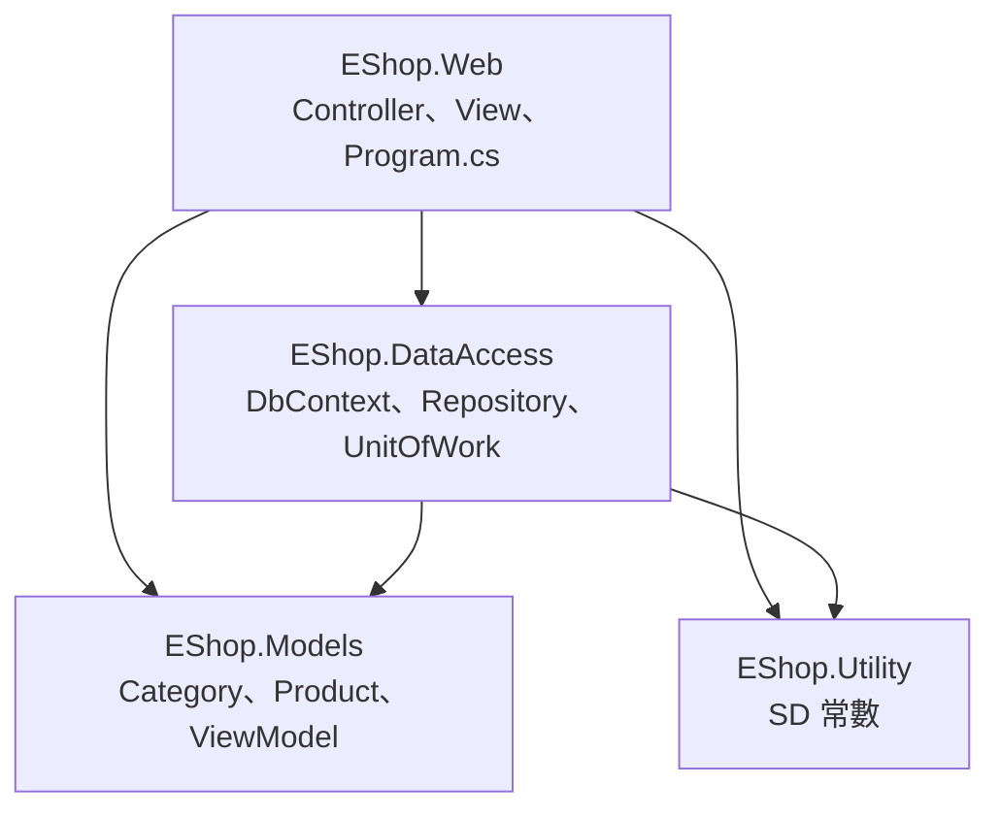

<div class="flex flex-col justify-center items-center h-full" style="background: #ffffff;">
  <p style="color: #5eada0; font-size: 1rem; font-weight: 600; letter-spacing: 0.2em; text-transform: uppercase; margin-bottom: 1.2rem;">ASP.NET Core Masterclass</p>
  <h1 style="color: #1a5c5c; font-size: 3.4rem; font-weight: 900; line-height: 1.15; margin-bottom: 1.5rem;">系統架構與分層</h1>
  <div style="height: 4px; width: 320px; background: linear-gradient(90deg, #5eada0, #a7d9d0); border-radius: 2px; margin-bottom: 1.5rem;"></div>
  <p style="color: #4a7c7c; font-size: 1.15rem; font-style: italic;">「把程式放在對的位置，專案才長得大」</p>
  <Link to="home" style="color: #9dc4c4; font-size: 0.85rem; margin-top: 2rem; text-decoration: none; letter-spacing: 0.05em;">← 返回目錄</Link>
</div>

<!--
大家好，歡迎來到第七章！

上一章我們學了依賴注入，知道 DbContext 是怎麼被注入到 Controller 的。但現在所有的資料存取程式碼，都直接寫在 Controller 裡。分類只有一個 Controller 還好，但接下來我們要做商品、會員、購物車、訂單，如果每個 Controller 都直接操作 DbContext，專案很快就會變得很難維護。

這一章我們要重新整理 EShop 的架構：先認識分層架構的觀念，接著把專案拆成多個專案，然後建立泛型 Repository 和 UnitOfWork 把資料存取包裝起來，最後用 Area 把網站分成前台和後台。

這一章做完，EShop 的骨架就正式定型了，第八到十章的所有功能都會建立在這個架構上。
-->

---
layout: default
---

# Outline

- **回顧：DI 與生命週期**
- **7-1 介紹分層架構**
- **7-2 修改專案架構** — 拆成 Models / DataAccess / Utility / Web
- **7-3 建立泛型 Repository（封裝 LINQ 查詢）**
- **7-4 建立 UnitOfWork 工作單元模式**
- **7-5 建立 Area 區分前台與後台**
- **EShop 專案實作** — 第 7 步：自己的程式碼也搬進分層架構
- **總結**

<!--
這一章有五個小節。第一節是觀念，第二節是搬家，把現有的程式碼搬到新的專案結構。第三、四節是這一章的核心：Repository 和 UnitOfWork。第五節用 Area 區分前後台。

這一章的程式碼改動比較多，建議大家每做完一個小節，就確認網站還能正常執行，再進行下一節。

最後的 EShop 專案實作，我們要把前幾章自己加的程式碼也搬進分層架構，並在後台加上營運總覽。
-->

---

# 回顧：DI 與生命週期

| 重點 | 說明 |
| --- | --- |
| IoC | 把物件的控制權交給外部容器 |
| DI | `builder.Services.AddScoped<介面, 實作>()` + 建構子注入 |
| 依賴介面 | Controller 只知道 `IShippingService`，不知道背後是誰 |
| Scoped | 每個請求一個實例；**`DbContext` 是 Scoped** |

<!--
我們先回顧上一章。

IoC 是把控制權交給外部容器的概念，DI 是實作方式。Controller 應該依賴介面，而不是具體類別。DbContext 是用 Scoped 註冊的，同一個請求共用同一個。

這一章我們會把這些觀念全部用上：Repository 和 UnitOfWork 都會定義介面，用 Scoped 註冊，然後注入到 Controller。
-->

---
layout: section
class: flex flex-col justify-center items-center text-center
---

# 7-1 介紹分層架構
### Layered Architecture

<!--
第一個小節，我們先來看什麼是分層架構。
-->

---

# 目前的問題：Controller 什麼都做

```csharp
public class CategoryController(ApplicationDbContext db) : Controller
{
    public async Task<IActionResult> Index()
        => View(await db.Categories.OrderBy(c => c.DisplayOrder).ToListAsync());

    public async Task<IActionResult> Edit(int? id)
    {
        var category = await db.Categories.FindAsync(id);
        // ...
    }
}
```

| 問題 | 說明 |
| --- | --- |
| 查詢邏輯散落各處 | 同樣的查詢在不同 Controller 重複寫 |
| Controller 綁死 EF Core | 想換資料存取方式，要改所有 Controller |
| 難以測試 | 測試 Controller 就一定要有真的資料庫 |

<!--
我們先看看目前的程式碼有什麼問題。

CategoryController 直接使用 DbContext，查詢邏輯都寫在 Controller 裡。現在只有分類還好，但接下來商品、購物車、訂單都這樣寫的話，同樣的查詢會在很多地方重複出現。

而且 Controller 和 EF Core 綁得很死，上一章學的「依賴介面」完全沒用上。測試的時候也一定要準備一個真的資料庫。
-->

---

# 什麼是分層架構？

想像一間餐廳，如果廚師要自己去市場買菜、自己端盤子給客人……

| 餐廳 | 分層架構 | EShop 專案 |
| --- | --- | --- |
| 外場服務生：接待客人、點餐、上菜 | **展示層（Presentation）** | `EShop.Web`（Controller、View） |
| 廚房：依照食譜料理 | **商業邏輯層（Business）** | Controller 內的流程 / Service |
| 倉庫管理員：管理食材進出 | **資料存取層（Data Access）** | `EShop.DataAccess`（Repository） |
| 食材規格表 | **模型（Models）** | `EShop.Models`（Entity、ViewModel） |

「分層架構就是依照職責，把程式分成幾個層次，**每一層只跟相鄰的層溝通**。」

<!--
我們用餐廳來理解分層架構。

一間運作良好的餐廳，外場服務生負責接待客人，廚房負責料理，倉庫管理員負責食材進出。服務生不會跑進倉庫拿食材，廚師也不會自己去外場點餐。每個人只做自己的事，只跟相鄰的人溝通。

程式也是一樣。展示層負責跟使用者互動，也就是 Controller 和 View；資料存取層負責跟資料庫溝通；模型則是大家共用的資料規格。

「分層架構就是依照職責，把程式分成幾個層次，每一層只跟相鄰的層溝通」。第四章補充過，MVC 就是展示層的實作方式。
-->

---
zoom: 0.75
---

# EShop 的分層與相依方向



| 規則 | 說明 |
| --- | --- |
| 箭頭方向 = 參考方向 | `Web` 參考 `DataAccess`，反過來不行 |
| `Models` 不參考任何人 | 最底層，只放資料定義 |
| 不能循環參考 | A 參考 B、B 又參考 A，編譯器會報錯 |

<!--
這是我們 EShop 接下來的分層結構。

箭頭代表參考方向：Web 參考 DataAccess 和 Models，DataAccess 參考 Models。Models 在最底層，不參考任何其他專案，它只放資料的定義。Utility 放全專案共用的常數，例如第九章的角色名稱。

參考方向一定是單向的，不能循環參考，否則編譯器會報錯。這個限制其實是好事，它逼我們把程式放在正確的位置。
-->

---

# 分層架構的好處

| 好處 | 說明 |
| --- | --- |
| **職責清楚** | 要改畫面找 Web，要改查詢找 DataAccess |
| **重複使用** | 同一個 Repository，後台、前台、API 都能用 |
| **容易替換** | Controller 依賴 `IUnitOfWork` 介面，底層實作可以抽換 |
| **容易測試** | 可以用假的 Repository 測試 Controller |
| **團隊分工** | 不同的人負責不同的專案，減少衝突 |

<!--
分層架構有五個好處，大家會發現跟 MVC、DI 的好處很像，因為它們的核心精神都一樣：關注點分離、依賴介面。

不過也要說一下，分層不是越多越好。小專案硬要拆很多層，反而增加複雜度。EShop 拆成四個專案，是業界中型專案很常見的規模。
-->

---
layout: default
---

# 練習 1：分層觀念
### 認證模擬題（單選）

在 EShop 的分層架構中，下列哪一個專案參考關係是**不允許**的？

A. `EShop.Web` 參考 `EShop.DataAccess`
B. `EShop.DataAccess` 參考 `EShop.Models`
C. `EShop.Models` 參考 `EShop.DataAccess`
D. `EShop.Web` 參考 `EShop.Models`

<!--
【出題動機】
確認大家理解參考方向，以及 Models 在最底層的原則。

【解題引導】
DataAccess 已經參考 Models 了，如果 Models 又參考 DataAccess 會發生什麼事？
-->

---
layout: default
---

# 練習 1：解析

**正確答案：C**

| 選項 | 解析 |
| --- | --- |
| A ✅ 允許 | 展示層使用資料存取層 |
| B ✅ 允許 | 資料存取層需要知道實體的定義 |
| C ❌ 不允許 | `DataAccess` 已參考 `Models`，再反向參考會造成**循環參考** |
| D ✅ 允許 | Controller 與 View 需要使用 Model |

<!--
答案是 C。Models 是最底層，不應該知道資料庫的存在，而且 DataAccess 已經參考 Models，反過來就變成循環參考。
-->

---
layout: section
class: flex flex-col justify-center items-center text-center
---

# 7-2 修改專案架構
### Restructure the Solution

<!--
觀念清楚了，第二個小節我們動手把 EShop 拆成四個專案。
-->

---

# Step 1：建立類別庫專案

```bash
cd EShop
dotnet new classlib -n EShop.Models
dotnet new classlib -n EShop.DataAccess
dotnet new classlib -n EShop.Utility
dotnet sln add EShop.Models EShop.DataAccess EShop.Utility
```

| 專案 | 範本 | 內容 |
| --- | --- | --- |
| `EShop.Models` | `classlib` | Entity、ViewModel |
| `EShop.DataAccess` | `classlib` | `ApplicationDbContext`、Migrations、Repository、UnitOfWork |
| `EShop.Utility` | `classlib` | `SD`（Static Details）共用常數 |
| `EShop.Web` | `mvc`（既有） | Controller、View、`Program.cs` |

<!--
第一步，用 classlib 範本建立三個類別庫專案，並加入方案。類別庫就是不能單獨執行、專門給其他專案參考的專案。

建立之後，記得把每個專案預設產生的 Class1.cs 刪掉。
-->

---

# Step 2：設定專案參考與套件

```bash
dotnet add EShop.DataAccess reference EShop.Models EShop.Utility
dotnet add EShop.Web reference EShop.DataAccess EShop.Models EShop.Utility

# EF Core 套件移到 DataAccess
dotnet add EShop.DataAccess package Microsoft.EntityFrameworkCore.SqlServer
dotnet remove EShop.Web package Microsoft.EntityFrameworkCore.SqlServer
```

| 套件 | 放在哪個專案 | 原因 |
| --- | --- | --- |
| `EntityFrameworkCore.SqlServer` | `DataAccess` | 資料存取層才需要知道資料庫 |
| `EntityFrameworkCore.Design` | `Web` | Migration 工具需要從啟動專案執行 |

<!--
第二步，設定專案之間的參考，照著剛剛那張相依圖的箭頭方向。

EF Core 的 SqlServer 套件搬到 DataAccess，因為只有資料存取層需要知道資料庫。Design 套件留在 Web，因為 dotnet ef 工具需要從啟動專案讀取設定，例如連線字串。
-->

---

# Step 3：搬移檔案並修改 namespace

| 原本位置 | 新位置 | 新 namespace |
| --- | --- | --- |
| `EShop.Web/Models/Category.cs` | `EShop.Models/Category.cs` | `EShop.Models` |
| `EShop.Web/Data/ApplicationDbContext.cs` | `EShop.DataAccess/Data/ApplicationDbContext.cs` | `EShop.DataAccess.Data` |
| `EShop.Web/Migrations/` | `EShop.DataAccess/Migrations/` | `EShop.DataAccess.Migrations` |
| `EShop.Web/Models/ErrorViewModel.cs` | `EShop.Models/ViewModels/ErrorViewModel.cs` | `EShop.Models.ViewModels` |

```razor
@* EShop.Web/Views/_ViewImports.cshtml *@
@using EShop.Web
@using EShop.Models
@using EShop.Models.ViewModels
@addTagHelper *, Microsoft.AspNetCore.Mvc.TagHelpers
```

<!--
第三步，搬移檔案。Category 搬到 Models 專案，DbContext 和 Migrations 搬到 DataAccess 專案，然後修改每個檔案最上面的 namespace。

搬完之後，所有用到這些類別的地方都要更新 using。View 的部分，只要在 _ViewImports 加上新的 using 就好。

Migrations 資料夾裡的檔案也要記得改 namespace，不然下次產生 Migration 的時候會出現重複的類別。
-->

---

# Step 4：建立 SD 共用常數

```csharp
// EShop.Utility/SD.cs
namespace EShop.Utility;

public static class SD
{
    // TempData 通知的 key
    public const string Success = "success";
    public const string Error = "error";
}
```

```csharp
TempData[SD.Success] = "分類新增成功";
```

<div class="mt-4 p-3 bg-blue-50 border-l-4 border-blue-400 text-gray-700 text-sm text-left">
💡 SD 是 <b>Static Details</b> 的縮寫。第 9 章的角色名稱、第 10 章的訂單狀態，都會集中放在這裡，避免字串打錯。
</div>

<!--
第四步，在 Utility 專案建立 SD 類別，放全專案共用的常數。

目前先放 TempData 通知的 key，把 "success" 這種字串集中管理。這樣如果打錯字，編譯器會直接報錯，而不是等到執行時才發現通知沒有出現。

第九章的角色名稱、第十章的訂單狀態，都會陸續加到這裡。
-->

---

# Step 5：執行 Migration 指令的方式改變

```bash
# 在方案根目錄執行，指定 Migration 所在專案與啟動專案
dotnet ef migrations add ChangeProjectStructure \
    --project EShop.DataAccess --startup-project EShop.Web

dotnet ef database update --project EShop.DataAccess --startup-project EShop.Web
```

| 參數 | 意義 |
| --- | --- |
| `--project` | Migration 檔案要產生在哪個專案（DbContext 所在） |
| `--startup-project` | 從哪個專案讀取 `Program.cs` 與連線字串 |

<!--
第五步，因為 DbContext 搬到 DataAccess，連線字串還在 Web，所以執行 Migration 指令的時候，要多加兩個參數。

--project 指定 Migration 檔案要產生在 DataAccess；--startup-project 指定從 Web 讀取設定。

這次 Model 沒有改變，產生出來的 Migration 應該是空的，可以用來確認搬家之後設定都正確。確認完可以用 migrations remove 把它移除。
-->

---

# 使用多專案架構的注意事項

| 注意事項 | 說明 |
| --- | --- |
| **之一：namespace 要跟著改** | 搬檔案後忘了改 namespace 或 using，會出現找不到型別 |
| **之二：Migration 要指定專案** | 忘了 `--project`，會出現找不到 DbContext 或 Migration 的錯誤 |
| **之三：先 `dotnet build` 再執行** | 在方案根目錄 build，一次看到所有專案的錯誤 |

<!--
多專案架構有三個注意事項。

之一，搬檔案之後一定要改 namespace 和 using。之二，Migration 指令要指定專案。之三，改完之後先在方案根目錄執行 dotnet build，一次看到所有專案的錯誤，全部修好再執行網站。
-->

---
layout: default
---

# 練習 2：完成專案重構
### 任務說明

1. 建立 `EShop.Models`、`EShop.DataAccess`、`EShop.Utility` 三個專案並設定參考
2. 搬移 `Category`、`ApplicationDbContext`、`Migrations`，修改 namespace
3. 建立 `SD` 類別，把 Controller 中的 `TempData["success"]` 改成 `TempData[SD.Success]`
4. 在方案根目錄執行 `dotnet build`，確認 0 個錯誤
5. 執行網站，確認分類 CRUD 功能完全正常

<!--
【練習目的】
完成專案結構的重構，確保功能不受影響。

【操作提示】
重構的原則是「功能不變，結構改變」。每搬一個檔案就 build 一次，錯誤會比較好找。
-->

---
layout: default
---

# 練習 2：解題提示

```text
EShop/
├── EShop.slnx
├── EShop.Models/
│   ├── Category.cs
│   └── ViewModels/ErrorViewModel.cs
├── EShop.DataAccess/
│   ├── Data/ApplicationDbContext.cs
│   └── Migrations/
├── EShop.Utility/
│   └── SD.cs
└── EShop.Web/
    ├── Controllers/  Views/  wwwroot/
    ├── appsettings.json
    └── Program.cs            ← using EShop.DataAccess.Data;
```

<!--
這是重構完成後的資料夾結構。Program.cs 要記得把 using 改成 EShop.DataAccess.Data，才找得到 ApplicationDbContext。
-->

---
layout: section
class: flex flex-col justify-center items-center text-center
---

# 7-3 建立泛型 Repository
### Generic Repository Pattern

<!--
專案結構拆好了，第三個小節我們來建立 Repository，把 LINQ 查詢封裝起來。
-->

---

# 什麼是 Repository？

「Repository（倉儲）是介於商業邏輯與資料庫之間的一層，**把資料存取的細節封裝起來**，對外只提供簡單的方法。」

| 沒有 Repository | 有 Repository |
| --- | --- |
| `db.Categories.AsNoTracking().OrderBy(...).ToListAsync()` | `repo.GetAllAsync(orderBy: ...)` |
| Controller 知道 EF Core、DbSet、Include、AsNoTracking | Controller 只知道 `GetAllAsync`、`Add`、`Remove` |

<div class="mt-4 p-3 bg-blue-50 border-l-4 border-blue-400 text-gray-700 text-sm text-left">
💡 就像餐廳的倉庫管理員：廚師只要說「給我 3 顆洋蔥」，不用知道洋蔥放在第幾排架子。
</div>

<!--
Repository 中文叫倉儲，它就是餐廳裡的倉庫管理員。

廚師只要說「給我三顆洋蔥」，倉庫管理員就會拿過來，廚師不需要知道洋蔥放在哪一排架子、怎麼盤點。

在程式裡，Controller 就是廚師，只要呼叫 GetAllAsync、Add、Remove 這些簡單的方法。至於底層是用 EF Core 還是其他方式、要不要 AsNoTracking、要 Include 哪些關聯，全部由 Repository 處理。
-->

---

# 為什麼要「泛型」Repository？

分類、商品、訂單……每個實體都需要這些操作：

| 共通操作 | 分類 | 商品 | 訂單 |
| --- | --- | --- | --- |
| 查詢全部 / 條件查詢 | ✅ | ✅ | ✅ |
| 查詢單筆 | ✅ | ✅ | ✅ |
| 新增、刪除 | ✅ | ✅ | ✅ |

「用泛型 `Repository<T>` 寫一次共通操作，每個實體直接繼承使用。」

<!--
EShop 會有分類、商品、購物車、訂單很多種實體，每一種都需要查詢全部、查詢單筆、新增、刪除這些操作。

如果每個實體都寫一個 Repository，裡面的程式碼幾乎一模一樣。所以我們用泛型，第二章提過的尖括號 T，寫一個通用的 Repository of T，每個實體繼承它就自動擁有這些方法。
-->

---

# Step 1：定義 IRepository&lt;T&gt; 介面

```csharp
// EShop.DataAccess/Repository/IRepository/IRepository.cs
using System.Linq.Expressions;

namespace EShop.DataAccess.Repository.IRepository;

public interface IRepository<T> where T : class
{
    Task<List<T>> GetAllAsync(
        Expression<Func<T, bool>>? filter = null,
        Func<IQueryable<T>, IOrderedQueryable<T>>? orderBy = null,
        string? includeProperties = null);

    Task<T?> GetAsync(
        Expression<Func<T, bool>> filter,
        string? includeProperties = null,
        bool tracked = false);

    void Add(T entity);
    void Remove(T entity);
    void RemoveRange(IEnumerable<T> entities);
}
```

<!--
我們先定義介面。

where T : class 是泛型限制，代表 T 一定要是類別。

GetAllAsync 有三個可選參數：filter 是篩選條件，orderBy 是排序方式，includeProperties 是要一起載入的關聯資料，第八章會用到。GetAsync 用來取得單筆，tracked 決定要不要讓 EF Core 追蹤這個物件。

注意 filter 的型別是 Expression of Func of T, bool，而不是 Func of T, bool。還記得第三章說的嗎？IQueryable 需要 Expression，EF Core 才能把 Lambda 翻譯成 SQL。如果這裡寫成 Func，查詢就會變成把整張表載入記憶體再篩選。

Update 沒有放在泛型介面裡，因為每個實體更新的方式可能不同，我們放在各自的 Repository。
-->

---

# Step 2：實作 Repository&lt;T&gt; — 查詢

```csharp
public class Repository<T>(ApplicationDbContext db) : IRepository<T> where T : class
{
    protected readonly ApplicationDbContext _db = db;
    private readonly DbSet<T> _dbSet = db.Set<T>();

    public async Task<List<T>> GetAllAsync(Expression<Func<T, bool>>? filter = null,
        Func<IQueryable<T>, IOrderedQueryable<T>>? orderBy = null, string? includeProperties = null)
    {
        IQueryable<T> query = _dbSet.AsNoTracking();
        if (filter is not null) query = query.Where(filter);
        query = Include(query, includeProperties);
        if (orderBy is not null) query = orderBy(query);
        return await query.ToListAsync();          // 條件全部串完，最後才執行
    }

    public async Task<T?> GetAsync(Expression<Func<T, bool>> filter,
        string? includeProperties = null, bool tracked = false)
    {
        IQueryable<T> query = tracked ? _dbSet : _dbSet.AsNoTracking();
        query = Include(query, includeProperties);
        return await query.FirstOrDefaultAsync(filter);
    }
```

<!--
接著實作 Repository of T，先看查詢的部分。

db.Set of T 可以取得任意實體的 DbSet，這是泛型 Repository 能運作的關鍵。

GetAllAsync 的寫法，就是第三章學的「動態組合查詢」：先從 AsNoTracking 開始，有 filter 就串接 Where，有關聯就 Include，有排序就套用排序，最後才 ToListAsync。整個查詢在 ToListAsync 之前都還是 IQueryable，所以會被翻譯成一句完整的 SQL。

GetAsync 則根據 tracked 參數決定要不要追蹤。只是要顯示資料就不用追蹤；如果之後要修改這個物件再存回去，就傳 tracked: true。
-->

---

# Step 2：實作 Repository&lt;T&gt; — 新增刪除與 Include

```csharp
    public void Add(T entity) => _dbSet.Add(entity);
    public void Remove(T entity) => _dbSet.Remove(entity);
    public void RemoveRange(IEnumerable<T> entities) => _dbSet.RemoveRange(entities);

    private static IQueryable<T> Include(IQueryable<T> query, string? includeProperties)
    {
        if (string.IsNullOrWhiteSpace(includeProperties)) return query;
        foreach (var prop in includeProperties.Split(',',
                     StringSplitOptions.RemoveEmptyEntries | StringSplitOptions.TrimEntries))
        {
            query = query.Include(prop);
        }
        return query;
    }
}
```

<div class="mt-4 p-3 bg-blue-50 border-l-4 border-blue-400 text-gray-700 text-sm text-left">
💡 Repository 只負責「把變更放進 DbContext」，<b>不呼叫</b> <code>SaveChangesAsync</code>。存檔的時機交給下一節的 UnitOfWork 決定。
</div>

<!--
Add、Remove、RemoveRange 都只有一行，直接呼叫 DbSet 對應的方法。

Include 方法把「分類,圖片」這種用逗號隔開的字串拆開，一個一個 Include，第八章查商品時要順便載入分類就會用到。

大家注意，Repository 裡面沒有呼叫 SaveChangesAsync。Repository 只負責把變更放進 DbContext，什麼時候真正寫入資料庫，交給下一節的 UnitOfWork 決定。為什麼要這樣設計，下一節會解釋。
-->

---

# Step 3：建立 CategoryRepository

```csharp
// IRepository/ICategoryRepository.cs
public interface ICategoryRepository : IRepository<Category>
{
    void Update(Category category);
}

// Repository/CategoryRepository.cs
public class CategoryRepository(ApplicationDbContext db)
    : Repository<Category>(db), ICategoryRepository
{
    public void Update(Category category) => _db.Categories.Update(category);
}
```

| 類別 / 介面 | 取得的方法 |
| --- | --- |
| `IRepository<Category>` | `GetAllAsync`、`GetAsync`、`Add`、`Remove`、`RemoveRange` |
| `ICategoryRepository` | 以上全部 + `Update` |

<!--
第三步，建立分類專用的 Repository。

ICategoryRepository 繼承 IRepository of Category，自動擁有所有共通方法，再加上 Update。CategoryRepository 繼承 Repository of Category，並實作 ICategoryRepository，只需要寫 Update 這一個方法。

之後要新增商品的 Repository，也是一樣的寫法，只要幾行就完成了。
-->

---

# 使用 Repository 的注意事項

| 注意事項 | 說明 |
| --- | --- |
| **之一：filter 要用 `Expression<Func<T, bool>>`** | 用 `Func` 會讓查詢退化成在記憶體篩選 |
| **之二：回傳結果前才 `ToListAsync()`** | 不要回傳 `IQueryable` 給 Controller，避免查詢邏輯外洩 |
| **之三：要修改的資料用 `tracked: true`** | `AsNoTracking` 查出來的物件，修改後需要 `Update` 才會被存 |

<!--
Repository 有三個注意事項。

之一，filter 的型別一定要是 Expression，這是第三章 IQueryable 觀念的實際應用。之二，Repository 回傳 List 而不是 IQueryable，避免 Controller 又開始自己組查詢，讓封裝失去意義。之三，AsNoTracking 查出來的物件，EF Core 不會追蹤它的變化，修改之後要呼叫 Update 才會被存；或是查詢時傳 tracked: true。
-->

---
layout: default
---

# 練習 3：自訂查詢方法
### 任務說明

1. 在 `ICategoryRepository` 加入方法 `Task<bool> IsNameExistsAsync(string name, int excludeId = 0)`
2. 在 `CategoryRepository` 實作：判斷是否有**其他**分類使用相同名稱
3. 思考：這個方法為什麼放在 `CategoryRepository`，而不是泛型 `Repository<T>`？

<!--
【練習目的】
練習在特定實體的 Repository 擴充專屬查詢。

【解題引導】
excludeId 用在編輯時：自己的名稱不算重複。用 AnyAsync 搭配兩個條件。
-->

---
layout: default
---

# 練習 3：解題提示

```csharp
public interface ICategoryRepository : IRepository<Category>
{
    void Update(Category category);
    Task<bool> IsNameExistsAsync(string name, int excludeId = 0);
}

public class CategoryRepository(ApplicationDbContext db)
    : Repository<Category>(db), ICategoryRepository
{
    public void Update(Category category) => _db.Categories.Update(category);

    public Task<bool> IsNameExistsAsync(string name, int excludeId = 0)
        => _db.Categories.AnyAsync(c => c.Name == name && c.Id != excludeId);
}
```

<!--
IsNameExistsAsync 只跟分類有關，其他實體不一定有 Name 欄位，所以放在 CategoryRepository。泛型 Repository 只放「所有實體都通用」的操作。
-->

---
layout: section
class: flex flex-col justify-center items-center text-center
---

# 7-4 建立 UnitOfWork 工作單元模式
### Unit of Work Pattern

<!--
第四個小節，我們要解決一個問題：Controller 需要很多個 Repository 的時候怎麼辦？還有，什麼時候存檔？
-->

---

# 為什麼需要 UnitOfWork？

第 10 章「送出訂單」要做的事：

| 步驟 | 使用的 Repository |
| --- | --- |
| 建立訂單主檔 | `OrderHeaderRepository` |
| 建立訂單明細 | `OrderDetailRepository` |
| 扣除商品庫存 | `ProductRepository` |
| 清空購物車 | `ShoppingCartRepository` |

| 問題 | 說明 |
| --- | --- |
| Controller 建構子參數爆炸 | 要注入 4 個 Repository |
| 誰負責存檔？ | 如果每個 Repository 各自存檔，扣庫存失敗時，訂單卻已經建立了 |

<!--
我們先看第十章「送出訂單」會遇到的情況：要建立訂單主檔、建立訂單明細、扣庫存、清空購物車，總共會用到四個 Repository。

第一個問題：Controller 的建構子要注入四個 Repository，參數會越來越多。

第二個問題更嚴重：如果每個 Repository 各自存檔，萬一訂單建好了，扣庫存的時候卻失敗了，資料庫就會出現一筆「有訂單但沒扣庫存」的錯誤資料。

這四個步驟應該要嘛全部成功，要嘛全部失敗。
-->

---

# 什麼是 UnitOfWork？

「UnitOfWork（工作單元）把多個 Repository 的操作包成**一個工作單元**，最後**一次存檔**，全部成功或全部失敗。」

| 比喻：超市結帳 | UnitOfWork |
| --- | --- |
| 把商品一件一件放進購物籃 | 呼叫各個 Repository 的 `Add` / `Remove` |
| 到櫃台**一次結帳** | `SaveAsync()` → 一次 `SaveChangesAsync()` |
| 刷卡失敗，所有商品都不算買 | 任何一個失敗，整批變更都不會寫入 |

<!--
UnitOfWork 中文叫工作單元，我們用超市結帳來理解。

逛超市的時候，我們把商品一件一件放進購物籃，但這時候還沒付錢。到櫃台一次結帳，刷卡成功，所有商品就都是你的；刷卡失敗，所有商品都不算買。不會出現「牛奶買到了，麵包沒買到」的情況。

UnitOfWork 就是這樣：呼叫各個 Repository 的 Add、Remove，就像把商品放進購物籃；最後呼叫 SaveAsync，一次結帳。EF Core 的 SaveChangesAsync 預設會把所有變更包在同一個資料庫交易裡，要嘛全部成功，要嘛全部失敗。

這也是上一章說的，DbContext 用 Scoped 的原因：所有 Repository 必須共用同一個 DbContext，才能一次結帳。
-->

---

# 在 ASP.NET Core 中練習 UnitOfWork

```csharp
// IRepository/IUnitOfWork.cs
public interface IUnitOfWork
{
    ICategoryRepository Category { get; }
    Task SaveAsync();
}

// Repository/UnitOfWork.cs
public class UnitOfWork(ApplicationDbContext db) : IUnitOfWork
{
    private readonly ApplicationDbContext _db = db;

    public ICategoryRepository Category { get; } = new CategoryRepository(db);

    public async Task SaveAsync() => await _db.SaveChangesAsync();
}
```

```csharp
// EShop.Web/Program.cs
builder.Services.AddScoped<IUnitOfWork, UnitOfWork>();
```

<!--
我們來實作 UnitOfWork。

IUnitOfWork 介面有一個 Category 屬性，型別是 ICategoryRepository，還有一個 SaveAsync 方法。之後新增商品、訂單，就在這裡多加屬性。

UnitOfWork 在建構時，把同一個 DbContext 傳給每一個 Repository，這樣所有 Repository 都共用同一個 DbContext。SaveAsync 就是呼叫一次 SaveChangesAsync。

最後在 Program.cs 用 Scoped 註冊 IUnitOfWork。注意我們不需要註冊 CategoryRepository，因為它是由 UnitOfWork 建立的。
-->

---

# 改寫 CategoryController

```csharp
public class CategoryController(IUnitOfWork unitOfWork) : Controller
{
    public async Task<IActionResult> Index()
    {
        var categories = await unitOfWork.Category.GetAllAsync(
            orderBy: q => q.OrderBy(c => c.DisplayOrder));
        return View(categories);
    }

    [HttpPost, ValidateAntiForgeryToken]
    public async Task<IActionResult> Create(Category category)
    {
        if (await unitOfWork.Category.IsNameExistsAsync(category.Name))
            ModelState.AddModelError(nameof(Category.Name), "此分類名稱已存在");
        if (!ModelState.IsValid) return View(category);

        unitOfWork.Category.Add(category);
        await unitOfWork.SaveAsync();
        TempData[SD.Success] = "分類新增成功";
        return RedirectToAction(nameof(Index));
    }
}
```

<!--
最後，我們把 CategoryController 改寫成使用 UnitOfWork。

建構子不再注入 ApplicationDbContext，改成注入 IUnitOfWork 介面。查詢用 unitOfWork.Category.GetAllAsync，排序用 orderBy 參數傳入一個 Lambda。新增用 Add，最後呼叫 SaveAsync 存檔。

大家比較一下改寫前後：Controller 裡完全看不到 DbContext、DbSet、ToListAsync 這些 EF Core 的東西了，只剩下「要做什麼」的商業流程，這就是分層和封裝的效果。
-->

---
zoom: 0.85
---

# 改寫 CategoryController — Edit 與 Delete

```csharp
public async Task<IActionResult> Edit(int? id)
{
    if (id is null or 0) return NotFound();
    var category = await unitOfWork.Category.GetAsync(c => c.Id == id);
    return category is null ? NotFound() : View(category);
}

[HttpPost, ValidateAntiForgeryToken]
public async Task<IActionResult> Edit(Category category)
{
    if (!ModelState.IsValid) return View(category);
    unitOfWork.Category.Update(category);
    await unitOfWork.SaveAsync();
    TempData[SD.Success] = "分類更新成功";
    return RedirectToAction(nameof(Index));
}

[HttpPost, ActionName("Delete"), ValidateAntiForgeryToken]
public async Task<IActionResult> DeletePost(int? id)
{
    var category = await unitOfWork.Category.GetAsync(c => c.Id == id);
    if (category is null) return NotFound();
    unitOfWork.Category.Remove(category);
    await unitOfWork.SaveAsync();
    TempData[SD.Success] = "分類刪除成功";
    return RedirectToAction(nameof(Index));
}
```

<!--
Edit 和 Delete 也是同樣的模式。GetAsync 取代了 FindAsync，Update 和 Remove 改成呼叫 Repository，最後都是 SaveAsync。

大家有沒有發現，現在每個 Action 的結構都一樣：取得資料、檢查、操作 Repository、SaveAsync、設定通知、轉址。之後的商品、訂單也都會是這個模式。
-->

---

# 使用 UnitOfWork 的注意事項

| 注意事項 | 說明 |
| --- | --- |
| **之一：Repository 不要自己存檔** | 存檔的時機統一由 `unitOfWork.SaveAsync()` 決定 |
| **之二：新增 Repository 要加到 UnitOfWork** | 介面加屬性、實作中 `new` 並傳入同一個 `db` |
| **之三：一個請求通常只 Save 一次** | 多次 Save 就失去「全部成功或全部失敗」的保證 |

<!--
UnitOfWork 有三個注意事項。

之一，Repository 裡不要呼叫 SaveChanges。之二，每新增一個 Repository，都要記得加到 IUnitOfWork 介面和 UnitOfWork 實作裡，第八到十章會一直做這件事。之三，一個操作流程原則上只呼叫一次 SaveAsync，才能保證全部成功或全部失敗。
-->

---
layout: default
---

# 練習 4：完成 Controller 改寫
### 任務說明

1. 建立 `IUnitOfWork` 與 `UnitOfWork`，並在 `Program.cs` 註冊
2. 把 `CategoryController` 的所有 Action 改用 `IUnitOfWork`
3. `Create` 與 `Edit` 都要檢查名稱重複（使用練習 3 的 `IsNameExistsAsync`）
4. 確認 `CategoryController` 裡**沒有任何** `using Microsoft.EntityFrameworkCore;`

<!--
【練習目的】
完成 Repository + UnitOfWork 的完整改寫。

【解題引導】
Edit 檢查名稱重複時，要把自己的 Id 排除掉。第 4 點是檢驗封裝是否成功的好方法。
-->

---
layout: default
---

# 練習 4：解題提示

```csharp
[HttpPost, ValidateAntiForgeryToken]
public async Task<IActionResult> Edit(Category category)
{
    if (await unitOfWork.Category.IsNameExistsAsync(category.Name, category.Id))
        ModelState.AddModelError(nameof(Category.Name), "此分類名稱已存在");
    if (!ModelState.IsValid) return View(category);

    unitOfWork.Category.Update(category);
    await unitOfWork.SaveAsync();
    TempData[SD.Success] = "分類更新成功";
    return RedirectToAction(nameof(Index));
}
```

<!--
Edit 時把 category.Id 當作 excludeId 傳進去，這樣修改自己的顯示順序、名稱不變的時候，就不會被誤判成重複。
-->

---
layout: section
class: flex flex-col justify-center items-center text-center
---

# 7-5 建立 Area 區分前台與後台
### Areas

<!--
最後一個小節，我們要用 Area 把網站分成前台和後台。
-->

---

# 什麼是 Area？

EShop 會有兩種使用者：

| | 前台（Customer） | 後台（Admin） |
| --- | --- | --- |
| 使用者 | 一般顧客 | 管理員、員工 |
| 功能 | 瀏覽商品、購物車、下單 | 分類管理、商品管理、訂單管理 |
| 網址 | `/Customer/Home/Index` | `/Admin/Category/Index` |

「Area（區域）讓我們在同一個網站中，把功能分成**獨立的區塊**，各自有自己的 Controllers 和 Views。」

<!--
EShop 會有兩種使用者：一般顧客會瀏覽商品、下單；管理員和員工會管理分類、商品、訂單。如果全部的 Controller 都放在同一個資料夾，很快就會分不清楚哪些是給誰用的。

Area 中文叫區域，就像百貨公司分成賣場和辦公室：賣場是給客人逛的，辦公室是給員工用的，兩邊各自有自己的空間。

每個 Area 都有自己的 Controllers 和 Views 資料夾，網址也會多一段 Area 的名稱。
-->

---

# Area 的資料夾結構

```text
EShop.Web/
├── Areas/
│   ├── Admin/
│   │   ├── Controllers/
│   │   │   └── CategoryController.cs      [Area("Admin")]
│   │   └── Views/
│   │       ├── Category/ Index.cshtml, Create.cshtml, ...
│   │       ├── _ViewImports.cshtml         ← 從 Views/ 複製
│   │       └── _ViewStart.cshtml           ← 從 Views/ 複製
│   └── Customer/
│       ├── Controllers/
│       │   └── HomeController.cs          [Area("Customer")]
│       └── Views/
│           ├── Home/ Index.cshtml, Privacy.cshtml
│           ├── _ViewImports.cshtml
│           └── _ViewStart.cshtml
└── Views/
    └── Shared/ _Layout.cshtml, _Notification.cshtml, Error.cshtml
```

<!--
這是加入 Area 之後的資料夾結構。

Areas 底下有 Admin 和 Customer 兩個區域，各自有 Controllers 和 Views。CategoryController 搬到 Admin，HomeController 搬到 Customer。

特別注意：_ViewImports 和 _ViewStart 要複製一份到每個 Area 的 Views 資料夾，否則 Area 裡的 View 會沒有 Layout，Tag Helper 也不會生效。這是第四章提過的注意事項。

共用的 _Layout 和 _Notification 留在最外層的 Views/Shared，所有 Area 都能使用。
-->

---

# Step 1：在 Controller 標註 [Area]

```csharp
// Areas/Admin/Controllers/CategoryController.cs
namespace EShop.Web.Areas.Admin.Controllers;

[Area("Admin")]
public class CategoryController(IUnitOfWork unitOfWork) : Controller
{
    // ...
}
```

```csharp
// Areas/Customer/Controllers/HomeController.cs
namespace EShop.Web.Areas.Customer.Controllers;

[Area("Customer")]
public class HomeController(ILogger<HomeController> logger) : Controller
{
    // ...
}
```

<!--
第一步，在 Controller 類別上標註 Area 屬性，告訴框架這個 Controller 屬於哪個區域。namespace 也要跟著資料夾改。

忘了加 Area 屬性是最常見的錯誤，症狀是網址對了卻一直 404，或是找不到 View。
-->

---

# Step 2：修改路由樣板

```csharp
// Program.cs
app.MapControllerRoute(
    name: "default",
    pattern: "{area=Customer}/{controller=Home}/{action=Index}/{id?}")
    .WithStaticAssets();
```

| 網址 | Area | Controller | Action |
| --- | --- | --- | --- |
| `/` | `Customer`（預設） | `Home` | `Index` |
| `/Admin/Category` | `Admin` | `Category` | `Index` |
| `/Admin/Category/Edit/2` | `Admin` | `Category` | `Edit` |

<!--
第二步，修改 Program.cs 的路由樣板，在最前面加上 area，預設值是 Customer。

這樣使用者打開網站首頁，會自動進入 Customer 區域的 HomeController；管理員要進後台，網址就是 /Admin/Category。
-->

---
class: code-sm
---

# Step 3：連結加上 asp-area

```razor
@* Views/Shared/_Layout.cshtml *@
<li class="nav-item">
    <a class="nav-link text-dark" asp-area="Customer" asp-controller="Home" asp-action="Index">首頁</a>
</li>
<li class="nav-item dropdown">
    <a class="nav-link dropdown-toggle text-dark" href="#" data-bs-toggle="dropdown">後台管理</a>
    <ul class="dropdown-menu">
        <li><a class="dropdown-item" asp-area="Admin" asp-controller="Category" asp-action="Index">分類管理</a></li>
    </ul>
</li>
```

<div class="mt-4 p-3 bg-blue-50 border-l-4 border-blue-400 text-gray-700 text-sm text-left">
💡 同一個 Area 內的連結可以省略 <code>asp-area</code>；<b>跨 Area 的連結一定要寫</b>，否則會連到目前所在的 Area。
</div>

<!--
第三步，修改 _Layout 的導覽列連結，加上 asp-area。

這裡我們把後台功能做成一個下拉選單，之後的商品管理、訂單管理都會加在這裡。

要特別注意：_Layout 是所有頁面共用的，如果連結沒有寫 asp-area，在後台頁面點「首頁」，就會連到 /Admin/Home，那個頁面並不存在。所以 _Layout 裡的連結一定要明確寫出 asp-area。
-->

---

# 使用 Area 的注意事項

| 注意事項 | 說明 |
| --- | --- |
| **之一：Controller 要加 `[Area("...")]`** | 沒加會找不到 View 或路由對不到 |
| **之二：每個 Area 都要有 `_ViewStart` 與 `_ViewImports`** | 否則沒有 Layout、Tag Helper 失效 |
| **之三：跨 Area 連結要寫 `asp-area`** | 特別是 `_Layout` 與共用的 Partial View |

<!--
Area 的三個注意事項剛剛都提過了，這裡再整理一次：Controller 要加 Area 屬性、每個 Area 都要有 _ViewStart 和 _ViewImports、跨 Area 的連結要寫 asp-area。

遇到 Area 相關的錯誤，照著這三點檢查，幾乎都能解決。
-->

---
layout: default
---

# 練習 5：建立前後台
### 任務說明

1. 建立 `Areas/Admin` 與 `Areas/Customer`，搬移 `CategoryController` 與 `HomeController`
2. 複製 `_ViewStart.cshtml`、`_ViewImports.cshtml` 到兩個 Area
3. 修改路由樣板，預設 Area 為 `Customer`
4. 修改 `_Layout` 的連結，後台功能放在「後台管理」下拉選單
5. 測試：在後台頁面點「首頁」、在前台點「分類管理」，都能正確跳轉

<!--
【練習目的】
完成 EShop 前後台的分區。

【操作提示】
如果遇到找不到 View 的錯誤，錯誤訊息會列出搜尋過的路徑，檢查 Area 資料夾名稱有沒有打錯。
-->

---
layout: default
---

# 練習 5：解題提示

| 症狀 | 檢查 |
| --- | --- |
| `/Admin/Category` 404 | `CategoryController` 是否有 `[Area("Admin")]` |
| 頁面沒有導覽列 | `Areas/Admin/Views/_ViewStart.cshtml` 是否存在 |
| `asp-action` 沒有變成連結 | `Areas/Admin/Views/_ViewImports.cshtml` 是否有 `@addTagHelper` |
| 後台點「首頁」變 404 | `_Layout` 的首頁連結是否有 `asp-area="Customer"` |

<!--
這張表整理了四個最常見的症狀和對應的檢查點，大家卡住的時候照著查就對了。
-->

---
layout: default
---

# 綜合練習：分店公告搬進新架構
### 任務說明

把第 5 章綜合練習的「分店公告 `Announcement`」搬進新架構：

1. `Announcement` 搬到 `EShop.Models`
2. 建立 `IAnnouncementRepository`（含 `Update` 與 `GetPinnedAsync()`）及實作
3. 加入 `IUnitOfWork.Announcement`
4. `AnnouncementController` 放在 **Admin** Area，改用 `IUnitOfWork`
5. 在 **Customer** Area 的首頁顯示置頂公告（使用 `GetPinnedAsync()`）

<!--
【練習目的】
獨立走一次「新增實體 → Repository → UnitOfWork → Controller → Area」的完整流程，這就是第八章新增商品時要做的事。

【解題引導】
GetPinnedAsync 可以直接呼叫繼承來的 GetAllAsync，傳入 filter 和 orderBy。前台首頁的 HomeController 也要注入 IUnitOfWork。
-->

---
layout: default
---

# 綜合練習：解題提示

```csharp
public class AnnouncementRepository(ApplicationDbContext db)
    : Repository<Announcement>(db), IAnnouncementRepository
{
    public void Update(Announcement obj) => _db.Announcements.Update(obj);

    public Task<List<Announcement>> GetPinnedAsync()
        => GetAllAsync(filter: a => a.IsPinned,
                       orderBy: q => q.OrderByDescending(a => a.PublishDate));
}

public class UnitOfWork(ApplicationDbContext db) : IUnitOfWork
{
    private readonly ApplicationDbContext _db = db;
    public ICategoryRepository Category { get; } = new CategoryRepository(db);
    public IAnnouncementRepository Announcement { get; } = new AnnouncementRepository(db);
    public async Task SaveAsync() => await _db.SaveChangesAsync();
}
```

<!--
GetPinnedAsync 直接重複使用泛型 Repository 的 GetAllAsync，只要傳入條件和排序就好，這就是泛型 Repository 的價值。

UnitOfWork 多了一個 Announcement 屬性，同樣傳入同一個 db。前台 HomeController 注入 IUnitOfWork，呼叫 unitOfWork.Announcement.GetPinnedAsync() 就能取得置頂公告。
-->

---
layout: section
class: flex flex-col justify-center items-center text-center
---

# EShop 專案實作
## 第 7 步：自己的程式碼也搬進分層架構

<!--
回到 EShop。講義這一章把分類管理搬進了四個專案，但我們的 EShop 從第一章開始，還加了很多講義沒有的東西：Middleware、會員折扣、商品目錄、前台商品頁、運費試算……

搬家的時候不能只搬講義的部分。這一步我們要替每一個檔案找到它該住的那一層，再利用新的後台 Area，加一個營運總覽頁面。
-->

---
zoom: 0.92
---

# EShop 第 7 步：自己的程式碼也搬進分層架構
### 任務說明

1. 完成本章的重構（四個專案、`SD`、Repository、UnitOfWork、Admin / Customer Area），再把前幾章的程式碼搬家：

| 程式碼 | 搬到 |
| --- | --- |
| `Product`、`MemberLevel`、`CartLine`、`ProductQuery`、`PagedResult<T>` | `EShop.Models` |
| `SeedData`、`IProductCatalog`、`InMemoryProductCatalog` | `EShop.DataAccess/Catalog` |
| `ProductsController`、`CheckoutController`（含 View） | `EShop.Web/Areas/Customer` |
| `PriceCalculator`、`IShippingService` 與兩家物流 | `EShop.Web/Services`（不動） |

2. 前台商品頁的網址維持 `/products`
3. 在 **Admin** Area 新增「營運總覽」`/Admin/Dashboard`：顯示資料庫的分類數量，以及商品目錄的分類統計表
4. 用 SQLite 直接測試 Repository 與 UnitOfWork（不經過網站）

<!--
第七步的第一件事是搬家，表格是搬家清單。

判斷的原則就是這一章教的分層：只裝資料、沒有邏輯的類別放 Models；負責取得資料的放 DataAccess，所以商品目錄雖然還在記憶體，也算是資料存取；和網頁有關的 Controller、View 留在 Web。PriceCalculator 和運費服務只有 Web 在用，所以不動。

第二件事，商品頁搬進 Customer Area 之後，網址還是要維持 /products，不能讓顧客的書籤失效。

第三件事是新功能：後台的營運總覽。它同時用到 UnitOfWork 和商品目錄，正好練習一個 Controller 注入兩個不同層的服務。

最後，分層之後資料存取層可以單獨測試，不用啟動整個網站。
-->

---
zoom: 0.94
---

# EShop 第 7 步：解題提示
### Area 裡的 Attribute Routing、營運總覽

```csharp
// eshop/EShop.Web/Areas/Customer/Controllers/ProductsController.cs
namespace EShop.Web.Areas.Customer.Controllers;

[Area("Customer")]
[Route("products")]
public class ProductsController(IProductCatalog catalog, IShippingService shipping)
    : Controller
```

```csharp
// eshop/EShop.Web/Areas/Admin/Controllers/DashboardController.cs
// 後台營運總覽：同時用到資料庫（UnitOfWork）與商品目錄
[Area("Admin")]
public class DashboardController(IUnitOfWork unitOfWork, IProductCatalog catalog)
    : Controller
{
    public async Task<IActionResult> Index()
    {
        var categories = await unitOfWork.Category.GetAllAsync();
        ViewData["CategoryCount"] = categories.Count;
        return View(catalog.GetCategorySummaries());
    }
}
```

<!--
ProductsController 搬家之後，namespace 改成 Areas.Customer.Controllers，再加上 Area 標籤。

大家可能會擔心：路由樣板改成 {area=Customer} 開頭之後，/products 還有用嗎？答案是有。Attribute Routing 的網址是寫在 Controller 上的，不受 MapControllerRoute 的樣板影響，Area 只是多一個路由值，產生連結的時候會用到。

DashboardController 放在 Admin Area，建構子同時注入 IUnitOfWork 和 IProductCatalog：分類數量從資料庫查，分類統計用第三章寫的 GetCategorySummaries。View 用一個表格把統計結果列出來，導覽列的「後台管理」選單也要加上「營運總覽」。
-->

---

# EShop 第 7 步：解題提示（續）
### 單獨測試資料存取層

```csharp
// eshop/EShop.Tests/RepositoryTests.cs
    [Fact]
    public async Task GetAllAsync_篩選與排序都在資料庫執行()
    {
        var unitOfWork = new UnitOfWork(_testDb.CreateContext());

        var categories = await unitOfWork.Category.GetAllAsync(
            filter: c => c.DisplayOrder >= 2,
            orderBy: q => q.OrderByDescending(c => c.DisplayOrder));

        Assert.Equal(["配方豆", "精品咖啡豆"], categories.Select(c => c.Name));
    }

    [Theory]
    [InlineData("配方豆", 0, true)]    // 新增：和既有分類重複
    [InlineData("配方豆", 3, false)]   // 編輯自己：不算重複
    [InlineData("濾掛咖啡", 0, false)]
    public async Task IsNameExistsAsync_檢查名稱是否重複(
```

<!--
分層的好處之一，就是每一層都可以單獨測試。

這裡直接 new 一個 UnitOfWork，把 SQLite 的 DbContext 傳進去，完全不需要啟動網站。第一個測試驗證泛型 Repository 的 GetAllAsync：篩選顯示順序大於等於 2 的分類，再由大到小排序，結果應該是配方豆、精品咖啡豆。

第二個測試用 Theory 驗證講義的 IsNameExistsAsync，三組資料分別是：新增時重複、編輯自己不算重複、全新的名稱。

還有一個測試示範 UnitOfWork 的精神：Add 之後、SaveAsync 之前，資料庫裡的分類還是三筆；呼叫 SaveAsync 之後才變成四筆。
-->

---

# EShop 第 7 步：解題提示（續 2）
### 前台與後台都能開啟

```csharp
// eshop/EShop.Tests/AreaPageTests.cs
    [Theory]
    [InlineData("/")]                      // 預設 Area 是 Customer
    [InlineData("/Customer/Home/Privacy")]
    [InlineData("/products")]              // attribute route 在 Area 中照樣運作
    [InlineData("/Admin/Category")]
    [InlineData("/Admin/Dashboard")]
    public async Task 前台與後台頁面都能開啟(string url)
    {
        var response = await _client.GetAsync(url);

        Assert.Equal(HttpStatusCode.OK, response.StatusCode);
    }
```

```bash
dotnet ef migrations add ChangeProjectStructure \
    --project EShop.DataAccess --startup-project EShop.Web
```

<!--
最後用一個整合測試，把前台和後台的主要網址都打一遍，確認搬家之後沒有任何頁面壞掉。

大家注意第一個網址是斜線：路由樣板的 area 預設值是 Customer，所以首頁會對應到 Customer Area 的 HomeController。/products 在 Area 裡照樣運作，後台的網址前面要加上 /Admin。

搬家之後，Migration 檔案也搬到了 DataAccess 專案，記得指令要加上 --project 和 --startup-project。這次模型沒有變，所以產生出來的 ChangeProjectStructure 是空的，但它會更新模型快照，讓之後的 Migration 從新的 namespace 開始。
-->

---

# 總結

| 小節 | 重點 |
| --- | --- |
| 7-1 分層架構 | 展示層 / 資料存取層 / 模型，每層只跟相鄰的層溝通，參考方向單向 |
| 7-2 專案架構 | `EShop.Web` → `EShop.DataAccess` → `EShop.Models`，外加 `EShop.Utility`（SD） |
| 7-3 泛型 Repository | `IRepository<T>` 封裝 LINQ；filter 用 `Expression`；不在 Repository 存檔 |
| 7-4 UnitOfWork | 集中所有 Repository，共用同一個 DbContext，`SaveAsync()` 一次存檔 |
| 7-5 Area | `[Area("Admin")]`、路由加 `{area=Customer}`、連結加 `asp-area` |
| **EShop** 第 7 步 | 前幾章的程式碼依分層搬家；`/products` 移進 Customer Area；Admin 營運總覽；Repository 單獨測試 |

下一章我們會介紹 **Product 商品管理與首頁**，在這個架構上建立商品、圖片上傳與前台首頁。

<!--
我們來總結這一章。

我們把 EShop 拆成四個專案，建立了泛型 Repository 封裝 LINQ 查詢，用 UnitOfWork 集中管理 Repository 並一次存檔，最後用 Area 把網站分成前台和後台。

EShop 在這一章完成了第一次大搬家：不只講義的分類管理，我們前幾章自己寫的商品目錄、前台商品頁、運費服務，也都依照分層放到了該去的地方。後台多了營運總覽，資料存取層也可以單獨測試了。

現在 EShop 的骨架已經完整了。下一章我們會在這個架構上建立商品管理，包括商品和分類的關聯、ViewModel、圖片上傳、DataTable，最後完成前台首頁的商品展示。
-->

---
layout: end
---

# 第 7 章結束
### 下一章：Product 商品管理與首頁
