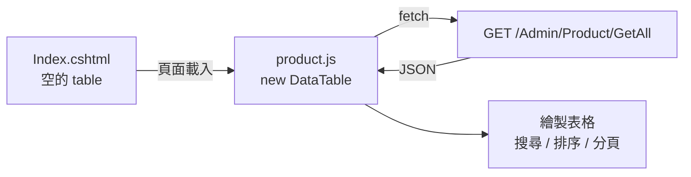

<div class="flex flex-col justify-center items-center h-full" style="background: #ffffff;">
  <p style="color: #5eada0; font-size: 1rem; font-weight: 600; letter-spacing: 0.2em; text-transform: uppercase; margin-bottom: 1.2rem;">ASP.NET Core Masterclass</p>
  <h1 style="color: #1a5c5c; font-size: 3.4rem; font-weight: 900; line-height: 1.15; margin-bottom: 1.5rem;">Product 商品管理與首頁</h1>
  <div style="height: 4px; width: 320px; background: linear-gradient(90deg, #5eada0, #a7d9d0); border-radius: 2px; margin-bottom: 1.5rem;"></div>
  <p style="color: #4a7c7c; font-size: 1.15rem; font-style: italic;">「把咖啡豆擺上架，讓客人看得到」</p>
  <Link to="home" style="color: #9dc4c4; font-size: 0.85rem; margin-top: 2rem; text-decoration: none; letter-spacing: 0.05em;">← 返回目錄</Link>
</div>

<!--
大家好，歡迎來到第八章！

上一章我們把 EShop 的架構整理好了：四個專案、泛型 Repository、UnitOfWork，還有前後台的 Area。從這一章開始，我們要在這個架構上一個一個加入商店的功能。

這一章的主角是商品 Product。我們會建立商品的 Model 和 CRUD，讓商品跟分類產生關聯，學習 ViewBag、ViewData 和 ViewModel 三種傳遞資料的方式，把新增和編輯合併成一個頁面，處理圖片上傳，用 DataTable 做出有搜尋、排序、分頁的商品列表，最後完成前台的首頁和商品詳細頁。

這一章做完，EShop 就真正像一個商店了。
-->

---
layout: default
---

# Outline

- **回顧：Repository、UnitOfWork 與 Area**
- **8-1 建立 Product Model**
- **8-2 Product 的基本 CRUD**
- **8-3 加入類別、圖片欄位與建立關聯**
- **8-4 ViewBag、ViewData 以及 ViewModel**
- **8-5 整合新增及編輯頁面（Upsert）**
- **8-6 儲存圖片路徑與靜態檔案管理**
- **8-7 DataTable 實作**
- **8-8 前台首頁建立與展示**
- **總結**

<!--
這一章有八個小節，是整門課最長的一章。

前兩節建立商品的基本功能，第三節建立商品和分類的關聯，第四、五節學習 ViewModel 並合併新增和編輯頁面，第六節處理圖片上傳，第七節用 DataTable 改善後台列表，第八節完成前台首頁。
-->

---

# 回顧：Repository、UnitOfWork 與 Area

| 重點 | 寫法 |
| --- | --- |
| 泛型 Repository | `GetAllAsync(filter, orderBy, includeProperties)`、`GetAsync`、`Add`、`Remove` |
| 專屬 Repository | `ICategoryRepository : IRepository<Category>` + `Update` |
| UnitOfWork | `unitOfWork.Category.Add(...)` → `await unitOfWork.SaveAsync()` |
| Area | `[Area("Admin")]`、`{area=Customer}/{controller=Home}/...`、`asp-area` |

「新增一個實體 = Model → Repository → UnitOfWork → Controller → View。」

<!--
我們先回顧上一章。

泛型 Repository 封裝了共通的查詢和新增刪除，每個實體再繼承出自己的 Repository 加上 Update。UnitOfWork 集中管理所有 Repository，一次存檔。Area 把網站分成前台和後台。

上一章的綜合練習，大家已經走過一次「新增一個實體」的完整流程：Model、Repository、UnitOfWork、Controller、View。這一章的商品，就是照著這個流程來做。
-->

---
layout: section
class: flex flex-col justify-center items-center text-center
---

# 8-1 建立 Product Model
### Product Entity

<!--
第一個小節，我們來建立商品的 Model。
-->

---
zoom: 0.95
---

# 在 ASP.NET Core 中練習建立 Product

```csharp
// EShop.Models/Product.cs
namespace EShop.Models;

public class Product
{
    public int Id { get; set; }

    [Required(ErrorMessage = "請輸入商品名稱"), MaxLength(50)]
    [Display(Name = "商品名稱")]
    public string Name { get; set; } = "";

    [Display(Name = "商品描述")]
    public string? Description { get; set; }

    [Required, MaxLength(30), Display(Name = "產地")]
    public string Origin { get; set; } = "";

    [Range(1, 100000, ErrorMessage = "價格需介於 1 到 100,000")]
    [Precision(10, 0), Display(Name = "售價")]
    public decimal Price { get; set; }

    [Range(0, 9999), Display(Name = "庫存")]
    public int Stock { get; set; }
}
```

<!--
我們在 Models 專案建立 Product 類別。

商品有名稱、描述、產地、售價和庫存。描述是 string?，代表可以不填。售價用 decimal，這是第二章說過的，金額一定要用 decimal。

Precision(10, 0) 是 EF Core 的標記，設定資料庫欄位的精準度：總共 10 位數、小數 0 位。如果沒有設定，EF Core 在建立 Migration 時會警告我們 decimal 沒有指定精準度。Precision 屬於 Microsoft.EntityFrameworkCore 命名空間，所以 Models 專案要安裝 Microsoft.EntityFrameworkCore.Abstractions 這個輕量套件。

庫存 Stock 會在第十章送出訂單時扣除。
-->

---

# 加入 DbSet、種子資料與 Migration

```csharp
// ApplicationDbContext.cs
public DbSet<Product> Products { get; set; }

protected override void OnModelCreating(ModelBuilder modelBuilder)
{
    // ...Category 的 HasData
    modelBuilder.Entity<Product>().HasData(
        new Product { Id = 1, Name = "耶加雪菲 G1", Origin = "衣索比亞", Price = 450, Stock = 20 },
        new Product { Id = 2, Name = "薇拉 SHB",    Origin = "哥倫比亞", Price = 380, Stock = 15 },
        new Product { Id = 3, Name = "翡翠莊園藝伎", Origin = "巴拿馬",  Price = 1200, Stock = 5 });
}
```

```bash
dotnet ef migrations add AddProductToDb --project EShop.DataAccess --startup-project EShop.Web
dotnet ef database update --project EShop.DataAccess --startup-project EShop.Web
```

<!--
接著在 DbContext 加入 DbSet of Product，並加上三筆種子資料。

然後執行 Migration。記得上一章學的，指令要加上 --project 和 --startup-project 兩個參數。

執行完之後，資料庫就會出現 Products 資料表和三筆咖啡豆。
-->

---
layout: default
---

# 練習 1：建立 Product
### 任務說明

1. 在 `EShop.Models` 建立 `Product`（名稱、描述、產地、售價、庫存）
2. `EShop.Models` 安裝 `Microsoft.EntityFrameworkCore.Abstractions` 以使用 `[Precision]`
3. 在 `ApplicationDbContext` 加入 `DbSet<Product>` 與至少 3 筆種子資料
4. 完成 Migration，確認資料表的 `Price` 欄位型別為 `decimal(10,0)`

<!--
【練習目的】
建立商品實體，為後面的 CRUD 做準備。

【操作提示】
可以打開產生的 Migration 檔案，看看 EF Core 是怎麼把 C# 屬性轉成資料表欄位的。
-->

---
layout: default
---

# 練習 1：解題提示

```bash
dotnet add EShop.Models package Microsoft.EntityFrameworkCore.Abstractions
```

```csharp
// Migrations/xxxx_AddProductToDb.cs（節錄）
migrationBuilder.CreateTable(
    name: "Products",
    columns: table => new
    {
        Id = table.Column<int>(type: "int", nullable: false)
            .Annotation("SqlServer:Identity", "1, 1"),
        Name = table.Column<string>(type: "nvarchar(50)", maxLength: 50, nullable: false),
        Price = table.Column<decimal>(type: "decimal(10,0)", precision: 10, scale: 0, nullable: false),
        // ...
    });
```

<!--
從 Migration 檔案可以看到：MaxLength(50) 變成 nvarchar(50)，Precision(10, 0) 變成 decimal(10,0)，string? 的 Description 會是 nullable: true。
-->

---
layout: section
class: flex flex-col justify-center items-center text-center
---

# 8-2 Product 的基本 CRUD
### Repository + Controller

<!--
第二個小節，我們照著上一章的流程，完成商品的基本 CRUD。
-->

---

# Step 1：ProductRepository 與 UnitOfWork

```csharp
public interface IProductRepository : IRepository<Product>
{
    void Update(Product product);
}

public class ProductRepository(ApplicationDbContext db)
    : Repository<Product>(db), IProductRepository
{
    public void Update(Product product) => _db.Products.Update(product);
}
```

```csharp
public interface IUnitOfWork
{
    ICategoryRepository Category { get; }
    IProductRepository Product { get; }
    Task SaveAsync();
}
// UnitOfWork 加入：public IProductRepository Product { get; } = new ProductRepository(db);
```

<!--
第一步，建立 ProductRepository，跟 CategoryRepository 幾乎一模一樣，只是把 Category 換成 Product。

然後在 IUnitOfWork 和 UnitOfWork 加上 Product 屬性。有了泛型 Repository，新增一個實體的資料存取層只需要這幾行。
-->

---

# Step 2：Admin 的 ProductController

```csharp
[Area("Admin")]
public class ProductController(IUnitOfWork unitOfWork) : Controller
{
    public async Task<IActionResult> Index()
        => View(await unitOfWork.Product.GetAllAsync(orderBy: q => q.OrderBy(p => p.Name)));

    public IActionResult Create() => View();

    [HttpPost, ValidateAntiForgeryToken]
    public async Task<IActionResult> Create(Product product)
    {
        if (!ModelState.IsValid) return View(product);
        unitOfWork.Product.Add(product);
        await unitOfWork.SaveAsync();
        TempData[SD.Success] = "商品新增成功";
        return RedirectToAction(nameof(Index));
    }
    // Edit、Delete 與 CategoryController 相同模式
}
```

<!--
第二步，在 Admin Area 建立 ProductController。

大家會發現，這跟 CategoryController 的結構完全一樣：注入 IUnitOfWork，Index 查詢全部，Create 驗證、新增、存檔、通知、轉址。Edit 和 Delete 也是同樣的模式，這裡就不重複貼了。

View 的部分，可以把 Category 的 View 複製過來，把欄位改成商品的欄位。記得在 _Layout 的「後台管理」下拉選單加上「商品管理」。
-->

---

# 使用多個 CRUD 的注意事項

| 注意事項 | 說明 |
| --- | --- |
| **之一：UnitOfWork 要加屬性** | 忘了加，Controller 會找不到 `unitOfWork.Product` |
| **之二：Area 的 View 路徑** | `Areas/Admin/Views/Product/Index.cshtml` |
| **之三：數字欄位的格式** | 列表的售價用 `@p.Price.ToString("N0")` 顯示千分位 |

<!--
基本 CRUD 的三個注意事項：UnitOfWork 要加屬性，View 要放在 Admin Area 的 Product 資料夾，數字欄位在列表上可以用 ToString("N0") 顯示千分位。
-->

---
layout: default
---

# 練習 2：商品 CRUD
### 任務說明

1. 建立 `IProductRepository`、`ProductRepository`，加入 `UnitOfWork`
2. 在 Admin Area 建立 `ProductController` 與 Index / Create / Edit / Delete 的 View
3. 列表頁庫存 ≤ 5 的商品，庫存欄位用紅字顯示
4. `_Layout` 的後台下拉選單加入「商品管理」

<!--
【練習目的】
獨立完成第二個實體的 CRUD，熟悉整個流程。

【解題引導】
紅字可以用 Bootstrap 的 text-danger class，在 View 裡用條件判斷決定要不要加上這個 class。
-->

---
layout: default
---

# 練習 2：解題提示

```razor
@foreach (var p in Model)
{
    <tr>
        <td>@p.Name</td>
        <td>@p.Origin</td>
        <td class="text-end">@p.Price.ToString("N0")</td>
        <td class="text-end @(p.Stock <= 5 ? "text-danger fw-bold" : "")">@p.Stock</td>
        <td>
            <a asp-action="Edit" asp-route-id="@p.Id" class="btn btn-sm btn-outline-primary">編輯</a>
            <a asp-action="Delete" asp-route-id="@p.Id" class="btn btn-sm btn-outline-danger">刪除</a>
        </td>
    </tr>
}
```

<!--
class 屬性裡用 @ 加小括號寫三元運算子，庫存小於等於 5 就加上 text-danger 和 fw-bold，否則是空字串。
-->

---
layout: section
class: flex flex-col justify-center items-center text-center
---

# 8-3 加入類別、圖片欄位與建立關聯
### Foreign Key & Navigation Property

<!--
第三個小節，我們要讓商品屬於某個分類，並加上圖片欄位。
-->

---

# 什麼是關聯（Relationship）？

每一包咖啡豆都屬於一個分類，一個分類底下有很多商品：

| 分類（Category） | 商品（Product） |
| --- | --- |
| 1 單品咖啡豆 | 耶加雪菲 G1、薇拉 SHB |
| 2 精品咖啡豆 | 翡翠莊園藝伎 |

「這是**一對多（One-to-Many）**關聯：在『多』的那一方（Product）加上**外鍵（Foreign Key）** `CategoryId`，指向『一』的那一方。」

<!--
每一包咖啡豆都屬於一個分類，而一個分類底下可以有很多商品，這在資料庫裡叫做一對多關聯。

實作的方式是：在「多」的那一方，也就是 Product，加上一個 CategoryId 欄位，記錄這個商品屬於哪個分類。這個欄位就叫外鍵，Foreign Key。

就像每一包咖啡豆上都貼了一張標籤，寫著「我屬於單品咖啡豆區」。
-->

---
zoom: 0.95
---

# 在 ASP.NET Core 中練習建立關聯

```csharp
public class Product
{
    // ...原本的屬性

    [Display(Name = "分類")]
    public int CategoryId { get; set; }                 // 外鍵

    [ForeignKey(nameof(CategoryId))]
    public Category? Category { get; set; }             // 導覽屬性（Navigation Property）

    public string? ImageUrl { get; set; }               // 圖片路徑
}
```

| 屬性 | 角色 |
| --- | --- |
| `CategoryId` | 外鍵，實際存在資料表的欄位 |
| `Category` | 導覽屬性，不會變成欄位；查詢時用 `Include` 載入分類物件 |
| `ImageUrl` | 圖片在 `wwwroot` 中的路徑，例如 `/images/product/xxx.jpg` |

<!--
我們在 Product 加上三個屬性。

CategoryId 是外鍵，會變成資料表的一個欄位。Category 是導覽屬性，它不會變成欄位，而是讓我們可以透過 product.Category.Name 直接取得分類名稱。ForeignKey 標記告訴 EF Core：這個導覽屬性是用 CategoryId 這個外鍵連接的。其實照著命名慣例寫，EF Core 也會自動認得。

ImageUrl 存的是圖片的路徑，圖片檔案本身會存在 wwwroot 資料夾，8-6 會詳細說明。

注意 Category 和 ImageUrl 都宣告成可為 null。這很重要：開啟 Nullable 之後，MVC 會把不可為 null 的參考型別屬性當成必填，如果 Category 不是 nullable，表單送出時就會出現「Category 欄位是必填」的驗證錯誤，因為表單只會送出 CategoryId。
-->

---

# 更新種子資料與 Migration

```csharp
modelBuilder.Entity<Product>().HasData(
    new Product { Id = 1, Name = "耶加雪菲 G1", Origin = "衣索比亞", Price = 450,  Stock = 20, CategoryId = 1 },
    new Product { Id = 2, Name = "薇拉 SHB",    Origin = "哥倫比亞", Price = 380,  Stock = 15, CategoryId = 1 },
    new Product { Id = 3, Name = "翡翠莊園藝伎", Origin = "巴拿馬",  Price = 1200, Stock = 5,  CategoryId = 2 });
```

```bash
dotnet ef migrations add AddCategoryAndImageToProduct --project EShop.DataAccess --startup-project EShop.Web
dotnet ef database update --project EShop.DataAccess --startup-project EShop.Web
```

<!--
種子資料要補上 CategoryId，否則外鍵會是 0，而 Id 為 0 的分類不存在，Migration 會因為外鍵限制而失敗。

然後新增 Migration 並更新資料庫。產生的 Migration 裡會看到新增 CategoryId 欄位、建立外鍵限制和索引。
-->

---

# 用 Include 載入關聯資料

```csharp
var products = await unitOfWork.Product.GetAllAsync(includeProperties: "Category");
```

EF Core 產生的 SQL：

```sql
SELECT [p].[Id], [p].[Name], ..., [c].[Id], [c].[Name], [c].[DisplayOrder]
FROM [Products] AS [p]
INNER JOIN [Categories] AS [c] ON [p].[CategoryId] = [c].[Id]
```

```razor
<td>@p.Category?.Name</td>
```

<div class="mt-4 p-3 bg-blue-50 border-l-4 border-blue-400 text-gray-700 text-sm text-left">
💡 沒有 <code>Include</code> 的話，<code>p.Category</code> 會是 <code>null</code>。EF Core <b>不會</b>自動載入關聯資料。
</div>

<!--
要在商品列表顯示分類名稱，查詢時就要用上一章寫在 Repository 裡的 includeProperties，傳入 "Category"。

EF Core 會產生一個 JOIN，把分類資料一起查出來。View 裡就可以用 p.Category?.Name 顯示分類名稱。

如果忘了 Include，Category 會是 null，畫面上的分類欄位就會是空的。這是新手很常遇到的問題。
-->

---

# 使用關聯的注意事項

| 注意事項 | 說明 |
| --- | --- |
| **之一：導覽屬性要宣告成可為 null** | 否則 MVC 會把它當必填，表單驗證失敗 |
| **之二：記得 Include** | 沒有 `Include`，導覽屬性會是 `null` |
| **之三：刪除分類時的外鍵限制** | 分類下還有商品時，預設會串聯刪除（Cascade）或被外鍵擋下，需先決定規則 |

<!--
關聯的三個注意事項。

之一和之二剛剛都說過了。之三是第五章留下的伏筆：現在商品有 CategoryId 外鍵，EF Core 預設的刪除行為是 Cascade，刪除分類會把底下的商品一起刪掉，這通常不是我們要的。實務上會在刪除分類前，先檢查底下有沒有商品，這就是本節的練習題。
-->

---
layout: default
---

# 練習 3：分類與商品的關聯
### 任務說明

1. 在 `Product` 加入 `CategoryId`、`Category`、`ImageUrl`，完成 Migration
2. 商品列表顯示分類名稱（使用 `includeProperties`）
3. 修改分類的刪除功能：**分類底下還有商品時不能刪除**，並用 Toastr 顯示錯誤

<!--
【練習目的】
建立一對多關聯，並處理刪除時的資料完整性。

【解題引導】
刪除前可以用 unitOfWork.Product.GetAsync 或在 ProductRepository 寫一個 AnyByCategoryAsync 判斷分類底下有沒有商品。
-->

---
layout: default
---

# 練習 3：解題提示

```csharp
// CategoryController.DeletePost
var hasProducts = await unitOfWork.Product.GetAsync(p => p.CategoryId == id) is not null;
if (hasProducts)
{
    TempData[SD.Error] = "此分類底下還有商品，無法刪除";
    return RedirectToAction(nameof(Index));
}
```

<div class="mt-4 p-3 bg-blue-50 border-l-4 border-blue-400 text-gray-700 text-sm text-left">
💡 更好的做法是在 <code>IProductRepository</code> 加上 <code>Task&lt;bool&gt; AnyAsync(Expression&lt;Func&lt;Product, bool&gt;&gt; filter)</code>，產生的 SQL 是 <code>EXISTS</code>，效能更好。
</div>

<!--
用 GetAsync 取得第一筆，如果不是 null 就代表還有商品。這樣寫可以動，但會把一整筆商品查出來。更好的做法是在 Repository 加一個 AnyAsync 方法，第三章說過，只想知道有沒有，用 Any 最有效率。
-->

---
layout: section
class: flex flex-col justify-center items-center text-center
---

# 8-4 ViewBag、ViewData 以及 ViewModel
### Passing Data to Views

<!--
第四個小節。新增商品時要選擇分類，那分類的下拉選單資料要怎麼傳到 View？這一節我們來比較三種傳遞資料的方式。
-->

---

# 問題：View 需要不只一種資料

新增商品的頁面需要：

| 資料 | 型別 |
| --- | --- |
| 商品本身（表單要綁定的欄位） | `Product` |
| 分類下拉選單的選項 | `IEnumerable<SelectListItem>` |

「`View(model)` 只能傳**一個** Model，另一種資料要怎麼傳？」

<!--
新增商品的頁面，除了商品本身的欄位，還需要一個分類的下拉選單，選項要從資料庫查出來。

但 View(model) 只能傳一個 Model，那分類清單要怎麼傳過去？ASP.NET Core 提供了三種方式：ViewData、ViewBag 和 ViewModel。
-->

---

# 方式一：ViewData

```csharp
public async Task<IActionResult> Create()
{
    var categories = await unitOfWork.Category.GetAllAsync();
    ViewData["CategoryList"] = categories.Select(c => new SelectListItem
    {
        Text = c.Name,
        Value = c.Id.ToString()
    });
    return View();
}
```

```razor
<select asp-for="CategoryId" class="form-select"
        asp-items="@(ViewData["CategoryList"] as IEnumerable<SelectListItem>)">
    <option disabled selected>-- 請選擇分類 --</option>
</select>
```

<!--
第一種是 ViewData，它是一個字典，用字串當 key 存放資料。

我們把分類轉換成 SelectListItem，這是下拉選單專用的型別，Text 是顯示的文字，Value 是送出的值。第三章學的 Select 在這裡派上用場了。

View 裡用 select 標籤搭配 asp-items 產生選項。但是因為 ViewData 存的是 object，取出來要用 as 轉型，寫起來有點冗長，而且 key 打錯字也不會有任何提示。
-->

---

# 方式二：ViewBag

```csharp
ViewBag.CategoryList = categories.Select(c => new SelectListItem
{
    Text = c.Name,
    Value = c.Id.ToString()
});
```

```razor
<select asp-for="CategoryId" asp-items="ViewBag.CategoryList" class="form-select">
    <option disabled selected>-- 請選擇分類 --</option>
</select>
```

| 比較 | ViewData | ViewBag |
| --- | --- | --- |
| 語法 | `ViewData["Key"]` | `ViewBag.Key` |
| 型別 | `object`，需轉型 | `dynamic`，不需轉型 |
| 本質 | 字典 | 包裝 ViewData 的動態物件（兩者共用資料） |

<!--
第二種是 ViewBag，它其實是 ViewData 的包裝，兩者存取的是同一份資料。差別在於 ViewBag 是 dynamic 型別，可以用點直接存取，不需要轉型，寫起來比較簡潔。

但 dynamic 的缺點是完全沒有編譯檢查，ViewBag.CategoryLsit 打錯字，編譯會過，執行時才發現下拉選單是空的。
-->

---

# 方式三：ViewModel（推薦）

「ViewModel 是**專門為某個 View 設計的類別**，把 View 需要的所有資料包在一起。」

```csharp
// EShop.Models/ViewModels/ProductVM.cs
using Microsoft.AspNetCore.Mvc.ModelBinding.Validation;
using Microsoft.AspNetCore.Mvc.Rendering;

namespace EShop.Models.ViewModels;

public class ProductVM
{
    public Product Product { get; set; } = new();

    [ValidateNever]
    public IEnumerable<SelectListItem> CategoryList { get; set; } = [];
}
```

```xml
<!-- EShop.Models.csproj：使用 SelectListItem 需要引用 ASP.NET Core 共用架構 -->
<ItemGroup>
  <FrameworkReference Include="Microsoft.AspNetCore.App" />
</ItemGroup>
```

<!--
第三種，也是最推薦的方式：ViewModel。

ViewModel 是專門為某個 View 設計的類別，把 View 需要的所有資料包在一起。ProductVM 裡有一個 Product 和一個 CategoryList。

CategoryList 上面的 ValidateNever 告訴 MVC 不要驗證這個屬性，因為表單送出時不會送回整個下拉選單的選項，如果驗證它就會失敗。

因為 SelectListItem 和 ValidateNever 屬於 ASP.NET Core MVC，Models 是類別庫專案，所以要在 csproj 加上 FrameworkReference，引用 ASP.NET Core 的共用架構。
-->

---

# 在 ASP.NET Core 中練習使用 ViewModel

```csharp
public async Task<IActionResult> Create()
{
    ProductVM vm = new()
    {
        CategoryList = (await unitOfWork.Category.GetAllAsync())
            .Select(c => new SelectListItem { Text = c.Name, Value = c.Id.ToString() })
    };
    return View(vm);
}
```

```razor
@model ProductVM

<input asp-for="Product.Name" class="form-control" />
<select asp-for="Product.CategoryId" asp-items="Model.CategoryList" class="form-select">
    <option disabled selected>-- 請選擇分類 --</option>
</select>
```

<!--
使用 ViewModel 之後，Controller 建立 ProductVM，填好分類清單，傳給 View。

View 的 @model 改成 ProductVM，表單欄位的 asp-for 變成 Product.Name、Product.CategoryId，下拉選單的 asp-items 用 Model.CategoryList。

全部都是強型別，打錯字編譯器就會報錯，IntelliSense 也會自動提示，這就是 ViewModel 最大的優點。
-->

---

# 三種方式比較

| 比較 | ViewData | ViewBag | ViewModel |
| --- | --- | --- | --- |
| 型別安全 | ❌ 需轉型 | ❌ dynamic | ✅ 強型別 |
| IntelliSense | ❌ | ❌ | ✅ |
| 打錯字 | 執行時才發現 | 執行時才發現 | **編譯時就發現** |
| 適合情境 | 頁面標題等少量資料 | 頁面標題等少量資料 | **表單、複雜頁面** |

<div class="mt-4 p-3 bg-blue-50 border-l-4 border-blue-400 text-gray-700 text-sm text-left">
💡 範本中的 <code>ViewData["Title"]</code> 就是 ViewData 的典型用法：只傳一個簡單的字串給 <code>_Layout</code>。
</div>

<!--
三種方式整理成一張表。

ViewData 和 ViewBag 都沒有型別安全，適合傳一些簡單、少量的資料，例如範本裡的 ViewData Title。ViewModel 有完整的型別安全和 IntelliSense，適合表單和比較複雜的頁面。

實務上的原則是：頁面需要的主要資料一律用 ViewModel，ViewData 和 ViewBag 只用在很簡單的地方。另外別忘了第五章的 TempData，它是用來跨轉址傳訊息的，跟這三個的用途不一樣。
-->

---

# 使用 ViewModel 的注意事項

| 注意事項 | 說明 |
| --- | --- |
| **之一：清單屬性加 `[ValidateNever]`** | 下拉選單選項不會隨表單送回，不應被驗證 |
| **之二：驗證失敗要重新填清單** | POST 收到的 `CategoryList` 是空的，回傳 View 前要再查一次 |
| **之三：ViewModel 放在 `Models/ViewModels`** | 與資料庫實體分開，不會被 EF Core 建成資料表 |

<!--
ViewModel 有三個注意事項。

之一，清單屬性要加 ValidateNever。之二特別重要：驗證失敗要回傳 View 的時候，POST 收到的 ViewModel 裡 CategoryList 是空的，因為表單不會送回選項，所以要重新查一次分類清單，否則下拉選單會變成空白。之三，ViewModel 放在 ViewModels 資料夾，跟資料庫實體分開。
-->

---
layout: default
---

# 練習 4：改用 ViewModel
### 任務說明

1. 建立 `ProductVM`，並在 `EShop.Models.csproj` 加入 `FrameworkReference`
2. 商品的 Create 改用 `ProductVM`，表單加入分類下拉選單
3. 故意讓驗證失敗（例如名稱空白），確認下拉選單**仍有選項**

<!--
【練習目的】
熟悉 ViewModel 的寫法，並處理驗證失敗時重新填清單的情況。

【解題引導】
可以把「建立分類清單」寫成一個 private 方法，GET 和 POST 都呼叫它。
-->

---
layout: default
---

# 練習 4：解題提示

```csharp
[HttpPost, ValidateAntiForgeryToken]
public async Task<IActionResult> Create(ProductVM vm)
{
    if (!ModelState.IsValid)
    {
        vm.CategoryList = await GetCategoryListAsync();   // 重新填清單
        return View(vm);
    }
    unitOfWork.Product.Add(vm.Product);
    await unitOfWork.SaveAsync();
    TempData[SD.Success] = "商品新增成功";
    return RedirectToAction(nameof(Index));
}

private async Task<IEnumerable<SelectListItem>> GetCategoryListAsync()
    => (await unitOfWork.Category.GetAllAsync(orderBy: q => q.OrderBy(c => c.DisplayOrder)))
        .Select(c => new SelectListItem { Text = c.Name, Value = c.Id.ToString() });
```

<!--
把建立清單的邏輯抽成 GetCategoryListAsync 方法，GET 和 POST 都可以重複使用。POST 新增時，要 Add 的是 vm.Product，不是整個 ViewModel。
-->

---
layout: section
class: flex flex-col justify-center items-center text-center
---

# 8-5 整合新增及編輯頁面
### Upsert

<!--
第五個小節。大家有沒有發現，Create 和 Edit 的 View 幾乎一模一樣？這一節我們把它們合併成一個頁面。
-->

---

# 什麼是 Upsert？

「Upsert = **Up**date + In**sert**：同一個頁面，依照有沒有 Id 決定是新增還是編輯。」

| 情況 | 網址 | 判斷 | 動作 |
| --- | --- | --- | --- |
| 新增 | `/Admin/Product/Upsert` | `id` 是 `null` 或 `0` | 顯示空白表單 → `Add` |
| 編輯 | `/Admin/Product/Upsert/3` | `id` 有值 | 帶出商品資料 → `Update` |

| 好處 | 說明 |
| --- | --- |
| 少一份 View | 表單只要維護一份 |
| 驗證規則一致 | 新增與編輯走同一段程式碼 |

<!--
Upsert 是 Update 和 Insert 的組合字，意思是用同一個頁面處理新增和編輯。

判斷方式很簡單：網址上沒有 id，或 id 是 0，就是新增；有 id 就是編輯，先把資料查出來帶到表單上。

好處是表單只要維護一份，新增和編輯的驗證規則也一定一致。商品的表單欄位比較多，又有圖片上傳，合併之後維護起來會輕鬆很多。
-->

---

# 在 ASP.NET Core 中練習 Upsert — GET

```csharp
public async Task<IActionResult> Upsert(int? id)
{
    ProductVM vm = new() { CategoryList = await GetCategoryListAsync() };

    if (id is null or 0)
        return View(vm);                                     // 新增

    var product = await unitOfWork.Product.GetAsync(p => p.Id == id);
    if (product is null) return NotFound();

    vm.Product = product;                                    // 編輯
    return View(vm);
}
```

<!--
GET 的 Upsert 先建立 ViewModel 並填好分類清單。

如果 id 是 null 或 0，代表是新增，直接回傳空白的 ViewModel。否則就是編輯，查出商品放進 ViewModel 再回傳。找不到商品就回傳 404。
-->

---
zoom: 0.9
---

# Upsert View

```razor
@model ProductVM
@{ var isEdit = Model.Product.Id != 0; }

<h2>@(isEdit ? "編輯商品" : "新增商品")</h2>
<form method="post" enctype="multipart/form-data">
    <input asp-for="Product.Id" type="hidden" />
    <input asp-for="Product.ImageUrl" type="hidden" />
    <div class="mb-3">
        <label asp-for="Product.Name" class="form-label"></label>
        <input asp-for="Product.Name" class="form-control" />
        <span asp-validation-for="Product.Name" class="text-danger"></span>
    </div>
    @* 產地、售價、庫存、描述欄位同上 *@
    <div class="mb-3">
        <label asp-for="Product.CategoryId" class="form-label"></label>
        <select asp-for="Product.CategoryId" asp-items="Model.CategoryList" class="form-select">
            <option disabled selected>-- 請選擇分類 --</option>
        </select>
    </div>
    <div class="mb-3">
        <label class="form-label">商品圖片</label>
        <input type="file" name="file" class="form-control" accept="image/*" />
    </div>
    <button type="submit" class="btn btn-primary">@(isEdit ? "更新" : "建立")</button>
</form>
```

<!--
Upsert View 用 isEdit 變數判斷目前是新增還是編輯，標題和按鈕文字會跟著改變。

表單有兩個隱藏欄位：Product.Id 讓 POST 知道要更新哪一筆；Product.ImageUrl 保留原本的圖片路徑，編輯時如果沒有上傳新圖片，就沿用舊的。

注意 form 標籤加上了 enctype="multipart/form-data"，這是上傳檔案一定要加的設定，否則檔案不會被送出。檔案欄位的 name 叫 file，等一下 POST 的參數名稱要一樣。
-->

---

# 在 ASP.NET Core 中練習 Upsert — POST

```csharp
[HttpPost, ValidateAntiForgeryToken]
public async Task<IActionResult> Upsert(ProductVM vm, IFormFile? file)
{
    if (!ModelState.IsValid)
    {
        vm.CategoryList = await GetCategoryListAsync();
        return View(vm);
    }

    if (file is not null)
        vm.Product.ImageUrl = await SaveImageAsync(file, vm.Product.ImageUrl);   // 8-6 實作

    if (vm.Product.Id == 0)
        unitOfWork.Product.Add(vm.Product);
    else
        unitOfWork.Product.Update(vm.Product);

    await unitOfWork.SaveAsync();
    TempData[SD.Success] = vm.Product.Id == 0 ? "商品新增成功" : "商品更新成功";
    return RedirectToAction(nameof(Index));
}
```

<!--
POST 的 Upsert 多了一個 IFormFile? file 參數，用來接住上傳的檔案，參數名稱要跟表單的 name 一樣。沒有上傳檔案時會是 null。

驗證通過之後，如果有上傳檔案，就呼叫 SaveImageAsync 儲存圖片，下一節會實作。然後根據 Id 是不是 0，決定要 Add 還是 Update。

大家注意最後 TempData 的判斷有一個小陷阱：SaveAsync 之後，新增的商品 Id 已經被資料庫填上了，不會是 0，所以訊息永遠會是「更新成功」。練習題會請大家修正這個問題。
-->

---

# 使用 Upsert 的注意事項

| 注意事項 | 說明 |
| --- | --- |
| **之一：隱藏欄位 `Id` 與 `ImageUrl`** | 少了 `Id` 會變成新增；少了 `ImageUrl` 編輯時圖片會消失 |
| **之二：表單要 `enctype="multipart/form-data"`** | 否則 `IFormFile` 永遠是 `null` |
| **之三：`SaveAsync` 後 Id 會被填入** | 需要判斷新增或編輯時，要在存檔**之前**先記下來 |

<!--
Upsert 有三個注意事項，前兩個跟隱藏欄位和 enctype 有關，第三個就是剛剛說的陷阱：SaveAsync 之後，新增的實體 Id 會被資料庫產生的值填入。
-->

---
layout: default
---

# 練習 5：完成 Upsert
### 任務說明

1. 刪除商品的 `Create` 與 `Edit`，改成 `Upsert`（GET + POST）與 `Upsert.cshtml`
2. 列表頁的「新增」與「編輯」按鈕都連到 `Upsert`
3. 修正 TempData 訊息的陷阱，讓新增時顯示「商品新增成功」
4. 編輯時，標題顯示「編輯商品：{商品名稱}」

<!--
【練習目的】
完成 Upsert，並修正存檔後 Id 改變的問題。

【解題引導】
在 SaveAsync 之前宣告一個 bool isNew = vm.Product.Id == 0。
-->

---
layout: default
---

# 練習 5：解題提示

```csharp
var isNew = vm.Product.Id == 0;
if (isNew) unitOfWork.Product.Add(vm.Product);
else unitOfWork.Product.Update(vm.Product);

await unitOfWork.SaveAsync();
TempData[SD.Success] = isNew ? "商品新增成功" : "商品更新成功";
```

```razor
<a asp-action="Upsert" class="btn btn-primary">＋ 新增商品</a>
<a asp-action="Upsert" asp-route-id="@p.Id" class="btn btn-sm btn-outline-primary">編輯</a>
```

<!--
在存檔前先記下 isNew，存檔後就能正確判斷。列表頁的新增按鈕不帶 id，編輯按鈕帶 asp-route-id。
-->

---
layout: section
class: flex flex-col justify-center items-center text-center
---

# 8-6 儲存圖片路徑與靜態檔案管理
### File Upload & Static Files

<!--
第六個小節，我們來實作圖片上傳，並了解 ASP.NET Core 怎麼提供靜態檔案。
-->

---

# 圖片要存在哪裡？

| 做法 | 說明 | 本課程 |
| --- | --- | --- |
| 存在資料庫（`varbinary`） | 資料庫會變得很大，備份與查詢變慢 | ❌ |
| **存在 `wwwroot` 資料夾，資料庫只存路徑** | 簡單直覺，適合學習與中小型網站 | ✅ |
| 存在雲端儲存（Azure Blob、S3） | 多台伺服器共用，正式環境主流 | 補充 |

```text
EShop.Web/wwwroot/images/product/3f2a91c0-...-8b7d.jpg     ← 實際檔案
Products.ImageUrl = "/images/product/3f2a91c0-...-8b7d.jpg" ← 資料庫存的路徑
```

<!--
圖片要存在哪裡？有三種做法。

直接存在資料庫會讓資料庫變得很大。我們採用第二種：把檔案存在 wwwroot 底下的 images/product 資料夾，資料庫只存路徑。這是最簡單直覺的做法。

正式環境如果有多台伺服器，通常會存在雲端儲存，例如 Azure Blob Storage，但做法的概念是一樣的：檔案放在某個地方，資料庫只存位置。
-->

---

# 什麼是 IWebHostEnvironment？

「`IWebHostEnvironment` 提供網站的環境資訊，最常用的是 **`WebRootPath`**：`wwwroot` 資料夾在伺服器上的實體路徑。」

| 屬性 | 範例值 |
| --- | --- |
| `WebRootPath` | `/home/app/EShop.Web/wwwroot` |
| `ContentRootPath` | `/home/app/EShop.Web` |
| `EnvironmentName` | `Development` / `Production` |

```csharp
[Area("Admin")]
public class ProductController(IUnitOfWork unitOfWork, IWebHostEnvironment env) : Controller
```

<!--
要把檔案存到 wwwroot，我們需要知道 wwwroot 在伺服器上的完整路徑。每台電腦的路徑都不一樣，所以不能寫死。

IWebHostEnvironment 是框架內建的服務，WebRootPath 就是 wwwroot 的實體路徑。它已經註冊在 DI 容器裡了，所以我們只要在 ProductController 的建構子多加一個參數，就能注入使用。這就是第六章學的 DI。
-->

---

# 在 ASP.NET Core 中練習儲存圖片

```csharp
private async Task<string> SaveImageAsync(IFormFile file, string? oldImageUrl)
{
    var folder = Path.Combine(env.WebRootPath, "images", "product");
    Directory.CreateDirectory(folder);                          // 資料夾不存在就建立

    var fileName = $"{Guid.NewGuid()}{Path.GetExtension(file.FileName)}";
    await using (var stream = new FileStream(Path.Combine(folder, fileName), FileMode.Create))
    {
        await file.CopyToAsync(stream);
    }

    if (!string.IsNullOrEmpty(oldImageUrl))                     // 刪除舊圖片
    {
        var oldPath = Path.Combine(env.WebRootPath, oldImageUrl.TrimStart('/'));
        if (System.IO.File.Exists(oldPath)) System.IO.File.Delete(oldPath);
    }

    return $"/images/product/{fileName}";
}
```

<!--
我們來實作 SaveImageAsync。

首先用 Path.Combine 組出資料夾路徑，Path.Combine 會自動處理 Windows 的反斜線和 Linux 的斜線，所以一定要用它，不要自己用字串拼接。

檔名用 Guid 重新命名，只保留原本的副檔名。為什麼不用原本的檔名？因為不同使用者可能上傳同名的檔案，會互相覆蓋；而且檔名可能含有特殊字元，甚至是惡意的路徑。

用 FileStream 建立檔案，再用 CopyToAsync 把上傳的內容寫進去。await using 會在寫完之後自動關閉檔案。

如果是編輯時上傳了新圖片，舊圖片就用不到了，要把它刪掉，避免 wwwroot 越來越大。注意這裡要寫 System.IO.File，因為 Controller 本身有一個 File 方法，會名稱衝突。

最後回傳網址格式的路徑，存進資料庫。
-->

---

# 靜態檔案：MapStaticAssets vs UseStaticFiles

| | `MapStaticAssets()` | `UseStaticFiles()` |
| --- | --- | --- |
| 版本 | .NET 9+ 範本預設 | 傳統寫法 |
| 服務的檔案 | **建置時**就存在的檔案（CSS、JS、lib） | 執行時 `wwwroot` 裡的**所有**檔案 |
| 特色 | 壓縮、指紋快取、ETag | 單純讀取檔案 |
| 使用者上傳的圖片 | ❌ 不在建置清單中 | ✅ |

```csharp
app.UseHttpsRedirection();
app.UseStaticFiles();      // 服務執行時才上傳的商品圖片
app.UseRouting();
app.UseAuthorization();
app.MapStaticAssets();
```

<!--
圖片存好了，但瀏覽器打開 /images/product/xxx.jpg 卻是 404，為什麼？

這是 .NET 9 之後才會遇到的狀況。範本預設使用 MapStaticAssets，它會在建置的時候掃描 wwwroot，把檔案壓縮、加上指紋，效能很好。但它只認得「建置時就存在」的檔案，使用者在網站執行期間上傳的圖片，不在它的清單裡。

解法是在 Pipeline 加上傳統的 UseStaticFiles，它會直接讀取 wwwroot 底下的任何檔案。兩個可以同時存在：CSS、JS 由 MapStaticAssets 提供最佳化，上傳的圖片由 UseStaticFiles 處理。

這一頁是很多人從舊版升級到新版時會踩到的坑，大家要記住。
-->

---

# 在 View 中顯示圖片

```razor
@* Upsert.cshtml：編輯時預覽目前的圖片 *@
@if (!string.IsNullOrEmpty(Model.Product.ImageUrl))
{
    
}

@* 列表頁 *@
<td></td>
```

<!--
圖片的路徑已經是網址格式，直接放在 img 的 src 就可以顯示。

編輯頁面用 if 判斷有沒有圖片，有的話顯示預覽。列表頁用 ?? 運算子，沒有圖片的商品就顯示一張預設圖片，這張圖片要自己先放在 wwwroot/images 底下。
-->

---

# 使用檔案上傳的注意事項

| 注意事項 | 說明 |
| --- | --- |
| **之一：檢查副檔名與大小** | 只接受 `.jpg`、`.png`、`.webp`，並限制大小（如 2 MB） |
| **之二：不要使用原始檔名** | 用 Guid 重新命名，避免覆蓋與路徑攻擊 |
| **之三：`System.IO.File` 名稱衝突** | Controller 有 `File()` 方法，檔案操作要寫完整命名空間 |
| **之四：`wwwroot` 不要進版控** | 把 `wwwroot/images/product/` 加入 `.gitignore` |

<!--
檔案上傳是網站很常見的安全漏洞來源，所以注意事項比較多。

之一，一定要檢查副檔名和檔案大小，不然使用者可能上傳一個執行檔，或是一個好幾 GB 的檔案塞爆伺服器。之二，不要用原始檔名。之三，System.IO.File 的名稱衝突。之四，使用者上傳的檔案不要 commit 到 Git。
-->

---
layout: default
---

# 練習 6：圖片上傳
### 任務說明

1. 實作 `SaveImageAsync`，並在 `Program.cs` 加入 `UseStaticFiles()`
2. 加入檢查：只接受 `.jpg`、`.jpeg`、`.png`、`.webp`，大小不超過 2 MB
3. 檢查失敗時，用 `ModelState.AddModelError` 在表單上顯示錯誤
4. 刪除商品時，一併刪除圖片檔案

<!--
【練習目的】
完成安全的圖片上傳流程。

【解題引導】
IFormFile 有 Length 屬性可以取得大小（位元組）。副檔名要轉成小寫再比對。
-->

---
layout: default
---

# 練習 6：解題提示

```csharp
private static readonly string[] AllowedExtensions = [".jpg", ".jpeg", ".png", ".webp"];
private const long MaxFileSize = 2 * 1024 * 1024;

// Upsert POST 的驗證區塊
if (file is not null)
{
    var ext = Path.GetExtension(file.FileName).ToLowerInvariant();
    if (!AllowedExtensions.Contains(ext))
        ModelState.AddModelError("", "只接受 jpg、png、webp 圖片");
    if (file.Length > MaxFileSize)
        ModelState.AddModelError("", "圖片大小不能超過 2 MB");
}
if (!ModelState.IsValid) { vm.CategoryList = await GetCategoryListAsync(); return View(vm); }
```

<!--
檢查要放在 ModelState.IsValid 判斷之前，這樣錯誤會跟其他驗證錯誤一起顯示。AddModelError 第一個參數是空字串，所以 View 要有 asp-validation-summary="ModelOnly" 才會顯示。
-->

---
layout: section
class: flex flex-col justify-center items-center text-center
---

# 8-7 DataTable 實作
### Search, Sort & Paging

<!--
第七個小節。商品越來越多之後，列表頁需要搜尋、排序、分頁。我們用 DataTables 這個套件，幾行設定就能完成。
-->

---

# 什麼是 DataTables？

「DataTables 是一個 JavaScript 表格套件，讓一般的 HTML 表格擁有**搜尋、排序、分頁**功能。」

| 做法 | 說明 |
| --- | --- |
| 伺服器產生 HTML 表格（目前） | 資料一多頁面就很長，沒有搜尋與排序 |
| **DataTables + JSON API** | Controller 提供 JSON，DataTables 在瀏覽器繪製表格 |



<!--
DataTables 是一個很常用的 JavaScript 表格套件，只要幾行設定，就能讓表格有搜尋、排序和分頁。

它的運作方式是：Index 頁面只放一個空的 table，頁面載入之後，JavaScript 呼叫 Controller 提供的 API 取得 JSON 資料，再由 DataTables 在瀏覽器把表格畫出來。

這也是第一章說的，ASP.NET Core 除了回傳 HTML，也可以回傳 JSON。DataTables 2.x 已經不需要 jQuery，可以直接用原生 JavaScript 建立。
-->

---

# Step 1：Controller 提供 JSON API

```csharp
#region API
[HttpGet]
public async Task<IActionResult> GetAll()
{
    var products = await unitOfWork.Product.GetAllAsync(includeProperties: "Category");
    var data = products.Select(p => new
    {
        p.Id, p.Name, p.Origin, p.Price, p.Stock,
        Category = p.Category?.Name
    });
    return Json(new { data });
}
#endregion
```

回傳的 JSON（屬性名稱自動轉成 camelCase）：

```json
{ "data": [ { "id": 1, "name": "耶加雪菲 G1", "origin": "衣索比亞",
              "price": 450, "stock": 20, "category": "單品咖啡豆" } ] }
```

<!--
第一步，在 ProductController 加一個 GetAll 的 API，回傳 JSON。

用 Select 投影成匿名型別，只回傳表格需要的欄位，分類只取名稱。這樣做有兩個好處：不會把不需要的資料送到前端，也避免 Category 和 Product 互相參照造成 JSON 序列化的問題。

DataTables 預設讀取 JSON 裡的 data 屬性，所以我們用 new { data } 包起來。ASP.NET Core 的 JSON 預設會把屬性名稱轉成小寫開頭的 camelCase，前端要用 name、price 這樣的名稱。

region 是用來摺疊程式碼的標記，方便把 API 集中在一起。
-->

---

# Step 2：Index View 引入 DataTables

```razor
@* Areas/Admin/Views/Product/Index.cshtml *@
<div class="d-flex justify-content-between mb-3">
    <h2>商品管理</h2>
    <a asp-action="Upsert" class="btn btn-primary">＋ 新增商品</a>
</div>
<table id="tblData" class="table table-bordered table-striped w-100">
    <thead>
        <tr><th>商品名稱</th><th>分類</th><th>產地</th><th>售價</th><th>庫存</th><th></th></tr>
    </thead>
</table>

@section Scripts {
    <link rel="stylesheet" href="https://cdn.datatables.net/2.3.2/css/dataTables.bootstrap5.min.css" />
    <script src="https://cdn.datatables.net/2.3.2/js/dataTables.min.js"></script>
    <script src="https://cdn.datatables.net/2.3.2/js/dataTables.bootstrap5.min.js"></script>
    <script src="https://cdn.jsdelivr.net/npm/sweetalert2@11"></script>
    <script src="~/js/product.js" asp-append-version="true"></script>
}
```

<!--
第二步，Index View 只保留表格的標題列，資料的部分交給 DataTables。

在 Scripts 區塊引入 DataTables 的 CSS 和 JS，我們使用 Bootstrap 5 的樣式版本，跟網站風格一致。SweetAlert2 是一個漂亮的確認對話框套件，等一下刪除時會用到。最後引入我們自己寫的 product.js。
-->

---

# Step 3：product.js 設定 DataTable

```js
// wwwroot/js/product.js
document.addEventListener('DOMContentLoaded', () => {
  window.productTable = new DataTable('#tblData', {
    ajax: '/Admin/Product/GetAll',
    columns: [
      { data: 'name' },
      { data: 'category' },
      { data: 'origin' },
      { data: 'price', render: DataTable.render.number(',', '.', 0, 'NT$ ') },
      { data: 'stock' },
      {
        data: 'id', orderable: false,
        render: id => `
          <a href="/Admin/Product/Upsert/${id}" class="btn btn-sm btn-outline-primary">編輯</a>
          <button onclick="deleteProduct(${id})" class="btn btn-sm btn-outline-danger">刪除</button>`
      }
    ],
    language: { url: 'https://cdn.datatables.net/plug-ins/2.3.2/i18n/zh-HANT.json' }
  });
});
```

<!--
第三步，在 wwwroot/js 建立 product.js。

new DataTable 的第一個參數是表格的選擇器，第二個參數是設定。ajax 指定資料來源 API；columns 對應每個欄位要顯示 JSON 的哪個屬性。

售價用 DataTables 內建的 number 渲染器，加上千分位和 NT$ 前綴。最後一個欄位用 render 自訂內容，產生編輯和刪除按鈕，把商品 id 放進網址和函式參數。

language 載入繁體中文的語系檔，搜尋框、分頁按鈕就會變成中文。
-->

---
zoom: 0.95
---

# Step 4：用 API 刪除商品

```csharp
[HttpDelete]
public async Task<IActionResult> Delete(int? id)
{
    var product = await unitOfWork.Product.GetAsync(p => p.Id == id);
    if (product is null) return Json(new { success = false, message = "找不到商品" });

    DeleteImage(product.ImageUrl);
    unitOfWork.Product.Remove(product);
    await unitOfWork.SaveAsync();
    return Json(new { success = true, message = "商品刪除成功" });
}
```

```js
async function deleteProduct(id) {
  const result = await Swal.fire({ title: '確定要刪除嗎？', text: '刪除後無法復原',
    icon: 'warning', showCancelButton: true, confirmButtonText: '刪除', cancelButtonText: '取消' });
  if (!result.isConfirmed) return;

  const res = await fetch(`/Admin/Product/Delete/${id}`, { method: 'DELETE' });
  const json = await res.json();
  json.success ? toastr.success(json.message) : toastr.error(json.message);
  window.productTable.ajax.reload();
}
```

<!--
第四步，把刪除也改成 API。

Controller 加一個 HttpDelete 的 Delete 方法，刪除成功或失敗都回傳 JSON，包含 success 和 message。原本的 Delete 確認頁面就可以移除了。

前端的 deleteProduct 先用 SweetAlert2 跳出確認對話框，使用者按下刪除之後，用 fetch 送出 DELETE 請求，再根據回傳的 JSON 用 Toastr 顯示結果，最後呼叫 ajax.reload 重新載入表格資料，不用重新整理整個頁面。

這裡的 DeleteImage 是把上一節刪除舊圖片的邏輯抽成一個方法。
-->

---

# 使用 DataTables 的注意事項

| 注意事項 | 說明 |
| --- | --- |
| **之一：JSON 屬性是 camelCase** | C# 的 `Name` 在 JSON 中是 `name`，`columns.data` 要對應 |
| **之二：API 回傳投影後的資料** | 不要直接回傳含導覽屬性的實體，避免循環參照與資料外洩 |
| **之三：API 也要防護 CSRF / 權限** | 第 9 章會對整個 Admin Area 加上 `[Authorize]` |
| **補充：資料量大時用 server-side** | `serverSide: true`，分頁與搜尋交給 Controller 以 `Skip` / `Take` 處理 |

<!--
DataTables 的注意事項。

之一，JSON 屬性名稱是 camelCase，大小寫要對上。之二，API 不要直接回傳 EF Core 的實體。之三，這個 API 目前任何人都能呼叫，第九章加上登入權限之後就會受到保護。

補充一下，我們目前的做法是一次把所有商品載入，再由瀏覽器分頁，適合幾千筆以內的資料。如果資料量非常大，可以開啟 serverSide 模式，每次換頁都呼叫 API，由 Controller 用第三章學的 Skip 和 Take 查詢該頁的資料。
-->

---
layout: default
---

# 練習 7：DataTable 商品列表
### 任務說明

1. 在 `ProductController` 加入 `GetAll` 與 `HttpDelete` 的 `Delete` API
2. 建立 `product.js`，用 DataTables 顯示商品列表（含中文語系）
3. 加入一個「圖片」欄位，顯示縮圖（沒有圖片時顯示預設圖）
4. 刪除時使用 SweetAlert2 確認，完成後用 Toastr 顯示結果並重新載入表格

<!--
【練習目的】
完成 JSON API 與前端 DataTables 的整合。

【解題引導】
GetAll 要多回傳 ImageUrl。圖片欄位的 render 回傳一個 img 標籤。
-->

---
layout: default
---

# 練習 7：解題提示

```csharp
var data = products.Select(p => new
{
    p.Id, p.Name, p.Origin, p.Price, p.Stock, p.ImageUrl,
    Category = p.Category?.Name
});
```

```js
{
  data: 'imageUrl', orderable: false,
  render: url => ``
},
```

<!--
API 多投影一個 ImageUrl，前端對應的屬性名稱是 imageUrl。render 裡用 JavaScript 的 ?? 運算子，跟 C# 一樣，是 null 就用預設圖片。
-->

---
layout: section
class: flex flex-col justify-center items-center text-center
---

# 8-8 前台首頁建立與展示
### Customer Home Page

<!--
最後一個小節，後台的商品管理完成了，我們來做給顧客看的前台首頁。
-->

---

# 前台首頁：商品卡片

```csharp
// Areas/Customer/Controllers/HomeController.cs
[Area("Customer")]
public class HomeController(IUnitOfWork unitOfWork) : Controller
{
    public async Task<IActionResult> Index()
    {
        var products = await unitOfWork.Product.GetAllAsync(
            filter: p => p.Stock > 0,
            orderBy: q => q.OrderBy(p => p.CategoryId).ThenBy(p => p.Price),
            includeProperties: "Category");
        return View(products);
    }

    public async Task<IActionResult> Details(int id)
    {
        var product = await unitOfWork.Product.GetAsync(p => p.Id == id, includeProperties: "Category");
        return product is null ? NotFound() : View(product);
    }
}
```

<!--
前台的 HomeController 在 Customer Area，同樣注入 IUnitOfWork。

Index 查詢有庫存的商品，先依分類再依價格排序，並載入分類。這一行就用到了 Repository 的 filter、orderBy、includeProperties 三個參數，大家可以看到當初設計泛型 Repository 的好處。

Details 顯示單一商品的詳細資訊，找不到就回傳 404。
-->

---
zoom: 0.95
---

# 首頁 View：Bootstrap Card

```razor
@* Areas/Customer/Views/Home/Index.cshtml *@
@model List<Product>

<div class="row row-cols-1 row-cols-sm-2 row-cols-lg-4 g-4">
    @foreach (var p in Model)
    {
        <div class="col">
            <div class="card h-100 shadow-sm">
                
                <div class="card-body">
                    <span class="badge bg-secondary">@p.Category?.Name</span>
                    <h5 class="card-title mt-2">@p.Name</h5>
                    <p class="text-muted small mb-1">產地：@p.Origin</p>
                    <p class="fs-5 fw-bold text-primary">NT$ @p.Price.ToString("N0")</p>
                </div>
                <div class="card-footer bg-white border-0">
                    <a asp-action="Details" asp-route-id="@p.Id" class="btn btn-outline-primary w-100">查看詳情</a>
                </div>
            </div>
        </div>
    }
</div>
```

<!--
首頁用 Bootstrap 的 Card 元件顯示商品。

外層的 row-cols 設定是響應式的：手機一列一張、平板一列兩張、電腦一列四張。每張卡片有商品圖片、分類標籤、名稱、產地、價格，以及「查看詳情」按鈕。

h-100 讓同一列的卡片高度一致，比較整齊。
-->

---

# 商品詳細頁

```razor
@* Areas/Customer/Views/Home/Details.cshtml *@
@model Product

<div class="row">
    <div class="col-md-5">
        
    </div>
    <div class="col-md-7">
        <span class="badge bg-secondary">@Model.Category?.Name</span>
        <h2 class="mt-2">@Model.Name</h2>
        <p class="text-muted">產地：@Model.Origin ｜ 庫存：@Model.Stock</p>
        <p class="fs-3 fw-bold text-primary">NT$ @Model.Price.ToString("N0")</p>
        <p>@Model.Description</p>
        <a asp-action="Index" class="btn btn-secondary">← 繼續逛逛</a>
        @* 第 10 章會在這裡加上「加入購物車」 *@
    </div>
</div>
```

<!--
詳細頁左邊是大圖，右邊是商品資訊。img-fluid 讓圖片自動縮放到容器的寬度。

注意 Razor 的 @ 會自動做 HTML 編碼，所以就算商品描述裡有 script 標籤，也只會被當成文字顯示，不會被執行，這是 Razor 內建的 XSS 防護。

第十章我們會在這個頁面加上數量選擇和「加入購物車」按鈕。
-->

---

# 使用前台頁面的注意事項

| 注意事項 | 說明 |
| --- | --- |
| **之一：前台只顯示可販售的商品** | 用 `filter` 排除庫存 0 或下架商品 |
| **之二：前台不要暴露後台連結** | 第 9 章會依角色決定導覽列要不要顯示「後台管理」 |
| **之三：Razor 輸出自動 HTML 編碼** | `@Model.Description` 是安全的；除非必要，不要用 `@Html.Raw` |

<!--
前台頁面有三個注意事項。

之一，前台只顯示可以販售的商品。之二，目前導覽列的「後台管理」所有人都看得到，第九章會依照角色決定要不要顯示。之三，Razor 的輸出會自動編碼，除非你非常確定內容是安全的，否則不要用 Html.Raw。
-->

---
layout: default
---

# 練習 8：前台首頁
### 任務說明

1. 完成 Customer 的 `Index`（商品卡片）與 `Details`（商品詳細頁）
2. 首頁上方加入分類按鈕列，點擊後只顯示該分類的商品（`/?categoryId=1`）
3. 詳細頁庫存 ≤ 5 時顯示「⚠ 即將售完」

<!--
【練習目的】
完成前台展示，並練習用 Repository 的 filter 做動態篩選。

【解題引導】
Index 加上 int? categoryId 參數。filter 可以寫成 p => p.Stock > 0 && (categoryId == null || p.CategoryId == categoryId)。分類按鈕列需要分類清單，可以用 ViewBag 傳遞，這是 ViewBag 適合的簡單情境。
-->

---
layout: default
---

# 練習 8：解題提示

```csharp
public async Task<IActionResult> Index(int? categoryId)
{
    ViewBag.Categories = await unitOfWork.Category.GetAllAsync(orderBy: q => q.OrderBy(c => c.DisplayOrder));
    ViewBag.CurrentCategoryId = categoryId;

    var products = await unitOfWork.Product.GetAllAsync(
        filter: p => p.Stock > 0 && (categoryId == null || p.CategoryId == categoryId),
        orderBy: q => q.OrderBy(p => p.Price),
        includeProperties: "Category");
    return View(products);
}
```

```razor
<a asp-action="Index" class="btn @(ViewBag.CurrentCategoryId == null ? "btn-primary" : "btn-outline-primary")">全部</a>
@foreach (Category c in ViewBag.Categories)
{
    <a asp-action="Index" asp-route-categoryId="@c.Id"
       class="btn @(ViewBag.CurrentCategoryId == c.Id ? "btn-primary" : "btn-outline-primary")">@c.Name</a>
}
```

<!--
filter 裡的 categoryId == null || ... 會被 EF Core 翻譯成 SQL。當 categoryId 是 null 的時候，EF Core 其實會直接省略這個條件，產生的 SQL 很乾淨。

View 的 foreach 要寫明確的型別 Category，因為 ViewBag 是 dynamic，foreach 需要知道每個元素的型別。這也說明了 ViewBag 的不便之處。
-->

---
layout: default
---

# 綜合練習：商品上下架與首頁搜尋
### 任務說明

1. `Product` 新增 `IsActive`（是否上架，預設 `true`），完成 Migration
2. 後台 Upsert 表單加入「上架」checkbox；DataTable 新增「狀態」欄位（上架 / 下架徽章）
3. 前台首頁只顯示「上架且有庫存」的商品
4. 前台首頁加入關鍵字搜尋（名稱或產地），可與分類篩選同時使用
5. 建立 `HomeVM`（分類清單、目前分類、關鍵字、商品清單），取代練習 8 的 `ViewBag`

<!--
【練習目的】
整合本章所有內容：Model 異動與 Migration、Upsert、DataTable、Repository 動態查詢、ViewModel。

【解題引導】
關鍵字條件可以寫成 (string.IsNullOrEmpty(keyword) || p.Name.Contains(keyword) || p.Origin.Contains(keyword))。HomeVM 讓 View 不再需要 ViewBag 和轉型。
-->

---
zoom: 0.9
layout: default
---

# 綜合練習：解題提示

```csharp
public class HomeVM
{
    public List<Category> Categories { get; set; } = [];
    public int? CategoryId { get; set; }
    public string? Keyword { get; set; }
    public List<Product> Products { get; set; } = [];
}

public async Task<IActionResult> Index(int? categoryId, string? keyword)
{
    HomeVM vm = new()
    {
        CategoryId = categoryId,
        Keyword = keyword,
        Categories = await unitOfWork.Category.GetAllAsync(orderBy: q => q.OrderBy(c => c.DisplayOrder)),
        Products = await unitOfWork.Product.GetAllAsync(
            filter: p => p.IsActive && p.Stock > 0
                && (categoryId == null || p.CategoryId == categoryId)
                && (string.IsNullOrEmpty(keyword) || p.Name.Contains(keyword) || p.Origin.Contains(keyword)),
            includeProperties: "Category")
    };
    return View(vm);
}
```

<!--
HomeVM 把首頁需要的四種資料全部包在一起，View 裡就能用 Model.Categories、Model.Products，全部都是強型別。

搜尋表單的分類要用隱藏欄位保留，這樣使用者在某個分類底下搜尋，分類篩選不會被清掉。
-->

---

# 總結

| 小節 | 重點 |
| --- | --- |
| 8-1 / 8-2 | `Product` 實體、`[Precision]`、`ProductRepository` 加入 UnitOfWork |
| 8-3 關聯 | 外鍵 `CategoryId` + 導覽屬性 `Category?`；查詢用 `includeProperties` |
| 8-4 傳遞資料 | ViewData / ViewBag 無型別安全；**ViewModel** 強型別，驗證失敗要重填清單 |
| 8-5 Upsert | 依 `Id` 判斷新增或編輯；隱藏欄位 `Id`、`ImageUrl` |
| 8-6 圖片 | `IWebHostEnvironment.WebRootPath`、Guid 檔名；上傳檔案需 `UseStaticFiles()` |
| 8-7 DataTable | `Json(new { data })` API + DataTables 2 + SweetAlert2 + `fetch` DELETE |
| 8-8 前台首頁 | Customer Area、Bootstrap Card、Details 頁 |

下一章我們會介紹 **會員與權限控管**，用 ASP.NET Core Identity 做出註冊、登入與角色權限。

<!--
我們來總結這一章。

我們建立了商品和分類的一對多關聯，學會用 ViewModel 傳遞多種資料，把新增和編輯整合成 Upsert，處理了圖片上傳和靜態檔案，用 DataTables 做出有搜尋排序分頁的後台列表，最後完成了前台的首頁和商品詳細頁。

現在 EShop 已經是一個可以瀏覽商品的商店了。但目前任何人都能進後台修改商品，這當然不行。下一章我們會介紹 ASP.NET Core Identity，做出會員註冊、登入，並用角色控管誰可以進入後台。
-->

---
layout: end
---

# 第 8 章結束
### 下一章：會員與權限控管
