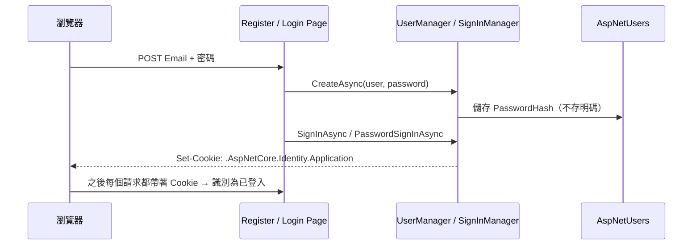

<div class="flex flex-col justify-center items-center h-full" style="background: #ffffff;">
  <p style="color: #5eada0; font-size: 1rem; font-weight: 600; letter-spacing: 0.2em; text-transform: uppercase; margin-bottom: 1.2rem;">ASP.NET Core Masterclass</p>
  <h1 style="color: #1a5c5c; font-size: 3.4rem; font-weight: 900; line-height: 1.15; margin-bottom: 1.5rem;">會員與權限控管</h1>
  <div style="height: 4px; width: 320px; background: linear-gradient(90deg, #5eada0, #a7d9d0); border-radius: 2px; margin-bottom: 1.5rem;"></div>
  <p style="color: #4a7c7c; font-size: 1.15rem; font-style: italic;">「你是誰？你能做什麼？」</p>
  <Link to="home" style="color: #9dc4c4; font-size: 0.85rem; margin-top: 2rem; text-decoration: none; letter-spacing: 0.05em;">← 返回目錄</Link>
</div>

<!--
大家好，歡迎來到第九章！

上一章我們完成了商品管理和前台首頁，EShop 已經像一個商店了。但目前有一個很嚴重的問題：任何人只要知道網址 /Admin/Product，就能進後台新增、修改、刪除商品。

這一章我們要用 ASP.NET Core Identity 建立會員系統。我們會先建立 Identity 的資料表，做出註冊和登入，接著用角色控管誰可以進後台，然後客製化註冊頁面，讓會員可以填寫姓名、地址，最後建立分店資訊，讓員工可以隸屬於某一間分店。
-->

---
layout: default
---

# Outline

- **回顧：Product 與 ViewModel**
- **9-1 建立 ASP.NET Core Identity**
- **9-2 會員註冊及登入**
- **9-3 角色（Role）與權限控管（Authorization）**
- **9-4 調整註冊頁面與客製化欄位**
- **9-5 建立分店資訊**
- **總結**

<!--
這一章有五個小節。前兩節建立會員系統的基礎：註冊和登入。第三節是權限控管的核心：角色與授權。第四節客製化會員資料。第五節建立分店，並讓員工隸屬於分店。
-->

---

# 回顧：Product 與 ViewModel

| 重點 | 說明 |
| --- | --- |
| 關聯 | `Product.CategoryId` 外鍵 + `Category?` 導覽屬性 + `includeProperties` |
| ViewModel | `ProductVM` 把商品與分類清單包在一起，強型別 |
| Upsert | 依 `Id` 判斷新增或編輯 |
| 前後台 | 後台 `Admin` 管理商品、前台 `Customer` 瀏覽商品 |

「問題：任何人都能打開 `/Admin/Product` 修改商品！」

<!--
我們先回顧上一章。我們建立了商品和分類的關聯，用 ViewModel 傳遞下拉選單，用 Upsert 整合新增和編輯，並完成了前台首頁。

但是現在任何人只要在網址輸入 /Admin/Product，就能進入後台修改商品。這一章就要解決這個問題。
-->

---
layout: section
class: flex flex-col justify-center items-center text-center
---

# 9-1 建立 ASP.NET Core Identity
### Authentication Infrastructure

<!--
第一個小節，我們來建立 ASP.NET Core Identity。
-->

---

# 什麼是驗證（Authentication）與授權（Authorization）？

想像咖啡店的員工休息室：

| 關卡 | 問的問題 | 咖啡店 | 網站 |
| --- | --- | --- | --- |
| **驗證 Authentication** | 你是誰？ | 門口刷員工證 | 登入：帳號 + 密碼 |
| **授權 Authorization** | 你能做什麼？ | 店長才能進倉庫 | 角色：Admin 才能進後台 |

「先驗證（你是誰），再授權（你能做什麼）。」

<!--
在做會員系統之前，我們要先分清楚兩個很像的英文單字：Authentication 和 Authorization。

Authentication 是驗證，回答「你是誰」。就像咖啡店員工休息室的門口，要刷員工證才能進去，確認你是這間店的員工。在網站裡就是登入。

Authorization 是授權，回答「你能做什麼」。進了休息室之後，只有店長能打開倉庫的門。在網站裡就是角色權限，例如只有 Admin 能進後台。

順序一定是先驗證再授權，這就是第一章說 UseAuthentication 一定要在 UseAuthorization 前面的原因。
-->

---

# 什麼是 ASP.NET Core Identity？

「ASP.NET Core Identity 是官方的會員系統，提供註冊、登入、密碼加密、角色、鎖定帳號等完整功能。」

| 功能 | 自己寫 | Identity |
| --- | --- | --- |
| 密碼加密儲存 | 自己選演算法、加鹽 | ✅ PBKDF2 雜湊 |
| 登入狀態 | 自己管理 Cookie | ✅ 加密的驗證 Cookie |
| 角色管理 | 自己建表 | ✅ `AspNetRoles`、`AspNetUserRoles` |
| 帳號鎖定、雙因素驗證 | 很難寫對 | ✅ 內建 |
| 註冊 / 登入頁面 | 自己刻 | ✅ Identity UI（Razor Pages） |

<!--
ASP.NET Core Identity 是官方提供的會員系統。

會員系統看起來簡單，但要寫對非常困難：密碼要用什麼演算法加密、要不要加鹽、登入狀態怎麼保存、怎麼防止暴力破解……任何一個環節出錯，都可能造成資料外洩。

Identity 把這些都做好了，而且經過大量實務驗證。所以除非有特殊需求，否則會員系統一律使用 Identity，不要自己寫。
-->

---

# Step 1：安裝套件

```bash
dotnet add EShop.DataAccess package Microsoft.AspNetCore.Identity.EntityFrameworkCore
dotnet add EShop.Web package Microsoft.AspNetCore.Identity.UI
```

| 套件 | 安裝在 | 用途 |
| --- | --- | --- |
| `Identity.EntityFrameworkCore` | `DataAccess` | Identity 的資料表與 EF Core 整合 |
| `Identity.UI` | `Web` | 內建的註冊、登入、登出等 Razor Pages |

<!--
第一步，安裝兩個套件。

Identity.EntityFrameworkCore 裝在 DataAccess，因為它跟資料庫有關，提供 Identity 需要的資料表。Identity.UI 裝在 Web，提供註冊、登入這些現成的頁面。
-->

---

# Step 2：DbContext 改繼承 IdentityDbContext

```csharp
using Microsoft.AspNetCore.Identity;
using Microsoft.AspNetCore.Identity.EntityFrameworkCore;

public class ApplicationDbContext(DbContextOptions<ApplicationDbContext> options)
    : IdentityDbContext<IdentityUser>(options)
{
    public DbSet<Category> Categories { get; set; }
    public DbSet<Product> Products { get; set; }

    protected override void OnModelCreating(ModelBuilder modelBuilder)
    {
        base.OnModelCreating(modelBuilder);      // ⚠️ 一定要呼叫，Identity 的資料表設定在這裡
        // ...HasData 種子資料
    }
}
```

<!--
第二步，把 ApplicationDbContext 的父類別從 DbContext 改成 IdentityDbContext of IdentityUser。IdentityDbContext 本身也繼承 DbContext，只是多了 Identity 需要的所有 DbSet。

最重要的是 OnModelCreating 第一行一定要呼叫 base.OnModelCreating。Identity 的資料表主鍵、索引都是在父類別的 OnModelCreating 設定的，忘了呼叫，Migration 會出現「實體沒有主鍵」的錯誤。
-->

---

# Step 3：Program.cs 註冊 Identity

```csharp
builder.Services.AddIdentity<IdentityUser, IdentityRole>()
    .AddEntityFrameworkStores<ApplicationDbContext>()
    .AddDefaultTokenProviders()
    .AddDefaultUI();

builder.Services.ConfigureApplicationCookie(options =>
{
    options.LoginPath = "/Identity/Account/Login";
    options.LogoutPath = "/Identity/Account/Logout";
    options.AccessDeniedPath = "/Identity/Account/AccessDenied";
});
builder.Services.AddRazorPages();                 // Identity UI 是 Razor Pages

var app = builder.Build();
// ...
app.UseRouting();
app.UseAuthentication();                          // ① 你是誰
app.UseAuthorization();                           // ② 你能做什麼
app.MapStaticAssets();
app.MapRazorPages();                              // 對應 /Identity/Account/... 頁面
app.MapControllerRoute(/* ... */);
```

<!--
第三步，在 Program.cs 註冊 Identity。

AddIdentity 的兩個型別參數分別是使用者和角色的類別。AddEntityFrameworkStores 告訴 Identity 用我們的 DbContext 存資料。AddDefaultTokenProviders 提供重設密碼、Email 驗證需要的 Token。AddDefaultUI 啟用內建的註冊登入頁面。

ConfigureApplicationCookie 設定登入頁、登出頁和權限不足頁的網址，未登入的使用者存取需要登入的頁面時，會被自動導向登入頁。

因為 Identity UI 是用 Razor Pages 寫的，所以要 AddRazorPages 和 MapRazorPages。

Pipeline 的部分，UseAuthentication 一定要在 UseAuthorization 之前。
-->

---

# Step 4：建立 Identity 資料表

```bash
dotnet ef migrations add AddIdentityToDb --project EShop.DataAccess --startup-project EShop.Web
dotnet ef database update --project EShop.DataAccess --startup-project EShop.Web
```

| 資料表 | 用途 |
| --- | --- |
| `AspNetUsers` | 使用者帳號（Email、密碼雜湊、電話……） |
| `AspNetRoles` | 角色（Admin、Employee、Customer） |
| `AspNetUserRoles` | 使用者與角色的對應（多對多） |
| `AspNetUserClaims` / `AspNetUserLogins` / `AspNetUserTokens` | 宣告、第三方登入、Token |
| `AspNetUserPasskeys` | .NET 10 新增：Passkey 憑證（啟用 Schema Version 3 才會建立，見本章補充） |

<!--
第四步，新增 Migration 並更新資料庫。

執行完之後，資料庫會多出好幾張 AspNet 開頭的資料表。最重要的是 AspNetUsers 存使用者、AspNetRoles 存角色、AspNetUserRoles 存使用者和角色的對應。

.NET 10 的 Identity 還新增了 Passkey 的支援，讓使用者可以用指紋或臉部辨識登入，不需要密碼。它需要一張 AspNetUserPasskeys 資料表，要啟用新的 Schema 版本才會建立，這一章最後的補充會介紹。
-->

---

# 使用 Identity 的注意事項

| 注意事項 | 說明 |
| --- | --- |
| **之一：`base.OnModelCreating` 必須呼叫** | 否則 Migration 會出現 `requires a primary key` 錯誤 |
| **之二：Authentication 在 Authorization 之前** | 順序錯了，授權時永遠是未登入狀態 |
| **之三：要 `MapRazorPages()`** | 否則 `/Identity/Account/Login` 會 404 |

<!--
Identity 的三個注意事項：base.OnModelCreating 一定要呼叫、Middleware 的順序、以及 MapRazorPages。這三個是設定 Identity 時最常出錯的地方。
-->

---
layout: default
---

# 練習 1：建立 Identity
### 任務說明

1. 安裝 Identity 套件，`ApplicationDbContext` 改繼承 `IdentityDbContext<IdentityUser>`
2. 在 `Program.cs` 註冊 Identity、設定 Cookie 路徑、加入 Middleware
3. 完成 Migration，用 SQL 工具確認 `AspNet*` 資料表已建立
4. 瀏覽 `/Identity/Account/Register`，確認內建註冊頁面可以開啟

<!--
【練習目的】
完成 Identity 的基礎設定。

【操作提示】
如果註冊頁面 404，檢查 AddRazorPages 和 MapRazorPages；如果出現 IEmailSender 相關錯誤，下一節會處理。
-->

---
layout: default
---

# 練習 1：解題提示

| 檢查項目 | 位置 |
| --- | --- |
| `IdentityDbContext<IdentityUser>` | `ApplicationDbContext.cs` |
| `base.OnModelCreating(modelBuilder);` | `OnModelCreating` 第一行 |
| `AddIdentity` + `AddDefaultUI` + `AddRazorPages` | `Program.cs` 服務註冊 |
| `UseAuthentication` → `UseAuthorization` → `MapRazorPages` | `Program.cs` Pipeline |

<!--
照著這張表檢查，四個項目都正確，Identity 就設定完成了。
-->

---
layout: section
class: flex flex-col justify-center items-center text-center
---

# 9-2 會員註冊及登入
### Register & Login

<!--
第二個小節，我們把 Identity 的註冊、登入頁面 Scaffold 到專案裡，並加上導覽列的登入狀態。
-->

---

# 什麼是 Scaffold？

「Scaffold（鷹架）是用工具**自動產生程式碼**。Identity UI 預設藏在套件裡，Scaffold 後才會出現在專案中讓我們修改。」

```bash
dotnet tool install -g dotnet-aspnet-codegenerator
dotnet add EShop.Web package Microsoft.VisualStudio.Web.CodeGeneration.Design

cd EShop.Web
dotnet aspnet-codegenerator identity \
    --dbContext EShop.DataAccess.Data.ApplicationDbContext \
    --files "Account.Register;Account.Login;Account.Logout;Account.AccessDenied"
```

產生的檔案：`Areas/Identity/Pages/Account/Register.cshtml`（+ `.cshtml.cs`）、`Login`、`Logout`、`AccessDenied`、`Views/Shared/_LoginPartial.cshtml`

<!--
Identity UI 的頁面預設是包在套件裡面的，我們看不到也改不了。如果要客製化註冊頁面，就要用 Scaffold 把它們產生到專案裡。

Scaffold 是鷹架的意思，就是用工具自動產生程式碼。我們安裝 aspnet-codegenerator 工具，然後指定 DbContext 和要產生哪些頁面，這裡只產生註冊、登入、登出和權限不足四個頁面，其他的頁面還是用套件內建的。

產生之後，專案會多出 Areas/Identity 資料夾，Identity 本身就是一個 Area。

補充一下，.NET 9 之後也有新的互動式工具 dotnet scaffold，操作起來更直覺，大家可以試試看。
-->

---

# 導覽列加入登入狀態：_LoginPartial

```razor
@* Views/Shared/_LoginPartial.cshtml（Scaffold 產生，節錄） *@
@inject SignInManager<IdentityUser> SignInManager
@inject UserManager<IdentityUser> UserManager

<ul class="navbar-nav">
@if (SignInManager.IsSignedIn(User))
{
    <li class="nav-item"><span class="nav-link">您好，@User.Identity?.Name</span></li>
    <li class="nav-item">
        <form asp-area="Identity" asp-page="/Account/Logout" method="post">
            <button type="submit" class="nav-link btn btn-link">登出</button>
        </form>
    </li>
}
else
{
    <li class="nav-item"><a class="nav-link" asp-area="Identity" asp-page="/Account/Register">註冊</a></li>
    <li class="nav-item"><a class="nav-link" asp-area="Identity" asp-page="/Account/Login">登入</a></li>
}
</ul>
```

```razor
@* _Layout.cshtml 導覽列右側 *@
<partial name="_LoginPartial" />
```

<!--
Scaffold 會產生 _LoginPartial，我們把它放進 _Layout 的導覽列右側。

這裡用到了第六章提過的 View 注入：@inject 把 SignInManager 和 UserManager 注入到 View 裡。SignInManager.IsSignedIn(User) 判斷目前使用者有沒有登入，有的話顯示名稱和登出按鈕，沒有的話顯示註冊和登入連結。

注意 Razor Pages 的連結用 asp-page，而不是 asp-controller 和 asp-action。登出一定要用 POST 表單，跟刪除一樣，避免被 GET 請求意外觸發。
-->

---

# 註冊與登入的運作流程



<!--
我們來看註冊和登入背後發生了什麼事。

註冊時，UserManager.CreateAsync 會把密碼做雜湊，只把雜湊值存進 AspNetUsers，資料庫裡永遠看不到明碼密碼。

登入時，SignInManager 驗證密碼正確後，會在回應中設定一個加密的 Cookie。之後瀏覽器的每個請求都會帶著這個 Cookie，UseAuthentication Middleware 會解開它，知道這個請求是誰發出的，並放進 User 屬性。

所以我們在 Controller 和 View 裡都能用 User 取得目前登入者的資訊。
-->

---

# 在 ASP.NET Core 中練習 [Authorize]

```csharp
using Microsoft.AspNetCore.Authorization;

[Area("Admin")]
[Authorize]                          // 必須登入才能存取整個 Controller
public class ProductController(IUnitOfWork unitOfWork, IWebHostEnvironment env) : Controller
{
    // ...
}

[Area("Customer")]
public class HomeController(IUnitOfWork unitOfWork) : Controller
{
    public async Task<IActionResult> Index() { /* 不需登入 */ }

    [Authorize]                      // 只有這個 Action 需要登入
    public IActionResult MyPage() => Content($"Hi {User.Identity?.Name}");
}
```

<!--
有了登入功能，我們就可以用 Authorize 屬性保護頁面。

Authorize 可以加在 Controller 上，整個 Controller 的所有 Action 都需要登入；也可以加在單一 Action 上。

未登入的使用者存取 ProductController，會被自動導向我們剛剛設定的 LoginPath，登入成功之後，會自動回到原本要去的頁面。
-->

---

# 補充：開發環境的 IEmailSender

Scaffold 出來的 Register 頁面會注入 `IEmailSender`，用來寄送確認信：

```csharp
// EShop.Web/Services/EmailSender.cs
using Microsoft.AspNetCore.Identity.UI.Services;

public class EmailSender(ILogger<EmailSender> logger) : IEmailSender
{
    public Task SendEmailAsync(string email, string subject, string htmlMessage)
    {
        logger.LogInformation("寄信給 {Email}：{Subject}", email, subject);
        return Task.CompletedTask;           // 開發階段先不真的寄信
    }
}
```

```csharp
builder.Services.AddScoped<IEmailSender, EmailSender>();
```

<!--
補充一下，Scaffold 出來的 Register 頁面會注入 IEmailSender，用來寄送 Email 確認信。

開發階段我們先寫一個假的 EmailSender，只把要寄的信印在 Log 裡。這又是第六章 DI 的好處：之後要改成真的寄信，例如串接 SendGrid，只要寫一個新的實作，換掉 Program.cs 的註冊就好，Register 頁面一行都不用改。
-->

---

# 使用登入功能的注意事項

| 注意事項 | 說明 |
| --- | --- |
| **之一：登出要用 POST** | 避免被圖片、連結等 GET 請求意外登出 |
| **之二：密碼規則可以調整** | 預設需大小寫、數字、符號、6 碼以上，可在 `AddIdentity(options => ...)` 修改 |
| **之三：不要自己比對密碼** | 一律使用 `SignInManager` / `UserManager` 的方法 |

```csharp
builder.Services.AddIdentity<IdentityUser, IdentityRole>(options =>
{
    options.Password.RequiredLength = 8;
    options.Lockout.MaxFailedAccessAttempts = 5;     // 連續錯 5 次鎖定
})
```

<!--
登入功能的三個注意事項。

之一，登出要用 POST。之二，Identity 預設的密碼規則比較嚴格，練習時可能會覺得麻煩，可以在 AddIdentity 的 options 裡調整，但正式環境建議不要放太寬。這裡也示範了帳號鎖定的設定：連續輸錯五次就鎖定。之三，永遠不要自己去資料庫比對密碼，一律使用 Identity 提供的方法。
-->

---
layout: default
---

# 練習 2：註冊、登入與保護後台
### 任務說明

1. Scaffold `Register`、`Login`、`Logout`、`AccessDenied` 頁面
2. 建立開發用的 `EmailSender` 並註冊
3. 在 `_Layout` 加入 `_LoginPartial`
4. 對 Admin Area 的所有 Controller 加上 `[Authorize]`
5. 測試：未登入存取 `/Admin/Product` → 導向登入頁 → 登入後回到商品管理

<!--
【練習目的】
完成會員註冊、登入，並初步保護後台。

【操作提示】
註冊時密碼要符合預設規則，例如 Test@1234。登入頁的網址會帶著 ReturnUrl 參數，這就是登入後能回到原頁面的原因。
-->

---
layout: default
---

# 練習 2：解題提示

```text
https://localhost:7123/Identity/Account/Login?ReturnUrl=%2FAdmin%2FProduct
```

| 步驟 | 發生的事 |
| --- | --- |
| 存取 `/Admin/Product` | `UseAuthorization` 發現未登入，回應 302 導向 `LoginPath` |
| 登入頁帶 `ReturnUrl` | 記住原本要去的頁面 |
| 登入成功 | 設定驗證 Cookie，轉址回 `ReturnUrl` |

<!--
觀察網址列，會看到登入頁帶著 ReturnUrl 參數，這就是 Identity 記住原本頁面的方式。
-->

---
layout: section
class: flex flex-col justify-center items-center text-center
---

# 9-3 角色與權限控管
### Roles & Authorization

<!--
第三個小節。現在只要登入就能進後台，但一般顧客也能註冊登入。我們需要角色來區分管理員、員工和顧客。
-->

---

# 什麼是角色（Role）？

| 角色 | 身分 | 前台 | 後台：分類 / 商品 | 後台：訂單（第 10 章） |
| --- | --- | --- | --- | --- |
| **Admin** | 系統管理員 | ✅ | ✅ | ✅ |
| **Employee** | 分店員工 | ✅ | ❌ | ✅ |
| **Customer** | 一般顧客 | ✅ | ❌ | ❌ |

「角色就像員工證上的職稱，系統依照職稱決定你可以進哪些門。」

<!--
角色就像員工證上的職稱。店長可以進所有地方，一般店員可以處理訂單，但不能修改商品價格，客人只能在前台消費。

EShop 規劃三種角色：Admin 管理所有東西；Employee 是分店員工，可以處理訂單；Customer 是一般顧客，只能使用前台。
-->

---

# Step 1：在 SD 定義角色名稱

```csharp
// EShop.Utility/SD.cs
public static class SD
{
    public const string Success = "success";
    public const string Error = "error";

    public const string Role_Admin = "Admin";
    public const string Role_Employee = "Employee";
    public const string Role_Customer = "Customer";
}
```

<div class="mt-4 p-3 bg-blue-50 border-l-4 border-blue-400 text-gray-700 text-sm text-left">
💡 角色名稱會出現在 Controller、View、註冊頁面……集中在 SD 管理，打錯字編譯器就會報錯。
</div>

<!--
第一步，把三個角色名稱加到第七章建立的 SD 類別。角色名稱會在很多地方使用，集中管理可以避免打錯字，這就是當初建立 SD 的原因。
-->

---

# Step 2：啟動時建立角色與管理員帳號

```csharp
// EShop.DataAccess/DbInitializer/DbInitializer.cs
public static class DbInitializer
{
    public static async Task InitializeAsync(IServiceProvider services)
    {
        var db = services.GetRequiredService<ApplicationDbContext>();
        await db.Database.MigrateAsync();                       // 自動套用尚未執行的 Migration

        var roleManager = services.GetRequiredService<RoleManager<IdentityRole>>();
        foreach (var role in new[] { SD.Role_Admin, SD.Role_Employee, SD.Role_Customer })
            if (!await roleManager.RoleExistsAsync(role))
                await roleManager.CreateAsync(new IdentityRole(role));

        var userManager = services.GetRequiredService<UserManager<IdentityUser>>();
        if (await userManager.FindByEmailAsync("admin@eshop.com") is null)
        {
            var admin = new IdentityUser { UserName = "admin@eshop.com", Email = "admin@eshop.com", EmailConfirmed = true };
            await userManager.CreateAsync(admin, "Admin@1234");
            await userManager.AddToRoleAsync(admin, SD.Role_Admin);
        }
    }
}
```

<!--
第二步，網站啟動時要確保三個角色存在，並建立一個預設的管理員帳號，不然沒有人能進後台。

DbInitializer 先呼叫 MigrateAsync，自動套用還沒執行的 Migration。接著用 RoleManager 檢查角色是否存在，不存在就建立。最後用 UserManager 檢查管理員帳號，不存在就建立並加入 Admin 角色。

每個步驟都有先檢查是否存在，所以不管網站啟動幾次，都不會重複建立。管理員的預設密碼在正式環境一定要從設定檔或環境變數讀取，並在第一次登入後修改。
-->

---

# Step 3：在 Program.cs 執行初始化

```csharp
var app = builder.Build();

using (var scope = app.Services.CreateScope())
{
    await DbInitializer.InitializeAsync(scope.ServiceProvider);
}

// ...Pipeline 設定
```

<div class="mt-4 p-3 bg-blue-50 border-l-4 border-blue-400 text-gray-700 text-sm text-left">
💡 <b>為什麼要 <code>CreateScope()</code>？</b>DbContext 與 UserManager 是 <b>Scoped</b> 服務，啟動時沒有 HTTP 請求，要自己建立一個 Scope 才能取得（第 6 章生命週期）。
</div>

<!--
第三步，在 Program.cs 的 Build 之後呼叫 DbInitializer。

這裡有一個第六章的觀念：DbContext 和 UserManager 都是 Scoped 服務，每個 HTTP 請求一個。但網站啟動的時候還沒有任何請求，所以我們要用 CreateScope 自己建立一個範圍，在這個範圍裡取得服務，用完之後 using 會自動釋放。
-->

---

# Step 4：用角色限制存取

```csharp
[Area("Admin")]
[Authorize(Roles = SD.Role_Admin)]                                   // 只有 Admin
public class ProductController(...) : Controller { }

[Area("Admin")]
[Authorize(Roles = SD.Role_Admin)]
public class CategoryController(...) : Controller { }

[Area("Admin")]
[Authorize(Roles = $"{SD.Role_Admin},{SD.Role_Employee}")]          // Admin 或 Employee
public class OrderController(...) : Controller { }                   // 第 10 章
```

| 寫法 | 意義 |
| --- | --- |
| `[Authorize]` | 登入即可 |
| `[Authorize(Roles = "A")]` | 必須是角色 A |
| `[Authorize(Roles = "A,B")]` | A **或** B |
| `[AllowAnonymous]` | 覆蓋上層設定，不需登入 |

<!--
第四步，用 Authorize 的 Roles 參數限制角色。

分類和商品管理只有 Admin 能進；第十章的訂單管理，Admin 和 Employee 都能進。多個角色用逗號隔開，代表「或」。這裡用了 C# 10 的常數字串插值，把兩個 SD 常數組合起來，一樣可以放在屬性裡。

登入但角色不符的使用者，會被導向 AccessDenied 頁面，也就是 HTTP 403。
-->

---

# Step 5：依角色顯示導覽列

```razor
@* _Layout.cshtml *@
@if (User.IsInRole(SD.Role_Admin))
{
    <li class="nav-item dropdown">
        <a class="nav-link dropdown-toggle text-dark" href="#" data-bs-toggle="dropdown">後台管理</a>
        <ul class="dropdown-menu">
            <li><a class="dropdown-item" asp-area="Admin" asp-controller="Category" asp-action="Index">分類管理</a></li>
            <li><a class="dropdown-item" asp-area="Admin" asp-controller="Product" asp-action="Index">商品管理</a></li>
        </ul>
    </li>
}
```

```razor
@* Views/_ViewImports.cshtml 加上 *@
@using EShop.Utility
```

<!--
第五步，導覽列的「後台管理」只有 Admin 看得到。User.IsInRole 判斷目前登入者是不是某個角色。

記得在 _ViewImports 加上 using EShop.Utility，View 才能使用 SD。

不過要注意：隱藏選單只是使用者體驗，真正的安全防線是 Controller 上的 Authorize。就算有人自己在網址列輸入 /Admin/Product，沒有權限一樣進不去。
-->

---

# 使用授權的注意事項

| 注意事項 | 說明 |
| --- | --- |
| **之一：隱藏選單 ≠ 權限控管** | 一定要在 Controller 加 `[Authorize]`，View 的判斷只是體驗 |
| **之二：角色變更後要重新登入** | 角色資訊存在 Cookie，改角色後需登出再登入才會生效 |
| **之三：API 也要保護** | `ProductController` 的 `GetAll`、`Delete` API 會一起被 `[Authorize]` 保護 |

<!--
授權的三個注意事項。

之一，隱藏選單不等於權限控管，真正的防線是 Authorize。之二，使用者的角色資訊是登入時放進 Cookie 的，所以修改角色之後，要重新登入才會生效。之三，第八章寫的 DataTable API 也在 ProductController 裡，現在一起被保護了，這就是把 Authorize 加在 Controller 層級的好處。
-->

---
layout: default
---

# 練習 3：角色權限
### 任務說明

1. 在 `SD` 加入三個角色常數，建立 `DbInitializer`
2. 在 `Program.cs` 啟動時執行初始化，確認 `AspNetRoles` 有三個角色
3. Category、Product Controller 改成只有 Admin 能存取
4. 導覽列的「後台管理」只有 Admin 看得到
5. 測試：一般註冊的帳號存取 `/Admin/Product` 應看到 Access Denied

<!--
【練習目的】
完成角色建立與權限控管。

【操作提示】
目前註冊的新帳號還沒有任何角色，所以存取後台會被拒絕。下一節我們會讓新註冊的會員自動成為 Customer。
-->

---
layout: default
---

# 練習 3：解題提示

| 帳號 | 角色 | `/Admin/Product` | 導覽列「後台管理」 |
| --- | --- | --- | --- |
| 未登入 | — | 302 → 登入頁 | 不顯示 |
| 新註冊帳號 | （無） | 403 → Access Denied | 不顯示 |
| `admin@eshop.com` | Admin | ✅ 正常進入 | 顯示 |

<!--
用三種身分測試，結果應該跟這張表一樣。未登入是 302 導向登入頁；登入但沒有權限是 403 權限不足。
-->

---
layout: section
class: flex flex-col justify-center items-center text-center
---

# 9-4 調整註冊頁面與客製化欄位
### ApplicationUser

<!--
第四個小節。內建的 IdentityUser 只有 Email、電話這些基本欄位，但購物網站需要會員的姓名和地址，第十章結帳時要用。我們來擴充會員資料。
-->

---

# 什麼是 ApplicationUser？

「`IdentityUser` 只有帳號相關的欄位；我們**繼承它**，加上商店需要的會員資料。」

```csharp
// EShop.Models/ApplicationUser.cs
using Microsoft.AspNetCore.Identity;

namespace EShop.Models;

public class ApplicationUser : IdentityUser
{
    [Required, MaxLength(30), Display(Name = "姓名")]
    public string Name { get; set; } = "";

    [Display(Name = "縣市")]   public string? City { get; set; }
    [Display(Name = "地址")]   public string? StreetAddress { get; set; }
    [Display(Name = "郵遞區號")] public string? PostalCode { get; set; }
}
```

<!--
IdentityUser 是 Identity 內建的使用者類別，只有 Email、UserName、PhoneNumber、PasswordHash 這些帳號相關的欄位。

我們建立 ApplicationUser 繼承 IdentityUser，就自動擁有所有帳號欄位，再加上姓名、縣市、地址、郵遞區號。這些新欄位會直接加在 AspNetUsers 資料表裡。

ApplicationUser 放在 Models 專案，因為 IdentityUser 屬於 Microsoft.Extensions.Identity.Stores 套件，第八章已經為 Models 加了 ASP.NET Core 的 FrameworkReference，裡面就包含了。
-->

---

# 把 IdentityUser 全部換成 ApplicationUser

| 位置 | 修改前 | 修改後 |
| --- | --- | --- |
| `ApplicationDbContext` | `IdentityDbContext<IdentityUser>` | `IdentityDbContext<ApplicationUser>` |
| `Program.cs` | `AddIdentity<IdentityUser, IdentityRole>` | `AddIdentity<ApplicationUser, IdentityRole>` |
| `_LoginPartial.cshtml` | `SignInManager<IdentityUser>` | `SignInManager<ApplicationUser>` |
| `Register` / `Login` / `Logout` 的 `.cshtml.cs` | `UserManager<IdentityUser>` | `UserManager<ApplicationUser>` |
| `DbInitializer` | `new IdentityUser { ... }` | `new ApplicationUser { Name = "系統管理員", ... }` |

```bash
dotnet ef migrations add ExtendIdentityUser --project EShop.DataAccess --startup-project EShop.Web
dotnet ef database update --project EShop.DataAccess --startup-project EShop.Web
```

<!--
接著要把專案裡所有的 IdentityUser 換成 ApplicationUser。這張表列出了所有要改的地方，大家可以用 VS Code 的全域搜尋 IdentityUser，一個一個替換。

改完之後新增 Migration，AspNetUsers 資料表就會多出 Name、City 等欄位。

漏改任何一個地方，執行時都會出現找不到服務的錯誤，例如 Unable to resolve service for type UserManager of IdentityUser，因為 DI 容器裡註冊的是 ApplicationUser 版本。
-->

---

# 客製化 Register 頁面 — InputModel

```csharp
// Areas/Identity/Pages/Account/Register.cshtml.cs（節錄）
public class InputModel
{
    [Required, EmailAddress] public string Email { get; set; } = "";
    [Required, DataType(DataType.Password)] public string Password { get; set; } = "";
    [Compare(nameof(Password))] public string ConfirmPassword { get; set; } = "";

    // ↓ 新增的欄位
    [Required, Display(Name = "姓名")] public string Name { get; set; } = "";
    [Display(Name = "手機")] public string? PhoneNumber { get; set; }
    [Display(Name = "縣市")] public string? City { get; set; }
    [Display(Name = "地址")] public string? StreetAddress { get; set; }
    [Display(Name = "角色")] public string? Role { get; set; }

    [ValidateNever] public IEnumerable<SelectListItem> RoleList { get; set; } = [];
}
```

<!--
接下來客製化註冊頁面。打開 Scaffold 產生的 Register.cshtml.cs，這是 Razor Pages 的程式碼檔案，作用類似 Controller。

裡面有一個 InputModel 類別，就是註冊表單的 ViewModel。我們在原本的 Email、密碼之外，加上姓名、手機、縣市、地址，以及角色。

角色和角色清單是給管理員用的：管理員在後台幫員工開帳號時，可以選擇角色。RoleList 跟第八章的 CategoryList 一樣，加上 ValidateNever。
-->

---

# 客製化 Register 頁面 — 載入角色清單

```csharp
public class RegisterModel(
    UserManager<ApplicationUser> userManager,
    SignInManager<ApplicationUser> signInManager,
    RoleManager<IdentityRole> roleManager,
    ILogger<RegisterModel> logger) : PageModel
{
    [BindProperty] public InputModel Input { get; set; } = new();
    public string? ReturnUrl { get; set; }

    public async Task OnGetAsync(string? returnUrl = null)
    {
        ReturnUrl = returnUrl;
        Input.RoleList = roleManager.Roles.Select(r => r.Name!)
            .Select(name => new SelectListItem { Text = name, Value = name });
    }
```

<!--
Register 頁面的 PageModel 用 primary constructor 注入 UserManager、SignInManager，我們再多注入一個 RoleManager，用來取得角色清單。

OnGetAsync 對應 GET 請求，就像 Controller 的 GET Action。我們在這裡把所有角色轉成 SelectListItem，放進 Input.RoleList。
-->

---

# 客製化 Register 頁面 — 建立使用者

```csharp
    public async Task<IActionResult> OnPostAsync(string? returnUrl = null)
    {
        returnUrl ??= Url.Content("~/");
        if (!ModelState.IsValid) return Page();

        var user = new ApplicationUser
        {
            UserName = Input.Email, Email = Input.Email, Name = Input.Name,
            PhoneNumber = Input.PhoneNumber, City = Input.City, StreetAddress = Input.StreetAddress
        };
        var result = await userManager.CreateAsync(user, Input.Password);
        if (result.Succeeded)
        {
            var role = User.IsInRole(SD.Role_Admin) && !string.IsNullOrEmpty(Input.Role)
                ? Input.Role : SD.Role_Customer;                  // 只有 Admin 能指定角色
            await userManager.AddToRoleAsync(user, role);

            if (!User.IsInRole(SD.Role_Admin))
                await signInManager.SignInAsync(user, isPersistent: false);
            return LocalRedirect(returnUrl);
        }
        foreach (var error in result.Errors) ModelState.AddModelError("", error.Description);
        return Page();
    }
}
```

<!--
OnPostAsync 處理註冊表單送出。

我們建立 ApplicationUser，把表單的欄位填進去，用 CreateAsync 建立帳號。成功之後決定角色：如果目前操作的人是 Admin，而且有選角色，就用選的角色；否則一律是 Customer。這個判斷很重要，不然一般人在註冊時自己改表單送出 Role=Admin，就變成管理員了。這叫權限提升攻擊，一定要在後端擋下來。

最後，如果是自己註冊的一般會員，就直接幫他登入；如果是管理員幫別人開帳號，就不要切換成新帳號的登入狀態。

建立失敗時，例如 Email 重複、密碼不符合規則，把錯誤訊息加到 ModelState 顯示在頁面上。
-->

---

# Register.cshtml：只有 Admin 看得到角色欄位

```razor
<div class="form-floating mb-3">
    <input asp-for="Input.Name" class="form-control" placeholder="姓名" />
    <label asp-for="Input.Name"></label>
    <span asp-validation-for="Input.Name" class="text-danger"></span>
</div>
@* 手機、縣市、地址欄位同上 *@

@if (User.IsInRole(SD.Role_Admin))
{
    <div class="form-floating mb-3">
        <select asp-for="Input.Role" asp-items="Model.Input.RoleList" class="form-select">
            <option disabled selected>-- 選擇角色 --</option>
        </select>
        <label asp-for="Input.Role"></label>
    </div>
}
```

<!--
在 Register.cshtml 加上新欄位。Scaffold 產生的頁面用的是 Bootstrap 的 form-floating 樣式，我們照著一樣的格式加上姓名、手機等欄位。

角色下拉選單用 User.IsInRole 包起來，只有管理員看得到。再強調一次，這只是畫面上的隱藏，真正的防護是剛剛 OnPostAsync 裡的判斷。
-->

---

# 使用 ApplicationUser 的注意事項

| 注意事項 | 說明 |
| --- | --- |
| **之一：所有 `IdentityUser` 都要換掉** | 漏一個就會出現 `Unable to resolve service for type UserManager<IdentityUser>` |
| **之二：角色要在後端判斷** | 不能相信表單送來的 `Role`，否則任何人都能註冊成 Admin |
| **之三：取得目前使用者** | Controller 中用 `userManager.GetUserId(User)` 取得 Id（第 10 章購物車會用到） |

<!--
ApplicationUser 的三個注意事項。

之一，所有 IdentityUser 都要換掉。之二，角色一定要在後端判斷。之三預告一下第十章：購物車要知道是哪個會員的，我們會用 UserManager 的 GetUserId，或是直接從 User 的 Claims 取得目前登入者的 Id。
-->

---
layout: default
---

# 練習 4：客製化註冊
### 任務說明

1. 建立 `ApplicationUser`，把專案中所有 `IdentityUser` 換掉，完成 Migration
2. 註冊頁加入姓名、手機、縣市、地址欄位
3. 一般註冊一律成為 Customer；Admin 登入後開啟註冊頁，可以選擇角色
4. 導覽列登入後顯示「您好，{姓名}」而不是 Email

<!--
【練習目的】
完成會員資料擴充與安全的角色指派。

【解題引導】
第 4 點：_LoginPartial 已經注入了 UserManager，可以用 await UserManager.GetUserAsync(User) 取得 ApplicationUser，再讀取 Name。
-->

---
layout: default
---

# 練習 4：解題提示

```razor
@* _LoginPartial.cshtml *@
@inject SignInManager<ApplicationUser> SignInManager
@inject UserManager<ApplicationUser> UserManager

@if (SignInManager.IsSignedIn(User))
{
    var appUser = await UserManager.GetUserAsync(User);
    <li class="nav-item">
        <a class="nav-link" asp-area="Identity" asp-page="/Account/Manage/Index">您好，@(appUser?.Name ?? User.Identity?.Name)</a>
    </li>
}
```

<!--
GetUserAsync 會根據 Cookie 裡的使用者 Id，從資料庫查出完整的 ApplicationUser。注意這樣每個頁面都會多一次資料庫查詢；如果想避免，可以用自訂 Claim 把姓名放進 Cookie，這是比較進階的做法。
-->

---
layout: section
class: flex flex-col justify-center items-center text-center
---

# 9-5 建立分店資訊
### Store

<!--
最後一個小節。EShop 在不同城市有實體分店，員工要隸屬於某間分店。我們來建立分店資訊，並把它跟會員關聯起來。
-->

---

# 建立 Store Model

```csharp
// EShop.Models/Store.cs
public class Store
{
    public int Id { get; set; }

    [Required, MaxLength(30), Display(Name = "分店名稱")]
    public string Name { get; set; } = "";

    [Required, Display(Name = "縣市")]    public string City { get; set; } = "";
    [Required, Display(Name = "地址")]    public string StreetAddress { get; set; } = "";
    [Display(Name = "電話")]              public string? PhoneNumber { get; set; }
}
```

```csharp
// ApplicationUser 加入分店關聯（員工才需要，所以可為 null）
public int? StoreId { get; set; }
[ForeignKey(nameof(StoreId))] public Store? Store { get; set; }
```

<!--
我們建立 Store 類別，包含分店名稱、縣市、地址和電話。

然後在 ApplicationUser 加上 StoreId 和 Store 導覽屬性，這跟第八章商品和分類的關聯是一樣的。差別是 StoreId 是 int?，可以為 null，因為一般顧客不屬於任何分店，只有員工才需要。
-->

---

# 分店的 Repository、UnitOfWork 與後台管理

```csharp
public interface IStoreRepository : IRepository<Store> { void Update(Store store); }

public class StoreRepository(ApplicationDbContext db) : Repository<Store>(db), IStoreRepository
{
    public void Update(Store store) => _db.Stores.Update(store);
}

// IUnitOfWork / UnitOfWork 加入
public IStoreRepository Store { get; } = new StoreRepository(db);
```

```csharp
[Area("Admin")]
[Authorize(Roles = SD.Role_Admin)]
public class StoreController(IUnitOfWork unitOfWork) : Controller
{
    // Index（DataTable）、Upsert、Delete —— 與 ProductController 相同模式
}
```

<!--
接著照著第七、八章的流程：Repository、UnitOfWork、Admin 的 StoreController。StoreController 的 Index 用 DataTable、新增編輯用 Upsert，完全照著商品管理的模式，大家應該已經很熟練了。

別忘了在 ApplicationDbContext 加上 DbSet of Store，並新增 Migration。
-->

---

# 註冊員工時選擇分店

```csharp
// InputModel 新增
[Display(Name = "所屬分店")] public int? StoreId { get; set; }
[ValidateNever] public IEnumerable<SelectListItem> StoreList { get; set; } = [];

// OnGetAsync：RegisterModel 額外注入 IUnitOfWork unitOfWork
Input.StoreList = (await unitOfWork.Store.GetAllAsync())
    .Select(s => new SelectListItem { Text = $"{s.City} {s.Name}", Value = s.Id.ToString() });

// OnPostAsync：只有 Employee 才記錄分店
if (role == SD.Role_Employee) user.StoreId = Input.StoreId;
```

```razor
<select asp-for="Input.StoreId" asp-items="Model.Input.StoreList" class="form-select" style="display:none"></select>

@section Scripts {
    <script>
      const role = document.getElementById('Input_Role');
      const store = document.getElementById('Input_StoreId');
      role?.addEventListener('change', () =>
        store.style.display = role.value === 'Employee' ? 'block' : 'none');
    </script>
}
```

<!--
最後，管理員幫員工開帳號的時候，要能選擇分店。

InputModel 加上 StoreId 和分店清單，OnGetAsync 從 UnitOfWork 取得分店清單。RegisterModel 的建構子要多注入 IUnitOfWork，Identity 的頁面也一樣可以用 DI。

OnPostAsync 裡，只有角色是 Employee 的時候才記錄 StoreId。

畫面上，分店下拉選單預設隱藏，用一小段 JavaScript 監聽角色選單，選到 Employee 才顯示。asp-for 產生的元素 id 會把點換成底線，所以是 Input_Role 和 Input_StoreId。

注意 StoreId 的指派要寫在 CreateAsync 之前，才會跟使用者一起存進資料庫；如果寫在之後，就要再呼叫一次 UpdateAsync。
-->

---

# 使用分店關聯的注意事項

| 注意事項 | 說明 |
| --- | --- |
| **之一：`StoreId` 設計成可為 null** | 顧客與管理員不屬於任何分店 |
| **之二：欄位要在 `CreateAsync` 之前指派** | 之後才指派需再呼叫 `userManager.UpdateAsync(user)` |
| **之三：刪除分店要檢查員工** | 還有員工隸屬的分店不能刪除（同第 8 章分類的做法） |

<!--
分店關聯的三個注意事項：StoreId 可為 null、指派的時機、以及刪除分店前要檢查底下有沒有員工。
-->

---
layout: default
---

# 練習 5：分店管理
### 任務說明

1. 建立 `Store` 與 Repository、加入 UnitOfWork，完成 Migration
2. 建立 Admin 的 `StoreController`（DataTable + Upsert + API Delete）
3. `ApplicationUser` 加入 `StoreId`；Admin 建立 Employee 帳號時可選擇分店
4. 在 `DbInitializer` 加入 2 間預設分店（台北信義店、台中勤美店）

<!--
【練習目的】
獨立完成一個新的後台功能，並把它與會員系統整合。

【解題引導】
DbInitializer 裡可以先檢查 db.Stores.AnyAsync()，沒有資料才新增。
-->

---
layout: default
---

# 練習 5：解題提示

```csharp
// DbInitializer.InitializeAsync
if (!await db.Stores.AnyAsync())
{
    db.Stores.AddRange(
        new Store { Name = "信義店", City = "台北市", StreetAddress = "信義路五段 7 號", PhoneNumber = "02-2345-6789" },
        new Store { Name = "勤美店", City = "台中市", StreetAddress = "公益路 68 號",   PhoneNumber = "04-2321-0000" });
    await db.SaveChangesAsync();
}
```

<!--
種子資料除了用 HasData，也可以像這樣在 DbInitializer 裡用程式新增。差別是 HasData 會寫進 Migration，DbInitializer 則是每次啟動時檢查，比較有彈性。
-->

---
layout: default
---

# 綜合練習：會員中心與員工分店後台
### 任務說明

1. 前台新增 `Customer/Account/Profile` 頁面（需登入），顯示並可修改自己的姓名、手機、地址
2. Admin 新增「使用者管理」頁面：DataTable 列出所有使用者的 Email、姓名、角色、所屬分店
3. 使用者管理可以「鎖定 / 解鎖」帳號（`LockoutEnd`），Admin 自己不能被鎖定
4. Employee 登入後，導覽列顯示「員工專區」，頁面顯示自己所屬分店的資訊

<!--
【練習目的】
整合 Identity、角色授權、UnitOfWork 與 DataTable。

【解題引導】
取得目前使用者用 userManager.GetUserAsync(User)。使用者清單可以用 userManager.Users.Include(u => u.Store)，角色用 userManager.GetRolesAsync(user)。鎖定就是把 LockoutEnd 設為很久以後的時間，解鎖設回 null 或現在時間。
-->

---
layout: default
---

# 綜合練習：解題提示

```csharp
[Area("Admin")]
[Authorize(Roles = SD.Role_Admin)]
public class UserController(UserManager<ApplicationUser> userManager) : Controller
{
    public IActionResult Index() => View();

    [HttpGet]
    public async Task<IActionResult> GetAll()
    {
        var users = await userManager.Users.Include(u => u.Store).AsNoTracking().ToListAsync();
        var data = new List<object>();
        foreach (var u in users)
            data.Add(new { u.Id, u.Email, u.Name, Store = u.Store?.Name,
                           Role = (await userManager.GetRolesAsync(u)).FirstOrDefault(),
                           IsLocked = u.LockoutEnd > DateTimeOffset.UtcNow });
        return Json(new { data });
    }

    [HttpPost]
    public async Task<IActionResult> ToggleLock(string id)
    {
        var user = await userManager.FindByIdAsync(id);
        if (user is null || await userManager.IsInRoleAsync(user, SD.Role_Admin))
            return Json(new { success = false, message = "無法鎖定此帳號" });
        user.LockoutEnd = user.LockoutEnd > DateTimeOffset.UtcNow ? null : DateTimeOffset.UtcNow.AddYears(100);
        await userManager.UpdateAsync(user);
        return Json(new { success = true, message = "操作成功" });
    }
}
```

<!--
使用者管理直接注入 UserManager，因為使用者資料是 Identity 在管理的。

GetAll 查出所有使用者並 Include 分店，再逐一取得角色。這個寫法每個使用者會多一次查詢，使用者很多的時候可以改成 join AspNetUserRoles 一次查出來，這是比較進階的優化。

ToggleLock 用 LockoutEnd 判斷目前是否鎖定，鎖定的話設為 null 解鎖，否則設為一百年後。Admin 帳號不能被鎖定，避免把自己鎖在門外。
-->

---

# 補充：.NET 10 的 Passkey 無密碼登入

| 登入方式 | 說明 |
| --- | --- |
| 密碼 | 傳統方式，可能被猜到、外洩、釣魚 |
| **Passkey（.NET 10 Identity 內建）** | 使用裝置的指紋、臉部辨識或 PIN，依 WebAuthn / FIDO2 標準，無法被釣魚 |

```csharp
builder.Services.AddIdentity<ApplicationUser, IdentityRole>(options =>
{
    options.Stores.SchemaVersion = IdentitySchemaVersions.Version3;   // 啟用 Passkey 資料表
})
```

<div class="mt-4 p-3 bg-blue-50 border-l-4 border-blue-400 text-gray-700 text-sm text-left">
💡 用 .NET 10 的 Blazor Web App 範本搭配「個別帳戶」驗證，會直接產生含 Passkey 註冊與登入的完整 UI，可以當作參考實作。
</div>

<!--
最後補充 .NET 10 Identity 的新功能：Passkey。

Passkey 讓使用者用手機或電腦的指紋、臉部辨識登入，不需要密碼。它基於 WebAuthn 標準，憑證綁定在網站的網域上，所以就算使用者點到釣魚網站，也無法被騙走。

.NET 10 的 Identity 已經內建 Passkey 的資料表和 API，設定 SchemaVersion 為 Version3 就會啟用。完整的 UI 可以參考 .NET 10 Blazor 範本產生的程式碼。這不在我們課程的範圍內，大家有興趣可以自己研究。
-->

---

# 總結

| 小節 | 重點 |
| --- | --- |
| 9-1 Identity | `IdentityDbContext`、`base.OnModelCreating`、`AddIdentity` + `UseAuthentication` → `UseAuthorization` |
| 9-2 註冊登入 | Scaffold Identity 頁面、`_LoginPartial`、`[Authorize]`、`IEmailSender` |
| 9-3 角色權限 | `SD.Role_*`、`DbInitializer` 建立角色與管理員、`[Authorize(Roles = ...)]`、`User.IsInRole` |
| 9-4 客製化註冊 | `ApplicationUser : IdentityUser`、角色**只能在後端**決定 |
| 9-5 分店 | `Store` + `ApplicationUser.StoreId?`，員工註冊時選擇分店 |

下一章我們會介紹 **購物車與訂單系統**，讓登入的會員可以把咖啡豆加入購物車、結帳下單。

<!--
我們來總結這一章。

我們用 ASP.NET Core Identity 建立了會員系統，Scaffold 了註冊登入頁面，用角色控管誰能進後台，擴充了會員資料，最後建立分店並讓員工隸屬於分店。

現在 EShop 有了會員，後台也被保護起來了。下一章是整門課的最後一章，我們會做出購物網站最核心的功能：購物車和訂單。登入的會員可以把商品加入購物車、修改數量、結帳下單，系統會扣除庫存，後台也能管理訂單狀態。
-->

---
layout: end
---

# 第 9 章結束
### 下一章：購物車與訂單系統
