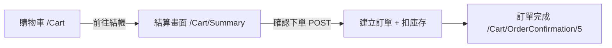
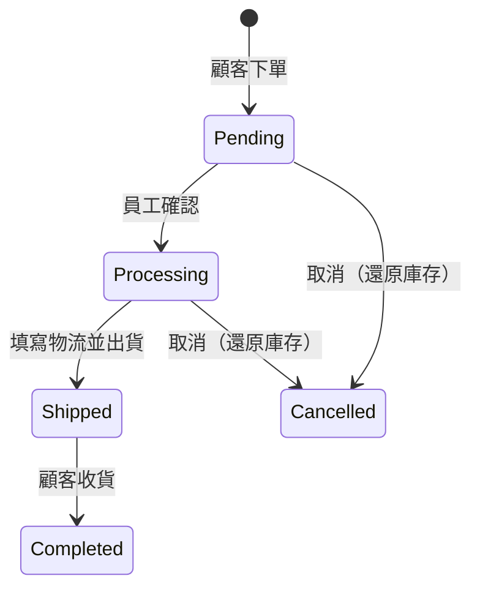

<div class="flex flex-col justify-center items-center h-full" style="background: #ffffff;">
  <p style="color: #5eada0; font-size: 1rem; font-weight: 600; letter-spacing: 0.2em; text-transform: uppercase; margin-bottom: 1.2rem;">ASP.NET Core Masterclass</p>
  <h1 style="color: #1a5c5c; font-size: 3.4rem; font-weight: 900; line-height: 1.15; margin-bottom: 1.5rem;">購物車與訂單系統</h1>
  <div style="height: 4px; width: 320px; background: linear-gradient(90deg, #5eada0, #a7d9d0); border-radius: 2px; margin-bottom: 1.5rem;"></div>
  <p style="color: #4a7c7c; font-size: 1.15rem; font-style: italic;">「從加入購物車到送出訂單，完成最後一哩路」</p>
  <Link to="home" style="color: #9dc4c4; font-size: 0.85rem; margin-top: 2rem; text-decoration: none; letter-spacing: 0.05em;">← 返回目錄</Link>
</div>

<!--
大家好，歡迎來到最後一章！

上一章我們用 Identity 建立了會員系統和角色權限，現在 EShop 知道「你是誰」了。有了會員，我們終於可以做購物網站最核心的功能：購物車和訂單。

這一章我們會從購物車的資料模型開始，做出購物車頁面和數量增減，接著設計結帳畫面，建立訂單主檔和明細的資料表與 Repository，把購物車轉成訂單並扣除庫存，最後在後台管理訂單狀態。

這一章會用到前面所有章節學過的東西：LINQ、MVC、EF Core、DI、Repository、UnitOfWork、ViewModel、Identity，可以說是整門課的總驗收。
-->

---
layout: default
---

# Outline

- **回顧：Identity 與角色**
- **10-1 建立購物車模型（ShoppingCart）**
- **10-2 購物車介面與 ViewModel 設計**
- **10-3 修改、移除與增減購物車數量**
- **10-4 結算畫面設計**
- **10-5 訂單資料表（OrderHeader & OrderDetail）**
- **10-6 建立訂單的 Repository**
- **10-7 將購物車金額與訂單合併**
- **10-8 送出訂單與庫存處理**
- **10-9 訂單狀態管理與後台查詢**
- **總結 & 課程回顧**

<!--
這一章有九個小節，可以分成三段：10-1 到 10-3 是購物車，10-4 到 10-8 是結帳下單，10-9 是後台的訂單管理。

每一節都會接續上一節的程式碼，最後完成一個完整的購物流程。
-->

---

# 回顧：Identity 與角色

| 重點 | 寫法 |
| --- | --- |
| 會員 | `ApplicationUser : IdentityUser`（姓名、縣市、地址） |
| 需要登入 | `[Authorize]` |
| 角色 | `[Authorize(Roles = $"{SD.Role_Admin},{SD.Role_Employee}")]` |
| 目前使用者 | `User.IsInRole(...)`、`userManager.GetUserAsync(User)` |

「購物車與訂單，都要記錄『這是哪一位會員的』。」

<!--
我們先回顧上一章。我們建立了 ApplicationUser，用 Authorize 限制登入，用角色控管後台權限。

這一章的購物車和訂單，都需要記錄「這是哪一位會員的」，所以會大量用到取得目前使用者的方法。
-->

---
layout: section
class: flex flex-col justify-center items-center text-center
---

# 10-1 建立購物車模型
### ShoppingCart Model

<!--
第一個小節，我們來設計購物車的資料模型。
-->

---
zoom: 0.9
---

# 什麼是購物車模型？

想像在實體咖啡店，我們把想買的咖啡豆放進購物籃：

| 購物籃裡的一項 | 資料欄位 |
| --- | --- |
| 是誰的購物籃 | `ApplicationUserId` |
| 放了哪一包咖啡豆 | `ProductId` |
| 放了幾包 | `Count` |

「購物車的**每一列**代表『某位會員』的『某一項商品』與『數量』。」

| Id | ApplicationUserId | ProductId | Count |
| --- | --- | --- | --- |
| 1 | `a1b2...`（小明） | 1 耶加雪菲 | 2 |
| 2 | `a1b2...`（小明） | 3 藝伎 | 1 |
| 3 | `c3d4...`（小華） | 1 耶加雪菲 | 1 |

<!--
我們先想想購物籃裡的每一項東西需要記錄什麼：是誰的購物籃、放了哪一包咖啡豆、放了幾包。

所以購物車資料表的每一列，代表「某位會員」的「某一項商品」和「數量」。同一位會員買了兩種商品，就有兩列；不同會員各自有自己的資料。

為什麼要存在資料庫，而不是存在 Session？因為存在資料庫，會員換一台電腦、換一個瀏覽器登入，購物車的內容都還在。
-->

---

# 在 ASP.NET Core 中練習建立 ShoppingCart

```csharp
// EShop.Models/ShoppingCart.cs
public class ShoppingCart
{
    public int Id { get; set; }

    public int ProductId { get; set; }
    [ForeignKey(nameof(ProductId))]
    public Product? Product { get; set; }

    [Range(1, 100, ErrorMessage = "數量需介於 1 到 100")]
    public int Count { get; set; }

    public string ApplicationUserId { get; set; } = "";
    [ForeignKey(nameof(ApplicationUserId))]
    public ApplicationUser? ApplicationUser { get; set; }

    [NotMapped]
    public decimal Subtotal => (Product?.Price ?? 0) * Count;   // 不存資料庫，顯示用
}
```

<!--
ShoppingCart 有兩個外鍵：ProductId 關聯到商品，ApplicationUserId 關聯到會員。注意 Identity 的使用者主鍵是字串，所以 ApplicationUserId 是 string。

Count 用 Range 限制在 1 到 100 之間。

最後的 Subtotal 是小計，用商品價格乘以數量算出來。它上面的 NotMapped 告訴 EF Core：這個屬性不要建成資料表欄位，因為它是算出來的，不需要存。
-->

---

# Repository、UnitOfWork 與 Migration

```csharp
public interface IShoppingCartRepository : IRepository<ShoppingCart>
{
    void Update(ShoppingCart cart);
}

public class ShoppingCartRepository(ApplicationDbContext db)
    : Repository<ShoppingCart>(db), IShoppingCartRepository
{
    public void Update(ShoppingCart cart) => _db.ShoppingCarts.Update(cart);
}

// IUnitOfWork / UnitOfWork
public IShoppingCartRepository ShoppingCart { get; } = new ShoppingCartRepository(db);
```

```bash
dotnet ef migrations add AddShoppingCartToDb --project EShop.DataAccess --startup-project EShop.Web
dotnet ef database update --project EShop.DataAccess --startup-project EShop.Web
```

<!--
接著就是大家已經很熟悉的流程：Repository、UnitOfWork、DbSet、Migration。這已經是我們第五次做這件事了。
-->

---
zoom: 0.75
---

# 商品詳細頁：加入購物車

```razor
@* Areas/Customer/Views/Home/Details.cshtml *@
<form asp-action="AddToCart" method="post" class="d-flex gap-2 mt-3" style="max-width: 320px">
    <input type="hidden" name="productId" value="@Model.Id" />
    <input type="number" name="count" value="1" min="1" max="@Model.Stock" class="form-control" />
    <button type="submit" class="btn btn-primary text-nowrap">🛒 加入購物車</button>
</form>
```

```csharp
// HomeController
[HttpPost, ValidateAntiForgeryToken, Authorize]
public async Task<IActionResult> AddToCart(int productId, int count)
{
    var userId = User.FindFirstValue(ClaimTypes.NameIdentifier)!;
    var cart = await unitOfWork.ShoppingCart.GetAsync(
        c => c.ApplicationUserId == userId && c.ProductId == productId, tracked: true);

    if (cart is null)
        unitOfWork.ShoppingCart.Add(new ShoppingCart { ApplicationUserId = userId, ProductId = productId, Count = count });
    else
        cart.Count += count;                 // 已在購物車：增加數量（tracked，SaveAsync 時自動更新）

    await unitOfWork.SaveAsync();
    TempData[SD.Success] = "已加入購物車";
    return RedirectToAction(nameof(Index));
}
```

<!--
在第八章的商品詳細頁加上數量輸入框和「加入購物車」按鈕。max 設成庫存數量，前端就不能選超過庫存的數量。

HomeController 的 AddToCart 加上 Authorize，未登入的使用者按下按鈕會被導向登入頁。

User.FindFirstValue(ClaimTypes.NameIdentifier) 可以直接從登入的 Cookie 取得使用者的 Id，不需要查資料庫。

接著判斷這個會員的購物車裡是不是已經有這個商品：沒有就新增一筆；已經有了就把數量加上去。注意查詢時傳了 tracked: true，因為我們要修改查出來的物件，EF Core 追蹤到 Count 改變了，SaveAsync 時會自動產生 UPDATE，不需要再呼叫 Update。這就是第七章 Repository 設計 tracked 參數的原因。
-->

---

# 使用購物車模型的注意事項

| 注意事項 | 說明 |
| --- | --- |
| **之一：同一商品只存一列** | 重複加入時累加 `Count`，而不是新增一列 |
| **之二：UserId 從登入資訊取得** | 不要用表單傳 `userId`，否則可以把商品塞進別人的購物車 |
| **之三：不存價格** | 購物車顯示「目前售價」；價格要到**下單時**才寫入訂單明細 |

<!--
購物車有三個注意事項。

之一，同一個商品只存一列。之二，使用者 Id 一定要從登入資訊取得，不能從表單傳進來，否則有心人可以改表單，把商品加到別人的購物車。

之三很重要：購物車不存價格。因為商品價格可能會調整，購物車應該永遠顯示目前的售價。等到真正下單的時候，才把當下的價格寫進訂單明細，之後就算商品漲價，已成立的訂單金額也不會變。
-->

---
layout: default
---

# 練習 1：加入購物車
### 任務說明

1. 建立 `ShoppingCart` 模型、Repository，加入 UnitOfWork，完成 Migration
2. 商品詳細頁加入數量與「加入購物車」按鈕
3. 完成 `AddToCart`：同一商品重複加入時累加數量
4. 加入檢查：累加後的數量**不能超過庫存**，超過時顯示錯誤通知

<!--
【練習目的】
完成購物車的資料模型與加入功能。

【解題引導】
庫存要查商品，可以用 unitOfWork.Product.GetAsync。累加後的數量等於原本的 Count 加上新的 count。
-->

---
layout: default
---

# 練習 1：解題提示

```csharp
var product = await unitOfWork.Product.GetAsync(p => p.Id == productId);
if (product is null) return NotFound();

var newCount = (cart?.Count ?? 0) + count;
if (newCount > product.Stock)
{
    TempData[SD.Error] = $"庫存不足，目前剩下 {product.Stock} 包";
    return RedirectToAction(nameof(Details), new { id = productId });
}
```

<!--
先查出商品，計算累加後的數量。cart?.Count ?? 0 的意思是：購物車裡還沒有這個商品時當作 0。超過庫存就用 TempData 顯示錯誤，並轉回商品詳細頁。

RedirectToAction 的第二個參數是路由值，用匿名物件傳入 id。
-->

---
layout: section
class: flex flex-col justify-center items-center text-center
---

# 10-2 購物車介面與 ViewModel 設計
### Cart Page

<!--
第二個小節，我們來做購物車頁面。
-->

---

# 設計 ShoppingCartVM

購物車頁面需要：

| 資料 | 型別 |
| --- | --- |
| 購物車品項（含商品資料） | `List<ShoppingCart>` |
| 訂單總金額 | `decimal` |

```csharp
// EShop.Models/ViewModels/ShoppingCartVM.cs
public class ShoppingCartVM
{
    public List<ShoppingCart> CartList { get; set; } = [];
    public decimal OrderTotal => CartList.Sum(c => c.Subtotal);
}
```

<!--
購物車頁面需要兩種資料：購物車的品項清單，以及總金額。依照第八章學的原則，我們建立一個 ShoppingCartVM。

OrderTotal 用 LINQ 的 Sum 把每一項的小計加總，這是第三章學的聚合方法。它是一個唯讀屬性，每次讀取都會重新計算。

10-7 的時候，我們會在這個 ViewModel 加上訂單資料。
-->

---

# 在 ASP.NET Core 中練習建立 CartController

```csharp
// Areas/Customer/Controllers/CartController.cs
[Area("Customer")]
[Authorize]
public class CartController(IUnitOfWork unitOfWork) : Controller
{
    private string UserId => User.FindFirstValue(ClaimTypes.NameIdentifier)!;

    public async Task<IActionResult> Index()
    {
        ShoppingCartVM vm = new()
        {
            CartList = await unitOfWork.ShoppingCart.GetAllAsync(
                filter: c => c.ApplicationUserId == UserId,
                includeProperties: "Product")
        };
        return View(vm);
    }
}
```

<!--
在 Customer Area 建立 CartController，整個 Controller 加上 Authorize，必須登入才能看購物車。

我們把取得使用者 Id 寫成一個私有屬性 UserId，之後每個 Action 都會用到。

Index 查出這位會員的所有購物車品項，includeProperties 載入商品資料，才能顯示商品名稱、圖片和價格。
-->

---
zoom: 0.75
---

# 購物車頁面 View

```razor
@model ShoppingCartVM

<h2>🛒 我的購物車</h2>
@if (!Model.CartList.Any())
{
    <div class="alert alert-info">購物車是空的，<a asp-controller="Home" asp-action="Index">去逛逛</a></div>
}
else
{
    <table class="table align-middle">
        <thead><tr><th>商品</th><th class="text-end">單價</th><th class="text-center">數量</th><th class="text-end">小計</th><th></th></tr></thead>
        @foreach (var c in Model.CartList)
        {
            <tr>
                <td> @c.Product?.Name</td>
                <td class="text-end">@c.Product?.Price.ToString("N0")</td>
                <td class="text-center">@* 10-3：＋ / − 按鈕 *@ @c.Count</td>
                <td class="text-end">@c.Subtotal.ToString("N0")</td>
                <td>@* 10-3：移除按鈕 *@</td>
            </tr>
        }
    </table>
    <div class="text-end fs-4">總計：<b class="text-primary">NT$ @Model.OrderTotal.ToString("N0")</b></div>
    <div class="text-end mt-3"><a asp-action="Summary" class="btn btn-success">前往結帳 →</a></div>
}
```

<!--
購物車頁面先判斷是不是空的，空的就顯示提示和「去逛逛」的連結。

有品項的話，用表格列出每一項的商品、單價、數量、小計，最下面顯示總金額和「前往結帳」按鈕。數量的加減按鈕和移除按鈕，下一節再加上。
-->

---
zoom: 0.95
---

# 補充：導覽列的購物車數量（View Component）

```csharp
// EShop.Web/ViewComponents/ShoppingCartViewComponent.cs
public class ShoppingCartViewComponent(IUnitOfWork unitOfWork) : ViewComponent
{
    public async Task<IViewComponentResult> InvokeAsync()
    {
        var userId = UserClaimsPrincipal.FindFirstValue(ClaimTypes.NameIdentifier);
        var count = userId is null ? 0
            : (await unitOfWork.ShoppingCart.GetAllAsync(c => c.ApplicationUserId == userId)).Count;
        return View(count);          // Views/Shared/Components/ShoppingCart/Default.cshtml
    }
}
```

```razor
@* _Layout.cshtml *@
<a class="nav-link" asp-area="Customer" asp-controller="Cart" asp-action="Index">
    🛒 <span class="badge bg-primary">@await Component.InvokeAsync("ShoppingCart")</span>
</a>
```

<!--
補充一個很實用的功能：在導覽列顯示購物車的品項數量。

導覽列在 _Layout 裡，每個頁面都會顯示，但 _Layout 沒有對應的 Controller，要怎麼查資料庫？答案是 View Component。它就像一個迷你的 Controller 加 View，可以注入服務、查資料，再產生一小塊 HTML。

ShoppingCartViewComponent 注入 IUnitOfWork，查詢目前使用者的購物車筆數，回傳給它自己的 View。_Layout 用 Component.InvokeAsync 呼叫它。

這裡為了簡單，用 GetAllAsync 再取 Count，會把資料查出來；更好的做法是在 Repository 加一個 CountAsync 方法，讓資料庫直接算 COUNT。
-->

---

# 使用購物車 ViewModel 的注意事項

| 注意事項 | 說明 |
| --- | --- |
| **之一：記得 Include Product** | 沒有 `includeProperties: "Product"`，`Subtotal` 會變成 0 |
| **之二：只查自己的購物車** | filter 一定要加 `ApplicationUserId == UserId` |
| **之三：`[NotMapped]` 屬性不能用在查詢條件** | `Subtotal` 不存在資料庫，不能寫在 `Where` 裡翻譯成 SQL |

<!--
購物車 ViewModel 的三個注意事項。

之一，忘了 Include Product，Subtotal 會是 0，因為 Product 是 null。之二，查詢一定要限定是自己的購物車。之三，Subtotal 是 NotMapped 的屬性，資料庫裡沒有這個欄位，如果寫在 Where 條件裡，EF Core 會拋出無法翻譯的例外，第三章說過的。
-->

---
layout: default
---

# 練習 2：購物車頁面
### 任務說明

1. 建立 `ShoppingCartVM` 與 `CartController.Index`
2. 完成購物車頁面，空購物車時顯示提示
3. 導覽列加入購物車連結（登入後才顯示）
4. 總金額未滿 1,500 元時，顯示「再買 NT$ XXX 即可免運」

<!--
【練習目的】
完成購物車頁面與 ViewModel。

【解題引導】
免運差額可以在 ShoppingCartVM 加一個唯讀屬性計算，View 只負責顯示。
-->

---
layout: default
---

# 練習 2：解題提示

```csharp
public class ShoppingCartVM
{
    public const decimal FreeShippingThreshold = 1500;
    public List<ShoppingCart> CartList { get; set; } = [];
    public decimal OrderTotal => CartList.Sum(c => c.Subtotal);
    public decimal AmountToFreeShipping => Math.Max(0, FreeShippingThreshold - OrderTotal);
}
```

```razor
@if (Model.AmountToFreeShipping > 0)
{
    <div class="alert alert-warning">再買 NT$ @Model.AmountToFreeShipping.ToString("N0") 即可免運</div>
}
```

<!--
把計算邏輯放在 ViewModel 裡，View 只負責判斷要不要顯示。這符合第四章說的「View 只做顯示」的原則。
-->

---
layout: section
class: flex flex-col justify-center items-center text-center
---

# 10-3 修改、移除與增減購物車數量
### Plus, Minus & Remove

<!--
第三個小節，我們來加上購物車的數量增減和移除功能。
-->

---
zoom: 0.75
---

# 在 ASP.NET Core 中練習增減數量

```csharp
[HttpPost, ValidateAntiForgeryToken]
public async Task<IActionResult> Plus(int cartId)
{
    var cart = await unitOfWork.ShoppingCart.GetAsync(
        c => c.Id == cartId && c.ApplicationUserId == UserId, includeProperties: "Product", tracked: true);
    if (cart is null) return NotFound();

    if (cart.Count >= cart.Product!.Stock)
        TempData[SD.Error] = "已達庫存上限";
    else
        cart.Count++;

    await unitOfWork.SaveAsync();
    return RedirectToAction(nameof(Index));
}

[HttpPost, ValidateAntiForgeryToken]
public async Task<IActionResult> Minus(int cartId)
{
    var cart = await unitOfWork.ShoppingCart.GetAsync(
        c => c.Id == cartId && c.ApplicationUserId == UserId, tracked: true);
    if (cart is null) return NotFound();

    if (cart.Count <= 1) unitOfWork.ShoppingCart.Remove(cart);   // 減到 0 就移除
    else cart.Count--;

    await unitOfWork.SaveAsync();
    return RedirectToAction(nameof(Index));
}
```

<!--
Plus 和 Minus 的寫法很像。

先查出購物車品項，注意條件除了 cartId，還加上了 ApplicationUserId == UserId，確保只能操作自己的購物車。如果少了這個條件，有人把 cartId 改成別人的，就能修改別人的購物車。

Plus 要檢查庫存上限，Minus 則是數量剩 1 的時候再減，就直接移除這個品項。

查詢時用 tracked: true，修改 Count 之後直接 SaveAsync 就會更新。
-->

---
zoom: 0.85
---

# 移除品項與按鈕

```csharp
[HttpPost, ValidateAntiForgeryToken]
public async Task<IActionResult> Remove(int cartId)
{
    var cart = await unitOfWork.ShoppingCart.GetAsync(c => c.Id == cartId && c.ApplicationUserId == UserId);
    if (cart is null) return NotFound();

    unitOfWork.ShoppingCart.Remove(cart);
    await unitOfWork.SaveAsync();
    TempData[SD.Success] = "已移除商品";
    return RedirectToAction(nameof(Index));
}
```

```razor
<td class="text-center">
    <form method="post" class="d-inline-flex align-items-center gap-2">
        <button asp-action="Minus" asp-route-cartId="@c.Id" class="btn btn-sm btn-outline-secondary">−</button>
        <span>@c.Count</span>
        <button asp-action="Plus" asp-route-cartId="@c.Id" class="btn btn-sm btn-outline-secondary">＋</button>
    </form>
</td>
<td>
    <form method="post"><button asp-action="Remove" asp-route-cartId="@c.Id" class="btn btn-sm btn-outline-danger">移除</button></form>
</td>
```

<!--
Remove 直接移除品項。

View 的部分，增減和移除都是修改資料的操作，所以要用 POST 表單，不能用連結。這裡用了一個小技巧：button 上也可以用 asp-action 和 asp-route，Tag Helper 會產生 formaction 屬性，同一個表單裡的不同按鈕可以送到不同的 Action。表單的 Tag Helper 也會自動加上 AntiForgery Token。
-->

---

# 使用購物車操作的注意事項

| 注意事項 | 說明 |
| --- | --- |
| **之一：條件要加上 UserId** | 只用 `cartId` 查詢，使用者改參數就能操作別人的購物車（IDOR 漏洞） |
| **之二：修改資料用 POST** | 增減、移除都用表單按鈕，並驗證 AntiForgery Token |
| **之三：tracked 查詢直接改屬性** | `tracked: true` 後修改 `Count`，`SaveAsync` 自動產生 UPDATE |

<!--
購物車操作的三個注意事項。

之一特別重要，這種「只用 Id 查資料，沒有檢查擁有者」的漏洞叫 IDOR，不安全的直接物件參考，是 OWASP 常見的漏洞之一。只要資料有擁有者，查詢條件就一定要加上擁有者的檢查。

之二，修改資料用 POST。之三，tracked 查詢可以直接修改屬性。
-->

---
layout: default
---

# 練習 3：購物車操作
### 任務說明

1. 完成 `Plus`、`Minus`、`Remove` 三個 Action 與畫面按鈕
2. 加入「清空購物車」按鈕，一次移除所有品項（使用 `RemoveRange`）
3. 測試 IDOR：用另一個帳號的 `cartId` 呼叫 `Plus`，應回傳 404

<!--
【練習目的】
完成購物車的增減與移除，並驗證安全性。

【解題引導】
清空購物車要先查出這位會員的所有品項，再呼叫 RemoveRange。
-->

---
layout: default
---

# 練習 3：解題提示

```csharp
[HttpPost, ValidateAntiForgeryToken]
public async Task<IActionResult> Clear()
{
    var carts = await unitOfWork.ShoppingCart.GetAllAsync(c => c.ApplicationUserId == UserId);
    unitOfWork.ShoppingCart.RemoveRange(carts);
    await unitOfWork.SaveAsync();
    TempData[SD.Success] = "購物車已清空";
    return RedirectToAction(nameof(Index));
}
```

<!--
RemoveRange 一次移除多筆，SaveAsync 時 EF Core 會產生對應的 DELETE。也可以用第五章補充的 ExecuteDeleteAsync 一行完成，但它會直接執行，不經過 UnitOfWork 的 SaveAsync。
-->

---
layout: section
class: flex flex-col justify-center items-center text-center
---

# 10-4 結算畫面設計
### Checkout Summary

<!--
第四個小節，我們來設計結帳畫面：確認購買的商品，並填寫收件資訊。
-->

---

# 結算畫面需要什麼？

| 區塊 | 內容 | 資料來源 |
| --- | --- | --- |
| 收件資訊 | 收件人、電話、縣市、地址 | 預設帶入會員資料，可以修改 |
| 訂單摘要 | 商品、數量、小計、總金額 | 購物車 |
| 送出按鈕 | 確認下單 | POST 到 `Summary` |



<!--
結算畫面有三個區塊：左邊是收件資訊，預設帶入會員註冊時填的姓名、電話、地址，但可以修改，例如寄給朋友；右邊是訂單摘要；最下面是確認下單的按鈕。

整個流程是：購物車、結算畫面、送出訂單、訂單完成頁。這一節先做結算畫面的顯示，送出的部分在 10-7 和 10-8。
-->

---
zoom: 0.9
---

# 結算畫面 — GET Summary

```csharp
public async Task<IActionResult> Summary()
{
    var user = await unitOfWork.ApplicationUser.GetAsync(u => u.Id == UserId);   // 需加入 ApplicationUserRepository
    ShoppingCartVM vm = new()
    {
        CartList = await unitOfWork.ShoppingCart.GetAllAsync(
            filter: c => c.ApplicationUserId == UserId, includeProperties: "Product"),
    };
    if (vm.CartList.Count == 0) return RedirectToAction(nameof(Index));

    ViewData["Name"] = user?.Name;                // 10-7 會改放進 OrderHeader
    ViewData["Phone"] = user?.PhoneNumber;
    ViewData["City"] = user?.City;
    ViewData["Address"] = user?.StreetAddress;
    return View(vm);
}
```

<div class="mt-4 p-3 bg-blue-50 border-l-4 border-blue-400 text-gray-700 text-sm text-left">
💡 為了在 UnitOfWork 取得會員資料，新增一個只需要查詢的 <code>IApplicationUserRepository : IRepository&lt;ApplicationUser&gt;</code>，並加入 <code>IUnitOfWork.ApplicationUser</code>。
</div>

<!--
GET 的 Summary 查出會員資料和購物車。

為了透過 UnitOfWork 取得會員資料，我們新增一個 ApplicationUserRepository，它只需要繼承泛型 Repository 就好，不需要額外的方法。

購物車是空的就導回購物車頁，避免送出空訂單。

收件資訊現在先用 ViewData 傳遞，大家可能會覺得這樣很不整齊，沒錯，這正是 10-7 要改善的地方：等訂單的 Model 建立好之後，收件資訊會放進 ViewModel 的 OrderHeader 裡。
-->

---
zoom: 0.7
---

# 結算畫面 — View 版面

```razor
@model ShoppingCartVM

<form method="post">
    <div class="row g-4">
        <div class="col-md-6">
            <h4>收件資訊</h4>
            <input name="Name" value="@ViewData["Name"]" class="form-control mb-2" placeholder="收件人" />
            <input name="Phone" value="@ViewData["Phone"]" class="form-control mb-2" placeholder="電話" />
            @* 縣市、地址 *@
        </div>
        <div class="col-md-6">
            <h4>訂單摘要</h4>
            <ul class="list-group mb-3">
                @foreach (var c in Model.CartList)
                {
                    <li class="list-group-item d-flex justify-content-between">
                        <span>@c.Product?.Name × @c.Count</span><span>NT$ @c.Subtotal.ToString("N0")</span>
                    </li>
                }
                <li class="list-group-item d-flex justify-content-between fw-bold">
                    <span>總計</span><span class="text-primary">NT$ @Model.OrderTotal.ToString("N0")</span>
                </li>
            </ul>
            <button type="submit" class="btn btn-success w-100">確認下單</button>
        </div>
    </div>
</form>
```

<!--
結算畫面用 Bootstrap 的 row 分成左右兩欄，左邊是收件資訊，右邊是訂單摘要和確認按鈕。

訂單摘要用 list-group 列出每一項商品和小計，最後一列是總計。
-->

---

# 使用結算畫面的注意事項

| 注意事項 | 說明 |
| --- | --- |
| **之一：空購物車不能結帳** | GET 與 POST 都要檢查 |
| **之二：畫面上的金額只是顯示** | 送出時**不能**相信表單的金額，一定要在伺服器重新計算 |
| **之三：收件資訊可與會員資料不同** | 預設帶入，但以使用者送出的為準 |

<!--
結算畫面的三個注意事項。

之一，空購物車不能結帳。之二最重要：畫面上的金額只是給使用者看的，送出訂單時絕對不能從表單接收金額，一定要在伺服器端根據資料庫的價格重新計算，否則使用者可以改表單，用 1 元買藝伎咖啡豆。之三，收件資訊以使用者送出的為準。
-->

---
layout: default
---

# 練習 4：結算畫面
### 任務說明

1. 建立 `IApplicationUserRepository` 並加入 UnitOfWork
2. 完成 GET `Summary` 與結算畫面，預設帶入會員資料
3. 訂單摘要加上運費：未滿 1,500 元運費 150 元，並顯示「應付金額」

<!--
【練習目的】
完成結帳畫面的顯示。

【解題引導】
運費規則可以放在 ShoppingCartVM 裡，跟練習 2 的免運門檻共用常數。
-->

---
layout: default
---

# 練習 4：解題提示

```csharp
public class ShoppingCartVM
{
    public const decimal FreeShippingThreshold = 1500;
    public const decimal ShippingFee = 150;

    public List<ShoppingCart> CartList { get; set; } = [];
    public decimal OrderTotal => CartList.Sum(c => c.Subtotal);
    public decimal Shipping => OrderTotal >= FreeShippingThreshold ? 0 : ShippingFee;
    public decimal AmountDue => OrderTotal + Shipping;
}
```

<!--
運費和應付金額都寫成唯讀屬性，購物車頁和結算頁都能直接使用。這種把計算規則集中在一個地方的做法，可以避免不同頁面算出不同的金額。
-->

---
layout: section
class: flex flex-col justify-center items-center text-center
---

# 10-5 新增訂單功能需要的資料表
### OrderHeader & OrderDetail

<!--
第五個小節，我們來設計訂單的資料表。
-->

---

# 為什麼訂單要分成主檔與明細？

想像一張超商的發票：

| 發票的部分 | 內容 | 資料表 |
| --- | --- | --- |
| 上半部（一張只有一份） | 日期、會員、收件資訊、總金額、狀態 | **OrderHeader**（訂單主檔） |
| 下半部（一行一個商品） | 商品、數量、**當時的單價** | **OrderDetail**（訂單明細） |

「一筆 OrderHeader 對應多筆 OrderDetail，這是**一對多**關聯。」

<!--
為什麼訂單要分成兩張資料表？我們看一張發票就懂了。

發票的上半部是整張發票共用的資訊：日期、會員、總金額，一張發票只有一份。下半部是購買的商品明細，一個商品一行，行數不固定。

如果只用一張表，每一行商品都要重複存一次日期、會員、地址，非常浪費，而且修改地址時要改很多列。所以我們把它拆成訂單主檔 OrderHeader 和訂單明細 OrderDetail，一對多關聯，跟第八章的分類和商品是一樣的。
-->

---
zoom: 0.85
---

# OrderHeader：訂單主檔

```csharp
public class OrderHeader
{
    public int Id { get; set; }
    [ValidateNever] public string ApplicationUserId { get; set; } = "";   // 由伺服器填入，不驗證表單
    [ForeignKey(nameof(ApplicationUserId))] public ApplicationUser? ApplicationUser { get; set; }

    public DateTime OrderDate { get; set; }
    public DateTime? ShippingDate { get; set; }
    [Precision(10, 0)] public decimal OrderTotal { get; set; }
    [Precision(10, 0)] public decimal ShippingFee { get; set; }

    public string OrderStatus { get; set; } = SD.StatusPending;
    public string? Carrier { get; set; }
    public string? TrackingNumber { get; set; }

    [Required, Display(Name = "收件人")] public string Name { get; set; } = "";
    [Required, Display(Name = "電話")]   public string PhoneNumber { get; set; } = "";
    [Required, Display(Name = "縣市")]   public string City { get; set; } = "";
    [Required, Display(Name = "地址")]   public string StreetAddress { get; set; } = "";

    public List<OrderDetail> OrderDetails { get; set; } = [];
}
```

<!--
OrderHeader 記錄整張訂單共用的資訊：哪位會員、下單日期、出貨日期、總金額、運費、訂單狀態、物流商和追蹤碼，以及收件資訊。

收件資訊為什麼不直接用會員資料？因為會員之後可能會搬家，已成立的訂單應該保留下單當時填寫的地址。

ApplicationUserId 上加了 ValidateNever：它不會出現在結帳表單裡，而是由伺服器填入。開啟 Nullable 之後，不可為 null 的 string 會被 MVC 當成必填，空字串就會驗證失敗，所以要告訴 MVC 不要驗證它。

OrderStatus 預設是 SD.StatusPending，待確認。最後的 OrderDetails 是集合導覽屬性，代表這張訂單的所有明細，下一頁會看到它的妙用。

Models 專案要參考 Utility 專案，才能使用 SD。
-->

---
zoom: 0.95
---

# OrderDetail 與訂單狀態常數

```csharp
public class OrderDetail
{
    public int Id { get; set; }

    public int OrderHeaderId { get; set; }
    [ForeignKey(nameof(OrderHeaderId))] public OrderHeader? OrderHeader { get; set; }

    public int ProductId { get; set; }
    [ForeignKey(nameof(ProductId))] public Product? Product { get; set; }

    public int Count { get; set; }
    [Precision(10, 0)] public decimal Price { get; set; }       // 下單當下的單價
}
```

```csharp
// EShop.Utility/SD.cs
public const string StatusPending    = "Pending";      // 待確認
public const string StatusProcessing = "Processing";   // 處理中
public const string StatusShipped    = "Shipped";      // 已出貨
public const string StatusCompleted  = "Completed";    // 已完成
public const string StatusCancelled  = "Cancelled";    // 已取消
```

<!--
OrderDetail 記錄每一個商品：屬於哪張訂單、哪個商品、數量，以及下單當下的單價。

Price 就是 10-1 注意事項說的：價格在下單時寫入訂單明細，之後商品改價，這張訂單的金額也不會變。

訂單狀態常數加到 SD 裡。資料庫存英文代碼，畫面上再轉成中文，10-9 會用 switch expression 處理。
-->

---

# 使用訂單資料表的注意事項

| 注意事項 | 說明 |
| --- | --- |
| **之一：明細要保存當時的價格** | 不能只存 `ProductId` 再去查目前售價 |
| **之二：收件資訊存在訂單上** | 會員之後修改地址，不影響已成立的訂單 |
| **之三：專案參考** | `EShop.Models` 要參考 `EShop.Utility` 才能使用 `SD` |

```bash
dotnet add EShop.Models reference EShop.Utility
dotnet ef migrations add AddOrderHeaderAndDetailToDb --project EShop.DataAccess --startup-project EShop.Web
dotnet ef database update --project EShop.DataAccess --startup-project EShop.Web
```

<!--
訂單資料表的三個注意事項，前兩個剛剛都講過了，都是「保存當下的狀態」這個原則。第三個是專案參考。

加入 DbSet 之後，新增 Migration 並更新資料庫。
-->

---
layout: default
---

# 練習 5：訂單資料表
### 任務說明

1. 建立 `OrderHeader`、`OrderDetail`，在 `SD` 加入訂單狀態常數
2. 加入 `DbSet` 並完成 Migration
3. 用 SQL 工具確認 `OrderDetails` 資料表有 `OrderHeaderId` 與 `ProductId` 兩個外鍵
4. 思考：刪除商品時，歷史訂單的明細會怎樣？應該允許刪除有訂單的商品嗎？

<!--
【練習目的】
完成訂單資料表設計，並思考資料完整性。

【解題引導】
預設外鍵是 Cascade，刪除商品會連帶刪除訂單明細，歷史訂單就不完整了。實務上通常改用「下架」而不是刪除，第八章綜合練習的 IsActive 就是這個用途。
-->

---
layout: default
---

# 練習 5：解題提示

```csharp
// ApplicationDbContext.OnModelCreating
modelBuilder.Entity<OrderDetail>()
    .HasOne(d => d.Product)
    .WithMany()
    .HasForeignKey(d => d.ProductId)
    .OnDelete(DeleteBehavior.Restrict);      // 有訂單明細的商品不能被刪除
```

| DeleteBehavior | 刪除商品時 |
| --- | --- |
| `Cascade`（預設） | 連同訂單明細一起刪除 ❌ 歷史訂單不完整 |
| `Restrict` | 資料庫拒絕刪除 ✅ 改用「下架」 |

<!--
用 Fluent API 把商品和訂單明細的刪除行為改成 Restrict，資料庫會拒絕刪除有訂單的商品。後台要讓商品不再販售，就用下架的方式。

這是資料庫設計很重要的觀念：交易紀錄一旦產生，就不應該因為主檔被刪除而消失。
-->

---
layout: section
class: flex flex-col justify-center items-center text-center
---

# 10-6 建立訂單的 Repository
### OrderHeader & OrderDetail Repository

<!--
第六個小節，我們來建立訂單的 Repository，除了基本的 Update，還要加上更新訂單狀態的方法。
-->

---
zoom: 0.85
---

# 在 ASP.NET Core 中練習訂單 Repository

```csharp
public interface IOrderHeaderRepository : IRepository<OrderHeader>
{
    void Update(OrderHeader order);
    Task UpdateStatusAsync(int id, string orderStatus);
}

public class OrderHeaderRepository(ApplicationDbContext db)
    : Repository<OrderHeader>(db), IOrderHeaderRepository
{
    public void Update(OrderHeader order) => _db.OrderHeaders.Update(order);

    public async Task UpdateStatusAsync(int id, string orderStatus)
    {
        var order = await _db.OrderHeaders.FirstOrDefaultAsync(o => o.Id == id);
        if (order is null) return;
        order.OrderStatus = orderStatus;
        if (orderStatus == SD.StatusShipped) order.ShippingDate = DateTime.Now;
    }
}
```

```csharp
public interface IOrderDetailRepository : IRepository<OrderDetail> { void Update(OrderDetail detail); }
// OrderDetailRepository 同 CategoryRepository 模式
```

<!--
OrderHeaderRepository 除了 Update，多了一個 UpdateStatusAsync，專門更新訂單狀態。

它查出訂單，修改狀態；如果是改成已出貨，順便記錄出貨日期。注意這裡沒有呼叫 SaveChanges，因為這個查詢是有追蹤的，修改之後，等 Controller 呼叫 unitOfWork.SaveAsync 時才會一起寫入，這就是第七章 UnitOfWork 的原則。

OrderDetailRepository 就是標準的寫法。
-->

---

# 加入 UnitOfWork 與交易支援

```csharp
public interface IUnitOfWork
{
    ICategoryRepository Category { get; }
    IProductRepository Product { get; }
    IStoreRepository Store { get; }
    IApplicationUserRepository ApplicationUser { get; }
    IShoppingCartRepository ShoppingCart { get; }
    IOrderHeaderRepository OrderHeader { get; }
    IOrderDetailRepository OrderDetail { get; }

    Task SaveAsync();
    Task<IDbContextTransaction> BeginTransactionAsync();       // 10-8 扣庫存需要
}

public class UnitOfWork(ApplicationDbContext db) : IUnitOfWork
{
    // ...各 Repository 屬性
    public Task<IDbContextTransaction> BeginTransactionAsync() => _db.Database.BeginTransactionAsync();
}
```

<!--
把兩個訂單 Repository 加到 UnitOfWork。現在 UnitOfWork 已經管理了七個 Repository，大家可以想像，如果沒有 UnitOfWork，CartController 的建構子要注入多少東西。

我們還加了一個 BeginTransactionAsync 方法，開啟資料庫交易。為什麼 SaveAsync 已經是一個交易了，還需要自己開交易？10-8 扣庫存的時候會解釋。
-->

---

# 使用訂單 Repository 的注意事項

| 注意事項 | 說明 |
| --- | --- |
| **之一：Repository 內不存檔** | `UpdateStatusAsync` 只修改追蹤中的物件，由 `SaveAsync` 寫入 |
| **之二：狀態字串用 SD 常數** | 避免 `"Shiped"` 這種拼字錯誤 |
| **之三：查詢明細要 Include Product** | 顯示商品名稱需要 `includeProperties: "Product"` |

<!--
訂單 Repository 的三個注意事項：不在 Repository 存檔、狀態一律用 SD 常數、查詢明細要記得 Include 商品。
-->

---
layout: default
---

# 練習 6：訂單 Repository
### 任務說明

1. 建立 `OrderHeaderRepository`（含 `UpdateStatusAsync`）與 `OrderDetailRepository`
2. 加入 `IUnitOfWork`，並實作 `BeginTransactionAsync`
3. 在 `IOrderHeaderRepository` 加入 `Task<List<OrderHeader>> GetByUserAsync(string userId)`，依下單日期由新到舊排序

<!--
【練習目的】
完成訂單的資料存取層。

【解題引導】
GetByUserAsync 可以直接呼叫繼承來的 GetAllAsync，傳入 filter 和 orderBy。
-->

---
layout: default
---

# 練習 6：解題提示

```csharp
public Task<List<OrderHeader>> GetByUserAsync(string userId)
    => GetAllAsync(
        filter: o => o.ApplicationUserId == userId,
        orderBy: q => q.OrderByDescending(o => o.OrderDate));
```

<!--
跟第七章的 GetPinnedAsync 一樣，重複使用泛型 Repository 的 GetAllAsync。這個方法會在綜合練習的「我的訂單」頁面用到。
-->

---
layout: section
class: flex flex-col justify-center items-center text-center
---

# 10-7 將購物車金額與訂單合併
### Cart → Order

<!--
第七個小節，我們要把購物車的內容轉成訂單。
-->

---

# 升級 ShoppingCartVM：加入 OrderHeader

```csharp
public class ShoppingCartVM
{
    public List<ShoppingCart> CartList { get; set; } = [];
    public OrderHeader OrderHeader { get; set; } = new();       // 收件資訊與金額

    public decimal OrderTotal => CartList.Sum(c => c.Subtotal);
    public decimal Shipping => OrderTotal >= 1500 ? 0 : 150;
    public decimal AmountDue => OrderTotal + Shipping;
}
```

```csharp
// GET Summary：收件資訊改放進 OrderHeader
vm.OrderHeader.Name = user?.Name ?? "";
vm.OrderHeader.PhoneNumber = user?.PhoneNumber ?? "";
vm.OrderHeader.City = user?.City ?? "";
vm.OrderHeader.StreetAddress = user?.StreetAddress ?? "";
```

```razor
<input asp-for="OrderHeader.Name" class="form-control" />
<span asp-validation-for="OrderHeader.Name" class="text-danger"></span>
```

<!--
還記得 10-4 用 ViewData 傳收件資訊嗎？現在 OrderHeader 已經有收件資訊的欄位了，我們把它放進 ShoppingCartVM。

GET Summary 把會員資料填進 vm.OrderHeader，View 就能用 asp-for="OrderHeader.Name" 綁定，還能自動套用 OrderHeader 上的 Required 驗證。這就是 ViewModel 比 ViewData 好的地方。
-->

---
zoom: 0.9
---

# 從購物車建立訂單：用導覽屬性一次存檔

```csharp
private static OrderHeader BuildOrder(ShoppingCartVM vm, string userId, List<ShoppingCart> carts)
{
    var order = vm.OrderHeader;                   // 表單送來的收件資訊
    order.ApplicationUserId = userId;
    order.OrderDate = DateTime.Now;
    order.OrderStatus = SD.StatusPending;
    order.OrderTotal = carts.Sum(c => c.Product!.Price * c.Count);   // 伺服器重新計算
    order.ShippingFee = order.OrderTotal >= 1500 ? 0 : 150;

    order.OrderDetails = carts.Select(c => new OrderDetail
    {
        ProductId = c.ProductId,
        Count = c.Count,
        Price = c.Product!.Price                  // 下單當下的單價
    }).ToList();

    return order;
}
```

<div class="mt-4 p-3 bg-blue-50 border-l-4 border-blue-400 text-gray-700 text-sm text-left">
💡 明細放在 <code>order.OrderDetails</code> 裡，<code>Add(order)</code> 時 EF Core 會<b>一起新增主檔與明細</b>，並自動填入 <code>OrderHeaderId</code>，只需要一次 <code>SaveAsync()</code>。
</div>

<!--
我們寫一個 BuildOrder 方法，把購物車轉成訂單。

收件資訊來自表單送出的 vm.OrderHeader；會員 Id、下單時間、狀態由伺服器設定；總金額用資料庫查出來的商品價格重新計算，不相信表單。

明細用 LINQ 的 Select 把每一個購物車品項轉成 OrderDetail，並寫入當下的單價。

關鍵在最後：明細是放在 order.OrderDetails 這個導覽屬性裡，而不是分開 Add。這樣呼叫 unitOfWork.OrderHeader.Add(order) 時，EF Core 會發現它帶著一串明細，就會一起新增，而且自動把主檔產生的 Id 填進每一筆明細的 OrderHeaderId。

如果不用導覽屬性，就要先存主檔拿到 Id，再存明細，變成兩次 SaveAsync，就失去 UnitOfWork 一次存檔的意義了。
-->

---

# 使用訂單合併的注意事項

| 注意事項 | 說明 |
| --- | --- |
| **之一：金額一律在伺服器計算** | `OrderTotal`、`ShippingFee`、`Price` 都不能從表單取得 |
| **之二：用導覽屬性建立明細** | 主檔與明細一起 `Add`，一次 `SaveAsync` |
| **之三：OrderStatus 等欄位不要綁定表單** | 伺服器端覆寫，避免使用者偽造狀態（Over-posting） |

<!--
訂單合併的三個注意事項。

之一，金額一律在伺服器計算。之二，用導覽屬性建立明細。之三，vm.OrderHeader 是從表單綁定的，有心人可以在表單多送一個 OrderStatus=Completed 的欄位，這種攻擊叫 Over-posting。所以我們在 BuildOrder 裡，把狀態、金額、會員 Id 這些欄位全部由伺服器覆寫，只採用表單的收件資訊。
-->

---
layout: default
---

# 練習 7：購物車轉訂單
### 任務說明

1. `ShoppingCartVM` 加入 `OrderHeader`，Summary 改用 `asp-for` 綁定收件資訊
2. 實作 `BuildOrder`，用導覽屬性建立明細
3. 寫一個簡單的單元測試思路：購物車 2 包 450 元 + 1 包 380 元，`OrderTotal` 應為多少？運費多少？

<!--
【練習目的】
完成購物車到訂單的轉換邏輯。

【解題引導】
450 × 2 + 380 = 1280，未滿 1500，運費 150。
-->

---
layout: default
---

# 練習 7：解題提示

| 項目 | 計算 | 結果 |
| --- | --- | --- |
| `OrderTotal` | 450 × 2 + 380 × 1 | 1,280 |
| `ShippingFee` | 1,280 < 1,500 | 150 |
| 應付金額 | 1,280 + 150 | 1,430 |
| `OrderDetails.Count` | 購物車 2 個品項 | 2 |

<!--
OrderTotal 是 1280 元，未滿免運門檻，運費 150 元，應付 1430 元。訂單明細有兩筆，因為購物車有兩個品項，數量是存在每一筆明細的 Count 裡。
-->

---
layout: section
class: flex flex-col justify-center items-center text-center
---

# 10-8 送出訂單與庫存處理
### Place Order & Stock

<!--
第八個小節，也是整門課最關鍵的一段程式碼：送出訂單並扣除庫存。
-->

---

# 為什麼扣庫存要特別小心？

情境：藝伎咖啡豆**只剩 1 包**，小明和小華**同時**按下「確認下單」

| 時間 | 小明的請求 | 小華的請求 | 資料庫庫存 |
| --- | --- | --- | --- |
| T1 | 讀取庫存 = 1 ✅ 足夠 | | 1 |
| T2 | | 讀取庫存 = 1 ✅ 足夠 | 1 |
| T3 | 寫入庫存 = 0 | | 0 |
| T4 | | 寫入庫存 = 0 | 0 |

「兩個人都下單成功，但實際只有 1 包 → **超賣**。這叫**競爭條件（Race Condition）**。」

<!--
扣庫存看起來很簡單：讀出庫存、判斷夠不夠、減掉、存回去。但如果兩個人同時下單，就會出問題。

藝伎咖啡豆只剩一包，小明和小華同時按下確認。小明讀到庫存是 1，夠；幾乎同時，小華也讀到庫存是 1，也夠。然後兩個人都把庫存寫成 0。結果兩張訂單都成立了，但我們只有一包豆子，這就是超賣。

這種多個請求同時存取同一份資料造成的錯誤，叫做競爭條件 Race Condition。
-->

---

# 解法：條件式扣庫存（一句 SQL 完成檢查與扣除）

```csharp
// ProductRepository
public async Task<bool> DecreaseStockAsync(int productId, int count)
{
    var affected = await _db.Products
        .Where(p => p.Id == productId && p.Stock >= count)       // 庫存足夠才更新
        .ExecuteUpdateAsync(s => s.SetProperty(p => p.Stock, p => p.Stock - count));
    return affected == 1;                                         // 0 筆 = 庫存不足
}
```

EF Core 產生的 SQL：

```sql
UPDATE [p] SET [p].[Stock] = [p].[Stock] - @count
FROM [Products] AS [p]
WHERE [p].[Id] = @productId AND [p].[Stock] >= @count
```

<!--
解法是把「檢查」和「扣除」合併成一句 SQL。

我們用第五章補充過的 ExecuteUpdateAsync：條件是「Id 等於這個商品，而且庫存大於等於要買的數量」，符合條件才把庫存減掉。

資料庫在執行一句 UPDATE 的時候，會鎖住這一列，兩個 UPDATE 不會同時修改同一列。所以小明的 UPDATE 先執行，庫存變成 0；小華的 UPDATE 接著執行時，條件 Stock >= 1 已經不成立，影響筆數是 0。

ExecuteUpdateAsync 回傳影響的筆數，1 代表扣除成功，0 代表庫存不足。這是業界處理庫存最常見、也最簡單可靠的方式之一。
-->

---

# 為什麼需要自己開交易？

| 步驟 | 執行方式 |
| --- | --- |
| 扣庫存（每個商品） | `ExecuteUpdateAsync` → **立即**執行 SQL |
| 新增訂單主檔 + 明細、清空購物車 | `Add` / `RemoveRange` → 等 `SaveAsync` 才執行 |

「`ExecuteUpdateAsync` 不經過 `SaveAsync`，如果後面失敗，已扣的庫存不會自動還原。」

```csharp
await using var transaction = await unitOfWork.BeginTransactionAsync();
// ...扣庫存、建立訂單、清空購物車、SaveAsync
await transaction.CommitAsync();       // 全部成功才提交；沒 Commit 就結束 → 自動 Rollback
```

<!--
不過 ExecuteUpdateAsync 有一個特性：它是立即執行的，不會等 SaveAsync。

想像購物車有三個商品，前兩個扣庫存成功，第三個庫存不足；或是扣完庫存之後，儲存訂單時發生錯誤。這時候前面已經扣掉的庫存，並不會自動還原。

所以我們要自己開一個資料庫交易，把扣庫存、建立訂單、清空購物車全部包在同一個交易裡。全部成功才 Commit；只要中途 return 或拋出例外，沒有執行到 Commit，await using 結束時就會自動 Rollback，所有變更都會還原。

這就是 10-6 在 UnitOfWork 加上 BeginTransactionAsync 的原因。
-->

---
zoom: 0.7
---

# 在 ASP.NET Core 中練習送出訂單

```csharp
[HttpPost, ActionName("Summary"), ValidateAntiForgeryToken]
public async Task<IActionResult> SummaryPost(ShoppingCartVM vm)
{
    var carts = await unitOfWork.ShoppingCart.GetAllAsync(
        filter: c => c.ApplicationUserId == UserId, includeProperties: "Product");
    if (carts.Count == 0) return RedirectToAction(nameof(Index));
    if (!ModelState.IsValid) { vm.CartList = carts; return View(vm); }

    await using var transaction = await unitOfWork.BeginTransactionAsync();

    foreach (var c in carts)
    {
        if (!await unitOfWork.Product.DecreaseStockAsync(c.ProductId, c.Count))
        {
            TempData[SD.Error] = $"「{c.Product!.Name}」庫存不足，請調整數量";
            return RedirectToAction(nameof(Index));               // 未 Commit → 自動 Rollback
        }
    }

    var order = BuildOrder(vm, UserId, carts);
    unitOfWork.OrderHeader.Add(order);                            // 主檔 + 明細
    unitOfWork.ShoppingCart.RemoveRange(carts);                   // 清空購物車
    await unitOfWork.SaveAsync();
    await transaction.CommitAsync();

    return RedirectToAction(nameof(OrderConfirmation), new { id = order.Id });
}
```

<!--
我們把所有東西組合起來，這就是送出訂單的完整程式碼。

第一步，從資料庫重新查出購物車，不相信表單。購物車是空的就導回；驗證失敗就回到結算畫面，記得把 CartList 補回去，跟第八章 ViewModel 的注意事項一樣。

第二步，開啟交易。

第三步，逐一扣除庫存。任何一個商品庫存不足，就顯示錯誤並 return，因為沒有 Commit，交易會自動 Rollback，前面扣掉的庫存全部還原。

第四步，用 BuildOrder 建立訂單，Add 主檔和明細，RemoveRange 清空購物車，SaveAsync 一次寫入。

最後 Commit 交易，導向訂單完成頁，並帶上新訂單的 Id。
-->

---

# 訂單完成頁

```csharp
public async Task<IActionResult> OrderConfirmation(int id)
{
    var order = await unitOfWork.OrderHeader.GetAsync(o => o.Id == id && o.ApplicationUserId == UserId);
    return order is null ? NotFound() : View(order);
}
```

```razor
@model OrderHeader

<div class="text-center py-5">
    <h1 class="display-5">🎉 訂單成立！</h1>
    <p class="fs-5">訂單編號 <b>#@Model.Id.ToString("D6")</b>，總計 NT$ @((Model.OrderTotal + Model.ShippingFee).ToString("N0"))</p>
    <p class="text-muted">我們會盡快為您處理，出貨後將通知您。</p>
    <a asp-controller="Home" asp-action="Index" class="btn btn-primary">繼續購物</a>
</div>
```

<!--
訂單完成頁顯示訂單編號和總金額。查詢條件同樣加上 ApplicationUserId，避免別人輸入訂單編號偷看。

D6 格式會把數字補零到 6 位，例如 5 會顯示成 000005，看起來比較像正式的訂單編號。
-->

---

# 使用交易與庫存的注意事項

| 注意事項 | 說明 |
| --- | --- |
| **之一：檢查與扣除要在同一句 SQL** | 先讀再寫會有競爭條件 |
| **之二：`ExecuteUpdateAsync` 會立即執行** | 與 `SaveAsync` 混用時，要用交易包起來 |
| **之三：失敗時不要 Commit** | `await using` 會在未 Commit 時自動 Rollback |
| **補充：連線重試策略** | 若啟用 `EnableRetryOnFailure`，手動交易需改用 `CreateExecutionStrategy().ExecuteAsync(...)` 包裝 |

<!--
交易與庫存的注意事項。

之一，檢查和扣除要在同一句 SQL，避免競爭條件。之二，ExecuteUpdateAsync 會立即執行，要用交易保護。之三，失敗時不要 Commit，讓交易自動 Rollback。

補充一個進階的注意事項：如果之後部署到雲端，在 UseSqlServer 開啟了 EnableRetryOnFailure 連線重試，EF Core 會不允許直接使用手動交易，要改用 ExecutionStrategy 包起來。大家先知道有這件事就好。
-->

---
layout: default
---

# 練習 8：送出訂單
### 任務說明

1. 在 `ProductRepository` 實作 `DecreaseStockAsync`
2. 完成 `SummaryPost` 與訂單完成頁
3. 測試競爭條件：把某商品庫存改成 1，用兩個瀏覽器（兩個帳號）各自加入購物車，**依序**送出，確認只有一張訂單成功
4. 確認失敗的那一次，購物車內容仍保留、庫存沒有被多扣

<!--
【練習目的】
完成下單流程，並驗證庫存與交易的正確性。

【操作提示】
第一個人送出後庫存變 0，第二個人送出時 DecreaseStockAsync 回傳 false，應該看到庫存不足的訊息，而且因為 Rollback，購物車還在。
-->

---
layout: default
---

# 練習 8：解題提示

| 檢查項目 | 預期結果 |
| --- | --- |
| 第一位送出 | 導向訂單完成頁；`Products.Stock` = 0；購物車清空 |
| 第二位送出 | Toastr：「庫存不足」；沒有新的 `OrderHeaders` |
| 第二位的購物車 | 仍保留（Rollback） |
| console 的 SQL | 看到 `UPDATE ... WHERE [p].[Stock] >= @count`，影響 0 筆 |

<!--
照著這張表逐一檢查。特別看一下 console 裡 EF Core 印出的 SQL，可以清楚看到條件式 UPDATE 和交易的 BEGIN、ROLLBACK 或 COMMIT。
-->

---
layout: section
class: flex flex-col justify-center items-center text-center
---

# 10-9 訂單狀態管理與後台查詢
### Order Management

<!--
最後一個小節，我們來做後台的訂單管理：查詢訂單、查看明細、更新訂單狀態。
-->

---
zoom: 0.65
---

# 什麼是訂單狀態流程？



| 狀態 | 中文 | 可以轉換到 |
| --- | --- | --- |
| `Pending` | 待確認 | Processing、Cancelled |
| `Processing` | 處理中 | Shipped、Cancelled |
| `Shipped` | 已出貨 | Completed |

<!--
訂單有自己的生命週期，就像一杯咖啡從點單、製作、出餐到客人拿走。

顧客下單後是待確認；員工確認後變成處理中；填寫物流資訊並出貨後變成已出貨；顧客收到貨變成已完成。在待確認和處理中的階段可以取消，取消時要把庫存還原。

重點是狀態不能亂跳：已出貨的訂單不能取消，已取消的訂單不能出貨。所以更新狀態之前，一定要檢查目前的狀態是否允許轉換。
-->

---

# 狀態顯示：switch expression

```csharp
// EShop.Utility/SD.cs
public static string GetStatusText(string status) => status switch
{
    StatusPending    => "待確認",
    StatusProcessing => "處理中",
    StatusShipped    => "已出貨",
    StatusCompleted  => "已完成",
    StatusCancelled  => "已取消",
    _                => status
};

public static string GetStatusBadge(string status) => status switch
{
    StatusPending    => "bg-warning text-dark",
    StatusProcessing => "bg-info text-dark",
    StatusShipped    => "bg-primary",
    StatusCompleted  => "bg-success",
    _                => "bg-secondary"
};
```

<!--
資料庫存的是英文代碼，畫面上要顯示中文，我們用第二章學的 switch expression 轉換。第二章的時候就預告過，訂單狀態會用 switch expression 處理，現在兌現了。

另一個方法 GetStatusBadge 回傳 Bootstrap 的徽章顏色，讓不同狀態在畫面上有不同的顏色，一眼就看得出來。
-->

---
zoom: 0.85
---

# 後台訂單列表：依狀態篩選

```csharp
[Area("Admin")]
[Authorize(Roles = $"{SD.Role_Admin},{SD.Role_Employee}")]
public class OrderController(IUnitOfWork unitOfWork) : Controller
{
    public IActionResult Index() => View();

    [HttpGet]
    public async Task<IActionResult> GetAll(string? status)
    {
        var orders = await unitOfWork.OrderHeader.GetAllAsync(
            filter: o => string.IsNullOrEmpty(status) || o.OrderStatus == status,
            orderBy: q => q.OrderByDescending(o => o.OrderDate),
            includeProperties: "ApplicationUser");

        var data = orders.Select(o => new
        {
            o.Id, o.Name, o.PhoneNumber, Email = o.ApplicationUser?.Email,
            OrderDate = o.OrderDate.ToString("yyyy/MM/dd HH:mm"),
            Total = o.OrderTotal + o.ShippingFee,
            Status = SD.GetStatusText(o.OrderStatus),
            Badge = SD.GetStatusBadge(o.OrderStatus)
        });
        return Json(new { data });
    }
}
```

<!--
後台的 OrderController，Admin 和 Employee 都可以存取，這是第九章預告過的。

GetAll API 可以傳入 status 參數篩選狀態，沒傳就顯示全部。依下單時間由新到舊排序，並載入會員資料以顯示 Email。

投影的時候，狀態轉成中文和徽章顏色，前端的 DataTable 直接顯示就好。
-->

---
zoom: 0.7
---

# 訂單列表 View：狀態頁籤 + DataTable

```razor
@{ var status = Context.Request.Query["status"].ToString(); }
<ul class="nav nav-pills mb-3">
    <li class="nav-item"><a class="nav-link @(status == "" ? "active" : "")" asp-route-status="">全部</a></li>
    @foreach (var s in new[] { SD.StatusPending, SD.StatusProcessing, SD.StatusShipped, SD.StatusCompleted, SD.StatusCancelled })
    {
        <li class="nav-item">
            <a class="nav-link @(status == s ? "active" : "")" asp-route-status="@s">@SD.GetStatusText(s)</a>
        </li>
    }
</ul>
<table id="tblOrder" class="table table-bordered w-100">
    <thead><tr><th>#</th><th>收件人</th><th>Email</th><th>下單時間</th><th>金額</th><th>狀態</th><th></th></tr></thead>
</table>
```

```js
new DataTable('#tblOrder', {
  ajax: `/Admin/Order/GetAll${location.search}`,        // 帶上 ?status=...
  order: [[3, 'desc']],
  columns: [
    { data: 'id' }, { data: 'name' }, { data: 'email' }, { data: 'orderDate' },
    { data: 'total', render: DataTable.render.number(',', '.', 0, 'NT$ ') },
    { data: 'status', render: (d, t, row) => `<span class="badge ${row.badge}">${d}</span>` },
    { data: 'id', render: id => `<a href="/Admin/Order/Details/${id}" class="btn btn-sm btn-outline-primary">詳情</a>` }
  ]
});
```

<!--
訂單列表上方是狀態頁籤，點擊後網址會帶上 status 參數。DataTable 的 ajax 網址直接接上目前網址的查詢字串 location.search，就能把篩選條件傳給 API。

狀態欄位的 render 用第三個參數 row 取得整筆資料，把 badge 顏色套上去。最後一欄是詳情按鈕。
-->

---
zoom: 0.75
---

# 訂單詳情與狀態更新

```csharp
public class OrderVM
{
    public OrderHeader OrderHeader { get; set; } = new();
    public List<OrderDetail> OrderDetails { get; set; } = [];
}

public async Task<IActionResult> Details(int id)
{
    var header = await unitOfWork.OrderHeader.GetAsync(o => o.Id == id, includeProperties: "ApplicationUser");
    if (header is null) return NotFound();
    OrderVM vm = new()
    {
        OrderHeader = header,
        OrderDetails = await unitOfWork.OrderDetail.GetAllAsync(d => d.OrderHeaderId == id, includeProperties: "Product")
    };
    return View(vm);
}

[HttpPost, ValidateAntiForgeryToken]
public async Task<IActionResult> StartProcessing(int id)
{
    var order = await unitOfWork.OrderHeader.GetAsync(o => o.Id == id);
    if (order?.OrderStatus != SD.StatusPending) { TempData[SD.Error] = "目前狀態無法轉為處理中"; }
    else { await unitOfWork.OrderHeader.UpdateStatusAsync(id, SD.StatusProcessing); await unitOfWork.SaveAsync(); TempData[SD.Success] = "訂單已開始處理"; }
    return RedirectToAction(nameof(Details), new { id });
}
```

<!--
訂單詳情用 OrderVM，包含主檔和明細。明細要 Include 商品，才能顯示商品名稱。

StartProcessing 把訂單從待確認改成處理中。更新之前先檢查目前狀態是不是 Pending，不是的話就顯示錯誤，這就是剛剛說的「狀態不能亂跳」。檢查通過才呼叫 UpdateStatusAsync，再 SaveAsync 寫入。
-->

---
zoom: 0.65
---

# 出貨與取消訂單（還原庫存）

```csharp
[HttpPost, ValidateAntiForgeryToken]
public async Task<IActionResult> ShipOrder(OrderVM vm)
{
    var order = await unitOfWork.OrderHeader.GetAsync(o => o.Id == vm.OrderHeader.Id, tracked: true);
    if (order is null || order.OrderStatus != SD.StatusProcessing) return BadRequest();

    order.Carrier = vm.OrderHeader.Carrier;
    order.TrackingNumber = vm.OrderHeader.TrackingNumber;
    await unitOfWork.OrderHeader.UpdateStatusAsync(order.Id, SD.StatusShipped);  // 同時寫入出貨日期
    await unitOfWork.SaveAsync();
    TempData[SD.Success] = "訂單已出貨";
    return RedirectToAction(nameof(Details), new { id = order.Id });
}

[HttpPost, ValidateAntiForgeryToken]
public async Task<IActionResult> CancelOrder(int id)
{
    var order = await unitOfWork.OrderHeader.GetAsync(o => o.Id == id);
    if (order is null || order.OrderStatus is not (SD.StatusPending or SD.StatusProcessing)) return BadRequest();

    await using var transaction = await unitOfWork.BeginTransactionAsync();
    foreach (var d in await unitOfWork.OrderDetail.GetAllAsync(d => d.OrderHeaderId == id))
        await unitOfWork.Product.IncreaseStockAsync(d.ProductId, d.Count);   // 還原庫存
    await unitOfWork.OrderHeader.UpdateStatusAsync(id, SD.StatusCancelled);
    await unitOfWork.SaveAsync();
    await transaction.CommitAsync();

    TempData[SD.Success] = "訂單已取消，庫存已還原";
    return RedirectToAction(nameof(Details), new { id });
}
```

<!--
出貨的時候，員工要填寫物流商和追蹤碼。先確認訂單目前是處理中，再寫入物流資訊，呼叫 UpdateStatusAsync 改成已出貨，它會順便記錄出貨日期。

注意這裡查詢用 tracked: true，而 UpdateStatusAsync 裡面也會查同一筆訂單。因為是同一個 DbContext，EF Core 會回傳同一個被追蹤的物件，所以物流資訊和狀態會在同一次 SaveAsync 一起寫入。

取消訂單只允許在待確認或處理中的狀態，這裡用了第二章的 pattern matching：is not 加上 or。取消時要把每個明細的數量加回庫存，IncreaseStockAsync 跟 DecreaseStockAsync 是一樣的寫法，只是改成加法、不需要檢查條件。還原庫存和改狀態包在同一個交易裡，確保一致。
-->

---

# 使用訂單管理的注意事項

| 注意事項 | 說明 |
| --- | --- |
| **之一：更新前檢查目前狀態** | 避免已出貨的訂單被取消、已取消的訂單被出貨 |
| **之二：取消要還原庫存** | 並與狀態更新放在同一個交易 |
| **之三：Employee 與 Admin 權限可以再細分** | 例如只有 Admin 能取消已處理中的訂單（用 `User.IsInRole` 判斷） |

<!--
訂單管理的三個注意事項：更新前檢查狀態、取消要還原庫存，以及權限可以依角色再細分。
-->

---
layout: default
---

# 練習 9：後台訂單管理
### 任務說明

1. 在 `SD` 加入 `GetStatusText`、`GetStatusBadge`
2. 完成 Admin 的 `OrderController`：列表（狀態頁籤 + DataTable）、詳情
3. 完成 `StartProcessing`、`ShipOrder`、`CancelOrder`，詳情頁依目前狀態只顯示可以按的按鈕
4. 在 `ProductRepository` 實作 `IncreaseStockAsync`
5. `_Layout` 後台選單加入「訂單管理」，Admin 與 Employee 都看得到

<!--
【練習目的】
完成訂單的後台管理與狀態流程。

【解題引導】
詳情頁可以用 @if (Model.OrderHeader.OrderStatus == SD.StatusPending) 決定顯示哪些按鈕。導覽列要用 User.IsInRole(SD.Role_Admin) || User.IsInRole(SD.Role_Employee)。
-->

---
zoom: 0.75
layout: default
---

# 練習 9：解題提示

```razor
@* Areas/Admin/Views/Order/Details.cshtml（按鈕區） *@
<form method="post" class="d-flex gap-2">
    <input asp-for="OrderHeader.Id" type="hidden" />
    @if (Model.OrderHeader.OrderStatus == SD.StatusPending)
    {
        <button asp-action="StartProcessing" asp-route-id="@Model.OrderHeader.Id" class="btn btn-info">開始處理</button>
    }
    @if (Model.OrderHeader.OrderStatus == SD.StatusProcessing)
    {
        <input asp-for="OrderHeader.Carrier" class="form-control" placeholder="物流商" />
        <input asp-for="OrderHeader.TrackingNumber" class="form-control" placeholder="追蹤碼" />
        <button asp-action="ShipOrder" class="btn btn-primary">出貨</button>
    }
    @if (Model.OrderHeader.OrderStatus is SD.StatusPending or SD.StatusProcessing)
    {
        <button asp-action="CancelOrder" asp-route-id="@Model.OrderHeader.Id" class="btn btn-outline-danger"
                onclick="return confirm('確定取消這筆訂單？')">取消訂單</button>
    }
</form>
```

```csharp
public Task IncreaseStockAsync(int productId, int count)
    => _db.Products.Where(p => p.Id == productId)
        .ExecuteUpdateAsync(s => s.SetProperty(p => p.Stock, p => p.Stock + count));
```

<!--
詳情頁依照目前狀態決定要顯示哪些按鈕，只顯示合法的操作。但別忘了，後端的狀態檢查還是一定要做，因為按鈕隱藏只是使用者體驗。
-->

---
layout: default
---

# 綜合練習：我的訂單與門市取貨
### 任務說明

1. 前台新增「我的訂單」（`Customer/Order/Index`），列出自己的訂單與狀態徽章，可以點進查看明細
2. 顧客可以自行取消「待確認」的訂單（還原庫存），其他狀態不能取消
3. 結帳時新增「配送方式」：宅配 / **門市取貨**；選門市取貨時從第 9 章的 `Store` 選擇分店，並**免運費**
4. `OrderHeader` 新增 `StoreId?`，Employee 在後台只能看到**自己分店**的門市取貨訂單與所有宅配訂單
5. 後台首頁加入今日統計：今日訂單數、今日營業額、待確認訂單數（使用 LINQ `Count` / `Sum`）

<!--
【練習目的】
這是整門課的綜合練習，會用到：LINQ 聚合、MVC、EF Core 關聯與 Migration、DI、Repository / UnitOfWork、ViewModel、Identity 角色與使用者資訊、交易。

【解題引導】
Employee 的分店可以用 userManager.GetUserAsync(User) 取得 StoreId，再加進 GetAll 的 filter。今日統計的條件是 o.OrderDate >= DateTime.Today，Sum 要記得排除已取消的訂單。
-->

---
zoom: 0.95
layout: default
---

# 綜合練習：解題提示

```csharp
// Admin OrderController.GetAll：Employee 只看自己分店的門市取貨訂單
var user = await userManager.GetUserAsync(User);
var isEmployee = User.IsInRole(SD.Role_Employee);
var storeId = user?.StoreId;

var orders = await unitOfWork.OrderHeader.GetAllAsync(
    filter: o => (string.IsNullOrEmpty(status) || o.OrderStatus == status)
              && (!isEmployee || o.StoreId == null || o.StoreId == storeId),
    orderBy: q => q.OrderByDescending(o => o.OrderDate),
    includeProperties: "ApplicationUser,Store");
```

```csharp
// 後台今日統計
var today = await unitOfWork.OrderHeader.GetAllAsync(o => o.OrderDate >= DateTime.Today);
var stats = new
{
    Count   = today.Count,
    Revenue = today.Where(o => o.OrderStatus != SD.StatusCancelled).Sum(o => o.OrderTotal + o.ShippingFee),
    Pending = today.Count(o => o.OrderStatus == SD.StatusPending)
};
```

<!--
Employee 的篩選條件是：宅配訂單（StoreId 是 null）全部看得到，門市取貨訂單只看自己分店的。isEmployee 和 storeId 是外部變數，會被 EF Core 當作參數放進 SQL。

今日統計先查出今天的訂單，再用第三章學的 Count 和 Sum 計算。營業額要排除已取消的訂單。

這一題做完，EShop 就是一個功能完整的購物網站了。
-->

---

# 總結

| 小節 | 重點 |
| --- | --- |
| 10-1 ~ 10-3 購物車 | `ShoppingCart`（UserId + ProductId + Count）；查詢一定加 UserId 防 IDOR |
| 10-4 結算畫面 | 帶入會員資料；**金額永遠在伺服器計算** |
| 10-5 ~ 10-6 訂單 | `OrderHeader` 一對多 `OrderDetail`；明細保存下單當時的單價 |
| 10-7 合併 | 導覽屬性 `OrderDetails` 讓主檔與明細一次 `SaveAsync` |
| 10-8 庫存 | 條件式 `ExecuteUpdateAsync` 防超賣 + 交易確保全有全無 |
| 10-9 訂單管理 | 狀態流程與轉換檢查、switch expression 顯示、取消還原庫存 |

<!--
我們來總結這一章。

購物車記錄會員、商品和數量，查詢一定要加上會員條件。結帳時金額永遠在伺服器計算。訂單分成主檔和明細，明細保存下單時的價格，用導覽屬性一次存檔。扣庫存用條件式 UPDATE 避免超賣，並用交易確保全部成功或全部失敗。最後，訂單有狀態流程，更新前要檢查目前狀態，取消時要還原庫存。
-->

---

# 課程回顧：我們一路走來

| 章節 | 學到的能力 | 在 EShop 中的角色 |
| --- | --- | --- |
| Ch01 – Ch02 | .NET 10、Middleware、C# 14 語法 | 地基 |
| Ch03 | LINQ、IQueryable | 所有查詢的寫法 |
| Ch04 – Ch05 | MVC、EF Core、CRUD、Toastr | 分類管理 |
| Ch06 – Ch07 | DI、分層架構、Repository、UnitOfWork、Area | 專案骨架 |
| Ch08 | 關聯、ViewModel、Upsert、檔案上傳、DataTable | 商品管理與首頁 |
| Ch09 | Identity、角色授權、ApplicationUser | 會員與分店 |
| Ch10 | 購物車、訂單、交易、庫存 | 完整購物流程 |

下一步可以學習：**Web API 與 JWT**、**單元測試（xUnit）**、**金流串接（綠界 / Stripe）**、**Docker 部署與 Azure**。

<!--
最後，我們一起回顧整門課。

第一、二章打好了 .NET 10 和 C# 的地基；第三章的 LINQ 貫穿了所有查詢；第四、五章用 MVC 和 EF Core 完成了第一個 CRUD；第六、七章用 DI 和分層架構把專案骨架整理好；第八章完成商品管理和首頁；第九章加上會員和權限；第十章完成購物車和訂單。

從一行 Hello World，到一個有前後台、會員權限、購物車、訂單和庫存管理的完整購物網站，恭喜大家完成了這門課！

如果想繼續往下學，推薦幾個方向：用 Web API 和 JWT 做前後端分離、用 xUnit 寫單元測試、串接綠界或 Stripe 金流，以及用 Docker 部署到 Azure。大家已經掌握了 ASP.NET Core 最核心的觀念，接下來學什麼都會很快。

謝謝大家！
-->

---
layout: end
---

# 課程結束
### 感謝大家的參與！
